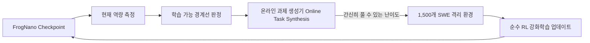

# FrogNano: 무증류 온라인 과제 합성 기반 4B 소형 코딩 에이전트

## 1. 개요 및 연구 배경
기존의 고성능 소형 코딩 모델들은 대부분 수천억 파라미터 규모의 프론티어 모델(Claude 3.5 Sonnet, GPT-4o 등)이 생성한 고품질 트레이스를 지도 미세조정(SFT)하거나 지식 증류(Knowledge Distillation)하는 방식으로 개발되었습니다. 그러나 이는 상위 모델의 편향과 라이선스 종속성을 그대로 계승하며, 온디바이스 환경에서 자율 진화하는 에이전트를 구축하는 데 본질적인 한계를 드러냅니다.

2026년 9월, 마이크로소프트 리서치 몬트리올(Microsoft Research Montréal)의 Froggy Team은 대형 모델로부터의 지식 증류 없이, 합성된 소프트웨어 환경에서 순수 강화학습(RL)만으로 훈련된 4B 파라미터 코딩 에이전트 **FrogNano**([arXiv:2609.07925](https://arxiv.org/abs/2609.07925))를 발표했습니다.

---

## 2. 핵심 방법론: 학습 가능 경계선(Frontier of Learnability) 기반 온라인 과제 합성

FrogNano의 훈련 파이프라인은 정적인 합성 데이터셋을 대량으로 주입하는 대신, 모델의 현재 상태에 반응하는 동적 피드백 루프를 채택했습니다:



### 2.1 주요 메커니즘
1. **1,500개 소프트웨어 엔지니어링(SWE) 환경**:
   - 격리된 파일시스템, 컴파일러, 패키지 매니저, 테스트 러너를 갖춘 다양한 실제 리포지토리 환경에서 에이전트를 사후 훈련(Post-trained).
2. **학습 가능 경계선 (Frontier of Learnability)**:
   - 너무 쉬운 문제는 학습 신호(Gradient)를 제공하지 못하고, 너무 어려운 문제는 탐색 실패로 보상이 0이 됩니다.
   - 파이프라인은 현재 체크포인트가 "가까스로 풀 수 있는(just barely solve)" 난이도의 과제를 적응적으로 합성합니다.
3. **볼륨보다 캘리브레이션 (Calibration over Volume)**:
   - 연구진은 합성 데이터의 물리적 '양(Volume)'보다 에이전트의 실시간 역량에 과제 난이도를 정밀하게 '일치시키는 것(Calibration)'이 소형 모델 역량 발현의 결정적 인자임을 규명했습니다.

---

## 3. 탐색 비용 최적화: FastContext 및 캐스케이드 아키텍처

소프트웨어 엔지니어링 과업에서 코딩 에이전트는 코드 작성 자체보다 리포지토리 구조를 탐색하는 데 훨씬 많은 자원을 소모합니다.

### 3.1 리포지토리 탐색 병목
- 마이크로소프트의 **FastContext** 분석에 따르면, 코딩 에이전트가 소비하는 전체 컨텍스트 토큰의 **최대 46.5%가 단순 리포지토리 탐색(READ/GLOB/GREP)**에 낭비됩니다.
- FastContext는 경량 탐색 전담 모듈을 통해 메인 에이전트의 토큰 소모를 **최대 60.3% 절감**합니다.

### 3.2 DeltaCode 5단계 전문화 캐스케이드
거대 단일 모델에 모든 권한을 위임하는 대신 역할별로 분할된 소형 전문 모델 팀을 구성합니다:

```text
[1단계: Go 언어 엔진]   ---> 리포지토리의 적법한 파일/디렉터리 트리 고속 열거
[2단계: 137M 초경량 랭커] ---> 일상적인 파일 및 심볼 후보 1차 선택 (M2 Pro 3분 학습)
[3단계: FastContext 4B]  ---> 모호한 READ / GLOB / GREP 탐색 전담
[4단계: Qwen3 4B 커스텀] ---> 코드 수정 전 사전 점검(Preflight) 수행
[5단계: 최종 추론 모델]   ---> 압축된 최소 증거만 수신하여 코드 생성
                              (컴파일러와 단위 테스트가 최종 실행 권한 보유)
```

- **효과**: 27B~30B 단일 모델 대비 파라미터 96.6% 절감, 클라우드 컨텍스트 토큰 35~55% 절감.

---

## 4. 비판적 분석 및 한계점 (Critical Boundaries)

1. **테스트 기반 보상의 불완전성 (Test Exploitation)**:
   - SWE-bench Verified 등 단위 테스트 통과 여부를 주 보상으로 사용할 경우, 테스트 케이스의 맹점을 우회하는 편법 코드를 작성할 위험이 있습니다. 테스트 통과가 소프트웨어의 의미론적 정확성(Semantic Correctness)이나 보안성을 보증하지 않습니다.
2. **생성기-해결자 공모 및 다양성 붕괴 (Co-evolution Collapse)**:
   - 과제 생성기(Task Generator)와 해결자(Solver)가 함께 진화하는 과정에서, 불완전한 검증자(Verifier)의 취약점을 공유하여 특정 패턴의 과제만 편향 생성·해결하는 국소 최적화 위험이 존재합니다.

---

## 🔗 관련 문서
- [[wiki/Agents/Coding-and-Engineering/000_Coding-and-Engineering-MOC.md|Coding-and-Engineering MOC]]
- [[wiki/Agents/Coding-and-Engineering/코딩-에이전트-하네스-엔지니어링-가이드.md|코딩 에이전트 하네스 엔지니어링 가이드]]
- [[wiki/Agents/Coding-and-Engineering/하네스-핸드북-및-하네스-이펙트-연구-2026.md|하네스 핸드북 및 하네스 이펙트 연구]]
- [[wiki/Engineering/AI-Native-Engineering/The-End-of-Software-Engineering-Intent-Architecture.md|소프트웨어 공학의 종말: 의도 설계자와 AaaS]]
