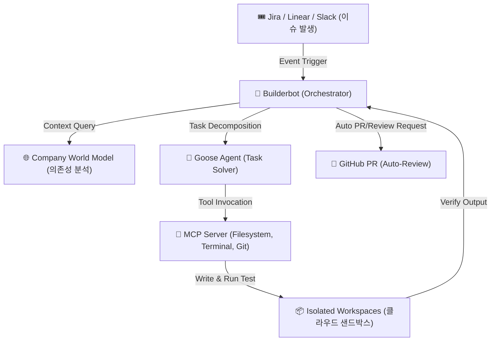

# 에이전트 기반 엔지니어링 조직(Agentic Engineering Org) 전환 가이드

2026년 소프트웨어 엔지니어링 생태계는 개별 개발자의 코딩 보조(Copilot) 단계를 넘어, 조직 전체를 자율적인 에이전트 협업 체계로 마이그레이션하는 **'에이전트 기반 엔지니어링 조직(Agentic Engineering Org)'** 패러다임으로 전환되고 있습니다. 이 문서는 Block, Inc.의 3,500명 엔지니어 전환 성공 사례와 이를 기반으로 한 실전 구현 프레임워크를 다룹니다.

---

## 1. AI 도입의 역설과 성숙도 모델 (Maturity Model)

개발자의 90% 이상이 AI 코딩 도구를 사용하더라도 전체 배포 속도가 개선되지 않는 현상을 **'AI 도입의 역설(AI Adoption Paradox)'**이라고 정의합니다. 이는 개별 코딩 속도 증가가 병목(요구사항 분해, 테스트, 코드 통합, 승인 절차 등)을 해결하지 못하기 때문입니다. 이를 해결하기 위해 에이전트 활용 성숙도를 5단계로 체계화하여 관리합니다.

| 성숙도 단계 | 명칭 | 주 행동 패턴 | 인간의 역할 | 핵심 변곡점 및 기술적 조건 |
| :--- | :--- | :--- | :--- | :--- |
| **Level 0** | **No AI** | 수동 코딩 | 코더 (Coder) | AI 도구 미도입 상태 |
| **Level 1** | **Autocomplete** | 단순 라인/블록 자동완성 | 코더 (부속 제어) | 코드 추천 수용율 모니터링 |
| **Level 2** | **Chat** | IDE 내 대화형 질문 및 해결 | 탐색자 | 오류 복사-붙여넣기 해결 위주 |
| **Level 3** | **Delegation** | **요구사항 단위 위임 및 검증** | **설계자 / 리뷰어** | **[핵심 전환점]** 요구사항 명세화 능력, 코드 품질 검토 가이드 필요 |
| **Level 4** | **Parallel MAS** | 다중 에이전트 병렬 실행 | 오케스트레이터 | 전용 역할군 에이전트(Planner, Tester) 통합 및 조율 |
| **Level 5** | **Autonomous** | 이벤트 기반 완전 자율 배포 | 시스템 모니터 | 이슈 티켓 감지부터 테스트, PR 배포까지 완전 자동화 |

---

## 2. Builderbot & Goose 기반 오케스트레이션 아키텍처

Block의 사례에서 증명된 다중 에이전트 오케스트레이터인 **Builderbot**과 오픈소스 에이전트 **Goose**는 MCP(Model Context Protocol) 표준 위에서 다음과 같은 통합 파이프라인으로 작동합니다.



### 🛠️ 핵심 구성 요소 스펙
1. **Goose Framework (Block 오픈소스)**:
   - MCP 표준 호환 에이전트 엔진으로, 개발 환경(IDE, 셸, API)과 직접 연결되어 구체적인 변경 사항을 수행합니다.
2. **Builderbot**:
   - 상위 오케스트레이터로서, 분산된 `Goose` 인스턴스들의 라이프사이클을 통제하고, 실패 시 자가 수정(Self-Correction) 시나리오를 가동합니다.
3. **Company World Model (회사 세계 모델)**:
   - 사내 수만 개의 리포지토리에 걸친 의존성 그래프(Dependency Graph), 공유 라이브러리 인터페이스, 배포 설정 파이프라인을 기계가 읽을 수 있는 데이터베이스로 시각화 및 매핑합니다.
   - 이를 통해 에이전트가 단일 소스코드를 고칠 때 다른 마이크로서비스에 미치는 사이드 이펙트를 미리 파악하고 차단할 수 있게 합니다.

---

## 3. AI-Ready Repository 표준 스펙 및 가이드

에이전트가 리포지토리 내부에서 헤매지 않고, 극도로 적은 토큰과 높은 무결성으로 코드를 변경하기 위해서는 리포지토리가 **'AI-ready'** 상태여야 합니다.

### 📂 표준 디렉토리 레이아웃 및 설정
```text
your-project-root/
├── .agents/
│   ├── rules/
│   │   ├── coding_style.md     # 코딩 스타일 규칙 및 금지 규칙
│   │   └── testing_guide.md    # 테스트 실행 및 모니터링 가이드
│   └── skills/
│       └── custom_task/
│           └── SKILL.md        # 도메인 특정 커스텀 작업 스킬 정의
├── .cursorrules                # Cursor/VS Code 에이전트용 시스템 지침
├── AGENTS.md                   # 리포지토리 아키텍처, 의존성 맵 및 온보딩 가이드 (Base Context)
└── package.json
```

### 📋 `AGENTS.md` (Base Context Template)
리포지토리의 핵심 규칙을 캡슐화한 `AGENTS.md` 템플릿의 예시는 다음과 같습니다.

```markdown
# Repository Agent Guide (AGENTS.md)

## 🏗️ System Architecture
- **Framework**: Next.js 15 (App Router), TypeScript, Prisma ORM
- **Database**: PostgreSQL (Prisma Client를 경유해서만 접근)
- **Key Flow**: Page -> Controller -> Service -> Repository -> Schema

## 🚨 Critical Rules
1. **No Any Types**: TypeScript 작성 시 `any` 타입 사용을 금지하며, 엄격한 인터페이스를 명시하세요.
2. **Error Handling**: 모든 서비스 레이어는 `Result<T, Error>` 모나딕 패턴으로 에러를 반환해야 합니다. (직접 throw 금지)
3. **Prisma Client**: 쿼리 작성 시 N+1 문제를 방지하기 위해 `include` 문을 최적화하세요.

## 🛠️ Execution Playbook
- **Install**: `npm install`
- **Build**: `npm run build`
- **Test**: `npm run test` (또는 특정 파일 테스트: `npx jest path/to/file.test.ts`)
```

---

## 4. 실전 가동 CLI 및 자동화 파이프라인 예시

### 1) Goose CLI를 이용한 자율 과업 기동
개발자나 오케스트레이터가 특정 이슈 번호를 타겟팅하여 에이전트를 가동하는 예시 명령어입니다.

```bash
# Goose 에이전트를 실행하고, 프로젝트 context 및 rules를 읽어 이슈를 자율 수정하도록 명령
goose run \
  --instructions="Read AGENTS.md and .agents/rules/ first. Solve Linear ticket #ENG-4892: Fix payment callback timeout retry logic." \
  --workspace=./sandbox_workspace \
  --allow-danger-commands=false
```

### 2) MCP Context Share 설정
MCP 설정을 통해 에이전트가 로컬 DWH 및 Jira API에 안전하게 연결할 수 있게 구성합니다.

```json
{
  "mcpServers": {
    "jira-connector": {
      "command": "node",
      "args": ["/usr/local/lib/node_modules/mcp-server-jira/dist/index.js"],
      "env": {
        "JIRA_API_TOKEN": "your-api-token",
        "JIRA_BASE_URL": "https://your-company.atlassian.net"
      }
    }
  }
}
```

---

## 5. 엔지니어링 거버넌스 및 성찰

1. **지식 노동의 격상 (Role Elevation)**:
   - 자율 에이전트 조직 모델에서 엔지니어의 핵심 경쟁력은 "얼마나 빨리 타이핑하는가"가 아닌, **"문제를 어떻게 쪼개고(Decomposition), 어떤 규칙을 부여하며(Context Engineering), 최종 소스코드를 어떻게 신뢰성 있게 검토(Supervisory Review)할 것인가"**로 전이됩니다.
2. **인간 중심의 공존 거버넌스 (Human-in-the-loop)**:
   - Block의 사례에서 나타난 것과 같이, 기술적 효율화(PR 21배 증가 등)가 개발자들의 무분별한 정리 해고나 고용 불안으로 직결되는 단기적 대체 방식은 조직의 지식 손실 및 심리적 안전성 붕괴를 초래합니다.
   - 따라서 에이전트를 독립적 일꾼이 아닌, 인간의 시스템 설계 능력을 극대화해주는 **'지식 증강 비서(Augmented Peer)'**로 포지셔닝하고, 에이전트의 릴리즈 최종 권한은 항상 인간 감독관이 검증하는 안전망(Guardian Pattern)을 엄격히 고수해야 합니다.

---
**관련 문서**:
- [[wiki/Agents/Coding-and-Engineering/000_Coding-and-Engineering-MOC.md]]
- [[wiki/Agents/Coding-and-Engineering/루프-엔지니어링-패러다임-및-시스템-안전.md]]
- [[wiki/Agents/Coding-and-Engineering/Claude Code의 Task 변화와 AI-native 엔지니어의 조건.md]]
- [[wiki/Agents/Multi-Agent-and-Orchestration/OpenClaw-및-HyperAgent-기반-MAS-아키텍처.md]]
- [[wiki/Agents/Multi-Agent-and-Orchestration/자율수행-멀티-에이전트-시스템-오케스트레이션-및-보안-격리-2026.md]]
