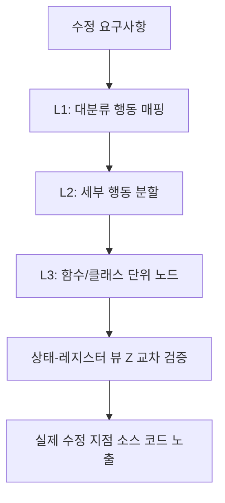

# 하네스 핸드북(Harness Handbook) 및 하네스 이펙트(The Harness Effect) 연구 (2026)

이 문서는 2026년 에이전트 오케스트레이션 및 프레임워크 설계 분야에서 급부상한 두 개의 핵심 연구인 **Harness Handbook**(arXiv:2607.13285)과 **The Harness Effect**(arXiv:2607.06906)를 기반으로, 대규모 에이전트 시스템의 **행동 국소화(Behavior Localization)** 및 **토큰 경제학(Token Economics)** 최적화 설계 방안을 분석합니다.

---

## 1. Harness Handbook: 에이전트 하네스의 자율적 진화 및 행동 국소화

생성형 AI 에이전트 시스템은 모델 자체뿐만 아니라 프롬프트 빌더, 상태 관리자, 도구 바인딩 등을 포함한 **하네스(Harness)**에 의해 성능이 결정됩니다. 비즈니스 요구사항이나 API 규격이 변함에 따라 하네스 역시 진화해야 하지만, 기존의 파일/함수 중심 코드 구조는 다단계 실행 흐름에 흩어진 "동작 행동"을 찾기 어렵게 만드는 병목(Behavior Localization Bottleneck)을 야기합니다.

### 1.1. 행동 중심 표상 (Behavior-Centric Representation)
Harness Handbook은 저장소의 파일 구조가 아닌 하네스의 **실제 런타임 행동**을 중심으로 정보를 재조합하고 이를 소스코드에 연결합니다.
- **L1–L3 문서 트리 (Document Tree $\mathcal{D}$)**: 하네스의 전체 런타임 흐름을 행동 계층 단위로 매핑하여 구성합니다.
- **상태-레지스터 뷰 (State-Register View $\mathcal{Z}$)**: 모듈 간의 상태 전이 및 상태 공유 지도를 시각화 및 구조화합니다.

### 1.2. 행동 가이드식 점진적 공시 (BGPD, Behavior-Guided Progressive Disclosure)
BGPD는 코딩 에이전트가 추상적인 요구사항에서부터 관련 구현 파일/함수 지점에 도달할 수 있도록 돕는 다단계 탐색 기법입니다.
1. 추상적 요구사항 유입 $\rightarrow$ L1-L3 트리를 통해 타깃 행동 영역 좁히기.
2. 특정 행동 노드에 연결된 파일 및 소스 코드 후보군 특정.
3. 로컬 소스 코드 정밀 검증 및 부분 공개를 통한 컨텍스트 최적화.



---

## 2. The Harness Effect: 오케스트레이션 설계와 토큰 경제학

**The Harness Effect**는 에이전트 시스템의 성능과 비용이 하위 파운데이션 모델 자체보다 이를 감싸는 하네스의 오케스트레이션 설계에 의해 더 크게 좌우됨을 실증하였습니다. 무조건 많은 토큰을 투입하여 성능을 높이려는 **"Token Maxing"**의 한계를 지적하고 하네스 최적화를 통한 극적인 지표 개선을 제시합니다.

### 2.1. 하네스 설계 개선 실증 지표
기존 에이전트 루프 대비 최적화된 하네스(예: Writer Agent Harness)를 도입한 결과, 하위 모델의 변경 없이 다음의 비약적인 개선을 달성했습니다:
- **비용 절감**: blended cost per task **41% 감소** ($0.21 $\rightarrow$ $0.12).
- **속도 향상**: median wall-clock time **44% 단축** (48s $\rightarrow$ 27s).
- **토큰 효율**: token usage per task **38% 감소** (14.2k $\rightarrow$ 8.8k).
- **모델 불변성(Model-Invariant)**: 이 지표 향상은 GPT-4, Claude, Gemini 등 모든 주요 파운데이션 모델군에서 고르게 관찰됨.

---

## 3. 하네스 효율성 극대화를 위한 6대 메커니즘 설계 방식

실제 프로덕션급 에이전트 하네스 설계 시 반영해야 할 실천적인 6대 메커니즘 패밀리입니다.

### 3.1. 캐시 형태 규율 (Cache-shape discipline)
프롬프트가 들어올 때 자주 바뀌는 세션 정보와 불변의 시스템 명령어 영역을 엄격히 분리하여, 캐시 히트율(Cache Hit Rate)을 극대화합니다.
- **2-Zone 프롬프트 구조**: 캐시 영역을 고정 캐시(Static)와 동적 롤아웃(Dynamic) 영역으로 나누어, 롤아웃이 증가해도 앞부분의 시스템 프롬프트 캐시가 깨지지 않도록 강제합니다.

### 3.2. 구조화된 점진적 압축 (Incremental Compaction)
컨텍스트 윈도우가 가득 차기 전에, 이전 에이전트의 판단 결과나 코드 수정 트레이스를 JSON 구조체 형태로 정제하고 의미 없는 중복 에러 로그를 자동 압축하여 컨텍스트에 유지합니다.

### 3.3. 컨텍스트 오프로드와 컨텍스트 방화벽 (Context Firewalls)
메인 오케스트레이터 모델이 모든 파일 내용이나 히스토리를 쥐고 있게 하지 않고, **경량 서브 에이전트**에게 특정 작업을 위임하여 필요한 요약본이나 핵심 데이터만 메인 모델에 전달합니다. 서브 에이전트가 메인 모델의 컨텍스트를 보호하는 **방화벽** 역할을 수행합니다.

```python
# Context Firewall 구현 예시: 서브 에이전트를 통한 대용량 파일 사전 필터링
from strands_agents.harness import SubAgent, MainOrchestrator

def execute_with_firewall(main_orchestrator: MainOrchestrator, large_file_path: str, query: str):
    # 대량의 소스코드를 메인 컨텍스트에 넣는 대신 서브 에이전트 구동
    firewall_agent = SubAgent(
        role="CodeFilter",
        instruction="제시된 코드에서 쿼리와 직접적으로 관련된 함수 시그니처와 docstring만 추출하세요."
    )
    
    # 서브 에이전트의 극도로 압축된 컨텍스트 요약본만 메인 모델로 전달
    compressed_context = firewall_agent.run(file_path=large_file_path, query=query)
    
    # 메인 모델은 압축된 결과물만 수신하여 추론 수행 (토큰 절감)
    return main_orchestrator.step(context=compressed_context, task=query)
```

### 3.4. 제로 토큰 대기 및 내구성 (Zero-token waiting)
사용자의 피드백을 기다리거나 외부 API 호출을 대기하는 비동기 시점에는 메모리 상태를 DB/지속 파일로 직렬화(Serialization)하고 프로세스를 대기 상태로 전환하여 불필요한 토큰 대기 오버헤드를 차단합니다.

### 3.5. 실패 비용 거버넌스 (Failure-spend governance)
동일한 에러나 무한 린트 루프에 빠졌을 때, 토큰 예산을 소진하기 전에 백오프(Backoff) 알고리즘이나 인간 개발자 개입(Human-in-the-loop) 트리거를 발생시켜 손실을 관리합니다.

---

## 🔗 연결된 문서
- 하네스 설계의 기초: [[wiki/Agents/Coding-and-Engineering/코딩-에이전트-하네스-엔지니어링-가이드.md]]
- 루프 최적화 전략: [[wiki/Agents/Coding-and-Engineering/루프-엔지니어링-패러다임-및-시스템-안전.md]]
- 에이전트 성능 평가: [[wiki/Agents/Evaluations/Deep-Agents-Benchmarking-Methodology.md]]
- [[wiki/Agents/000_Agents-MOC.md]]
- [[index.md]]
