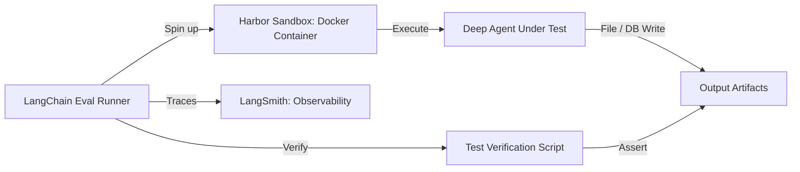

# LangChain: Deep Agents Benchmarking 및 평가 방법론

이 문서는 LangChain이 복잡한 다단계 자율 추론을 실행하는 **Deep Agents**의 성능과 안정성을 프로덕션 레벨에서 객관적으로 검증하기 위해 구축한 벤치마킹 체계 및 시스템 아키텍처를 정의합니다.

## 1. 아키텍처 구성 요소: 격리 기반의 Harbor 프레임워크

에이전트가 로컬 파일을 변경하거나 코드를 작성하여 터미널에서 실행하는 등의 자율 작업을 안전하고 일관되게 평가하기 위해 Docker 컨테이너 기반의 격리 테스트 베드인 **Harbor**를 사용합니다.

- **격리 검증**: 에이전트의 런타임 코드가 외부 및 호스트 환경을 훼손하지 못하도록 통제하고, 매 테스트 시점마다 동일한 초기 상태(Fresh State)를 제공하여 평가 신뢰성을 유지합니다.
- **결과 검증 (Artifact Verification)**: 에이전트가 출력한 최종 텍스트 답변이 아니라, 디스크 상에 남긴 파일, 코드 구현 결과물, 빌드된 결과 데이터 등을 테스트 스크립트(Test Script)가 직접 실행하여 정합성을 채점합니다.

## 2. 4대 분야 표준 벤치마크

1.  **Terminal Bench (2.0)**:
    - **타겟**: 터미널 쉘 기반 코딩, 실무 디버깅, 소프트웨어 형상 관리 및 인프라 보안 대응 능력 평가.
2.  **Harbor-Index**:
    - **타겟**: 개발 및 데이터 사이언스 도메인의 다단계 엔지니어링 수행 효율성 평가.
3.  **τ³-bench**:
    - **타겟**: 다중 턴으로 이어지는 복잡한 사용자 대화 내역 처리 및 협업 역량 벤치마크.
4.  **ContextBench**:
    - **타겟**: 다중 문서 교차 분석 및 대규모 RAG 상황에서의 롱컨텍스트 검색 충실도 검증.

## 3. 하네스 엔지니어링 (Harness Engineering)

에이전트 벤치마킹 성능 극대화를 위해 기반 파운데이션 모델(LLM)을 고비용 모델로 교체하는 것에만 의존하지 않고, 에이전트를 보좌하는 주변 시스템인 **하네스(Harness)**를 튜닝합니다.

- **프롬프트 가이드라인 동적 변경**: 실패 트레이스 분석을 기반으로 프롬프트 컨텍스트 압축 및 에러 복구 유도 프롬프트(Self-Correction Prompt) 구조 변경.
- **도구 규격(Tool Schema) 최적화**: LLM이 인자를 쉽게 오파싱하지 않도록 JSON 스키마를 고도화하고 상세 예시(Few-shot) 추가.
- **상태 추적 및 디버깅**: 모든 어텐션 단계와 툴 콜 실행 로그를 **LangSmith**에 적재하여, 추론 실패 경로(Failure Mode)를 감지하고 수정 방향을 역추적합니다.

---
## 🔗 관련 문서 링크
- Pytest 기반 에이전트 단위 테스트: [[wiki/Agents/Evaluations/DeepEval-Evaluation-Framework.md]]
- AI 협업자 아키텍처: [[wiki/Agents/Frameworks/OpenWorker-Agentic-AI.md]]
- 에이전트 하네스 SDK 설계: [[wiki/Agents/Frameworks/Strands-Agents-Harness-SDK.md]]
