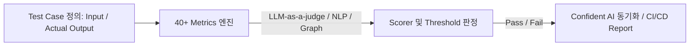

# DeepEval: Pytest 기반 오픈소스 LLM 및 에이전트 평가 프레임워크

이 문서는 프로덕션 환경의 LLM 애플리케이션 및 AI 에이전트의 신뢰성을 확보하기 위해 사용되는 오픈소스 평가 프레임워크 **DeepEval**의 설계 구조와 핵심 평가 메트릭을 정의합니다.

## 1. 아키텍처 및 파이프라인 개요

DeepEval은 Python의 `pytest` 테스팅 프레임워크처럼 구동되며, 비결정론적(Non-deterministic) 특성을 갖는 LLM 결과물을 정량적/정성적 지표로 채점합니다. CI/CD 파이프라인에 이식하여 지속적 통합(Continuous Integration) 중 품질 저하를 방지할 수 있습니다.



## 2. 4대 분야 핵심 메트릭 (Metrics)

### 2.1. Agentic Metrics (에이전틱 지표)
에이전트가 환경과 상호작용하고 도구를 호출하며 목표를 달성하는 과정을 모니터링합니다.
- **Task Completion**: 주어진 작업의 최종 완수 여부.
- **Tool Correctness**: 적절한 시점에 알맞은 도구를 호출했는지 평가.
- **Goal Accuracy**: 수립한 목표와 결과의 정밀 정합성.
- **Plan Adherence**: 생성된 에이전트 실행 계획(Plan)을 충실히 준수했는지 측정.
- **Step Efficiency**: 불필요한 도구 호출 및 루프 없이 최적의 단계(Step)로 완수했는지 확인.

### 2.2. RAG Metrics (검색 증강 생성 지표)
RAG 파이프라인의 검색 단계와 생성 단계를 격리하여 검증합니다.
- **Answer Relevancy**: 생성된 답변이 질문에 직접적으로 대답하는가.
- **Faithfulness (할루시네이션 지표)**: 생성된 답변이 검색된 컨텍스트(Context)에만 기반하는가.
- **Contextual Recall / Precision**: 질문에 필요한 올바른 정보를 검색했는가.

### 2.3. Multi-turn / Conversational Metrics (다중 턴 지표)
지속적인 턴(Turn)이 오가는 환경의 상태 유지를 평가합니다.
- **Knowledge Retention**: 대화가 누적되어도 이전 턴의 핵심 컨텍스트를 소실하지 않는가.
- **Role Adherence**: 지정된 페르소나와 역할을 지속해서 유지하는가.

### 2.4. MCP (Model Context Protocol) Metrics
- **MCP Task Completion**, **MCP Use** 등 외부 MCP 서버 자원 활용 능력 및 흐름 유효성을 실시간 검증합니다.

## 3. 실전 테스트 코드 구현 예시

다음은 `pytest`를 기반으로 에이전트의 도구 사용 및 RAG 신뢰성을 동시에 평가하는 DeepEval 테스트 구현 예시입니다.

```python
import pytest
from deepeval import assert_test
from deepeval.test_case import LLMTestCase
from deepeval.metrics import FaithfulnessMetric, ToolCorrectnessMetric

def test_agent_tool_use():
    # 1. 테스트 케이스 정의
    test_case = LLMTestCase(
        input="Find the latest 2026-07 financial data for Nvidia and check if we have enough cash in the backup pool.",
        actual_output="Nvidia's Q2 2026 revenue is $32B. The backup pool has $50M cash, which exceeds the required reserve.",
        retrieval_context=["Nvidia cash reserve guidelines and current pool status show $50M backup."],
        tools_called=["search_nvidia_finance", "check_backup_pool_cash"]
    )
    
    # 2. 메트릭 선언 (임계값 0.7 설정)
    faithfulness_metric = FaithfulnessMetric(threshold=0.7)
    tool_metric = ToolCorrectnessMetric(threshold=0.7)
    
    # 3. 평가 실행
    assert_test(test_case, [faithfulness_metric, tool_metric])
```

---
## 🔗 관련 문서 링크
- LangChain의 에이전트 벤치마킹 체계: [[wiki/Agents/Evaluations/Deep-Agents-Benchmarking-Methodology.md]]
- 코드베이스 RAG 최적화 표준: [[wiki/RAG/OpenWiki-OKF-Codebase-Documentation.md]]
