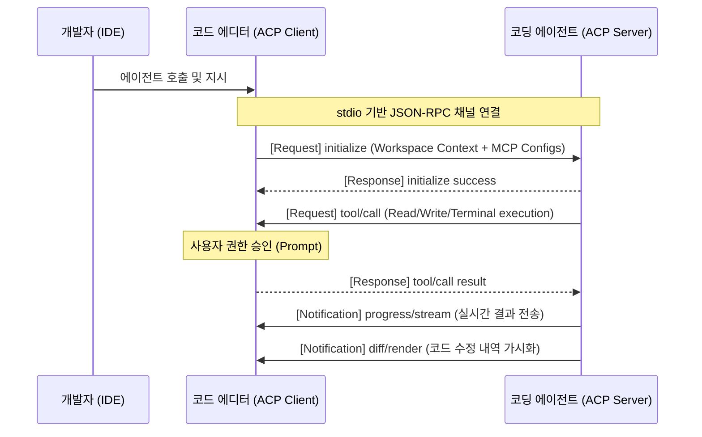

# 🔌 Agent Client Protocol (ACP) 표준 및 생태계

**Agent Client Protocol (ACP)**는 코드 에디터/IDE(클라이언트)와 AI 코딩 에이전트(서버) 간의 양방향 통신을 규격화하는 오픈소스 표준 프로토콜입니다. Microsoft가 개발한 언어 서버 프로토콜(LSP)이 개발 환경과 프로그래밍 언어 분석 엔진을 분리했듯이, ACP는 코딩 에이전트와 특정 IDE 간의 강력한 결합(Tight Coupling)을 제거하여 상호 호환성을 제공하는 것을 목표로 합니다.

---

## 1. 등장 배경 및 필요성

기존 AI 코딩 에이전트 생태계는 다음과 같은 통합 오버헤드 문제를 안고 있었습니다.
* **통합 비용의 비대화**: 새로운 코딩 에이전트가 나올 때마다 각각의 IDE(VS Code, JetBrains, Zed 등)에 맞는 전용 플러그인을 개발해야 했습니다.
* **제한된 선택권**: 특정 에이전트를 사용하기 위해 사용자가 선호하지 않는 에디터로 강제 이주해야 하는 현상이 발생했습니다.
* **이중 표준의 파편화**: 에이전트가 파일 탐색, 코드 수정, 터미널 실행 권한을 획득하는 인터페이스가 개발사마다 상이했습니다.

ACP는 **"에디터와 에이전트의 분리"**를 통해 에이전트 개발자는 프로토콜 스펙만 충족하면 모든 에디터로 확장할 수 있고, 에디터 개발자는 ACP 호환 에이전트 생태계를 즉시 흡수할 수 있도록 이 문제를 해결합니다.

---

## 2. 핵심 아키텍처 및 통신 메커니즘

ACP는 로컬 실행과 원격 실행 환경을 모두 지원하도록 유연하게 설계되었습니다.

### 1) 실행 및 전송 계층
* **로컬 가동 (Local Agents)**: 에디터가 에이전트 프로세스를 온디맨드 방식으로 서브프로세스로 가동하고, 표준 입출력(`stdin`/`stdout`) 상에서 **JSON-RPC**를 사용하여 통신합니다.
* **원격 가동 (Remote Agents)**: 클라우드나 원격 서버에 호스팅된 에이전트와 HTTP 또는 WebSocket 프로토콜을 통해 안전하게 통신합니다. (2026년 기준 실용화 확대 중)
* **동시 세션 지원**: 단일 연결 내부에서 다중 스레드/세션을 지원하여 여러 작업의 병렬 처리가 가능합니다.

### 2) JSON-RPC 기반 양방향 인터랙션
* **에이전트 제어와 스트리밍**: JSON-RPC의 Notification을 활용해 에이전트의 사고 과정(Chain of Thought)이나 부분 출력을 실시간으로 에디터 UI에 스트리밍합니다.
* **사용자 개입 및 보안 승인(Human-in-the-loop)**: 에이전트가 파일 수정이나 터미널 명령을 실행할 때, Bidirectional Request를 사용해 에디터에 승인을 요청하고 에디터는 사용자 프롬프트를 통해 이를 중재합니다.
* **풍부한 에이전틱 UX 요소**: 에이전트가 생성한 코드 수정 사항을 에디터 내에서 시각적 Diffs 창으로 렌더링하고, 마크다운 표준을 이용해 UI 레이아웃의 유연성을 확보합니다.

### 3) MCP (Model Context Protocol) 연동 및 통합
* 에디터가 로컬에 보유한 사용자 환경의 MCP 서버 설정(Tools, Resources)을 에이전트 실행 시점에 세션 인자로 전송합니다.
* 이를 통해 에이전트는 에디터의 파일 시스템뿐만 아니라 에디터가 등록해둔 모든 MCP 도구에 직접 접근하여 통합 작업을 수행할 수 있습니다.

---

## 3. 생태계 지원 현황 (2026.07 기준)

### 1) 지원 에디터 및 IDE (ACP Clients)
* **Zed**: AI 아키텍처에 외부 에이전트(External Agents) 연동을 위한 ACP 표준을 네이티브 탑재하여 가장 높은 호환성을 보여줍니다.
* **JetBrains**: AI Assistant를 기반으로 ACP 클라이언트 규격을 공식 릴리즈했습니다.
* **VS Code & Cursor/Windsurf**: `ACP Client` 및 `ACP Pro Extension`을 통해 에코시스템 내 에이전트와의 드롭인 연동을 전면 지원합니다.
* **Neovim**: `avante.nvim`, `codecompanion.nvim` 플러그인을 통해 ACP 연동 개발을 처리합니다.
* **기타**: Obsidian (`obsidian-agent-client`), Unity Editor 등.

### 2) 호환 코딩 에이전트 (ACP Servers)
* **Goose**: Block(구 Square)에서 오픈소스로 배포한 ACP 기반 멀티 에이전트 프레임워크.
* **Cline**: 자율 코딩 에이전트로 ACP 프로토콜을 지원하여 IDE 내부에서 CLI를 작동시킵니다.
* **Claude Agent / Gemini CLI / GitHub Copilot CLI**: 빅테크 에이전트 어댑터를 통해 ACP 기반 연동이 퍼블릭 프리뷰 등으로 제공됩니다.
* **기타**: OpenHands, OpenClaw, AutoDev 등.

### 3) 주요 프레임워크 및 어댑터
* **Mastra**: `@mastra/acp` 라이브러리를 통해 외부 에이전트를 마스트라 도구로 래핑하여 오케스트레이션할 수 있습니다.
* **LangChain/LangGraph**: `Deep Agents ACP` 플러그인을 통해 에이전트 상태 관리를 ACP 연결부로 연동합니다.
* **LlamaIndex**: `workflows-acp` 패키지를 통해 워크플로우 추적 정보를 ACP 프로토콜 규격으로 출력합니다.

---

## 4. MCP vs. ACP 비교

| 구분 | MCP (Model Context Protocol) | ACP (Agent Client Protocol) |
| :--- | :--- | :--- |
| **목적** | LLM/에이전트에 컨텍스트 데이터(DB, API, 파일) 제공 | 에디터/IDE와 코딩 에이전트 간의 조작 및 통신 표준화 |
| **초점** | 데이터 및 리소스 접근성 제공 (Context-driven) | 개발자 개발 경험 및 코드 제어/Diff 렌더링 (UX-driven) |
| **통신 방향** | 에이전트/LLM $\rightarrow$ 외부 도구/데이터 호출 | 에디터 $\leftrightarrow$ 에이전트 간 양방향 프로세스 실행 |
| **상호 운용** | ACP 에디터가 ACP 에이전트 실행 시 MCP 설정을 동시 전달하여 상호 보완적으로 작동 |

---

**관련 문서**:
* [[wiki/Agents/Frameworks/000_Frameworks-MOC.md]]
* [[wiki/Agents/Implementation/Supermemory-Architecture-and-MCP.md]]
* [[wiki/Engineering/AI-Native-Engineering/Block-자율-개발-배포-플랫폼-아키텍처.md]]
