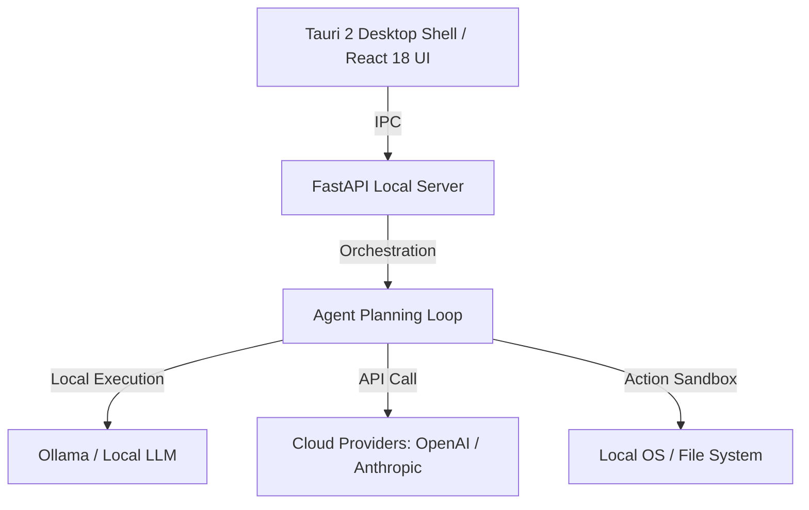

# OpenWorker: 오픈소스 로컬 퍼스트 AI Coworker (Andrew Ng)

이 문서는 Andrew Ng 교수와 Rohit Prasad가 2026년 7월에 공동 공개한 오픈소스 로컬 퍼스트 AI 협업 에이전트 **OpenWorker**의 아키텍처와 활용 방안을 기술합니다.

## 1. 아키텍처 개요

OpenWorker는 프라이버시를 강력히 보호하는 **로컬 퍼스트(Local-First)** 아키텍처를 따릅니다. 사용자의 파일 시스템 제어, 스크립트 실행, 캘린더/이메일 등의 도구 사용 작업을 전적으로 로컬 호스트 컴퓨터 내에서 구동합니다.



- **데스크톱 쉘**: Tauri 2 + React 18 프론트엔드로 리소스 오버헤드를 최소화하고 빠른 UI 렌더링 지원.
- **백엔드 엔진**: Python FastAPI 로컬 서버로 에이전트의 실행 루프 및 상태 관리.
- **모델 독립성**: Ollama 등을 활용한 완전 로컬 모델(Local-only)부터 외부 상용 API 키 기반의 프론티어 모델까지 손쉽게 바인딩 가능.

## 2. 핵심 설계 메커니즘

### 2.1. 결과 지향적 태스크 스케줄링 (Outcome-Oriented)
기존 챗봇의 텍스트 답변 수집 범위를 넘어섭니다. 사용자가 최종 완수해야 할 목표(Outcome)를 입력하면 에이전트가 하위 단계(Sub-steps)를 수립하여 이를 실현할 때까지 도구 호출과 검증을 자율 순환합니다.

### 2.2. 위험도 기반 보안 승인 절차 (Risk-Tiered human-in-the-loop)
에이전트가 로컬 환경에서 파괴적이거나 돌이킬 수 없는 작업을 수행하는 상황을 방지하기 위해 작업의 성격을 등급별로 분류합니다.
- **Read-only**: 승인 없이 자율 탐색 및 수집.
- **Write / Execute (Consequential Actions)**: 로컬 파일 수정, CLI 명령어 실행, 외부 이메일 발송 등은 반드시 사용자 화면에 사전 팝업을 띄워 승인을 받아야만 다음 단계로 이동합니다.

## 3. 실무 예시 및 스크립트

OpenWorker와 같은 로컬 퍼스트 에이전트의 백엔드 실행을 모사하는 핵심 API 핸들러의 개념 예시입니다.

```python
from fastapi import FastAPI, HTTPException
from pydantic import BaseModel
from typing import List

app = FastAPI()

class ActionRequest(BaseModel):
    plan_steps: List[str]
    risk_level: str  # "LOW", "MEDIUM", "HIGH"

@app.post("/execute")
async def execute_agent_step(request: ActionRequest):
    # 위험 단계 검증
    if request.risk_level in ["MEDIUM", "HIGH"]:
        # 사용자 승인(Human-in-the-loop) 인터럽트 처리 유도
        return {
            "status": "AWAITING_USER_APPROVAL",
            "message": f"Action with risk {request.risk_level} requires manual validation."
        }
    
    # 로컬 작업 실행 시뮬레이션
    return {"status": "SUCCESS", "message": "Low risk steps executed locally."}
```

---
## 🔗 관련 문서 링크
- 에이전트 하네스 구조 표준: [[wiki/Agents/Frameworks/Strands-Agents-Harness-SDK.md]]
- 에이전트 다단계 피드백 루프 평가: [[wiki/Agents/Evaluations/Deep-Agents-Benchmarking-Methodology.md]]
