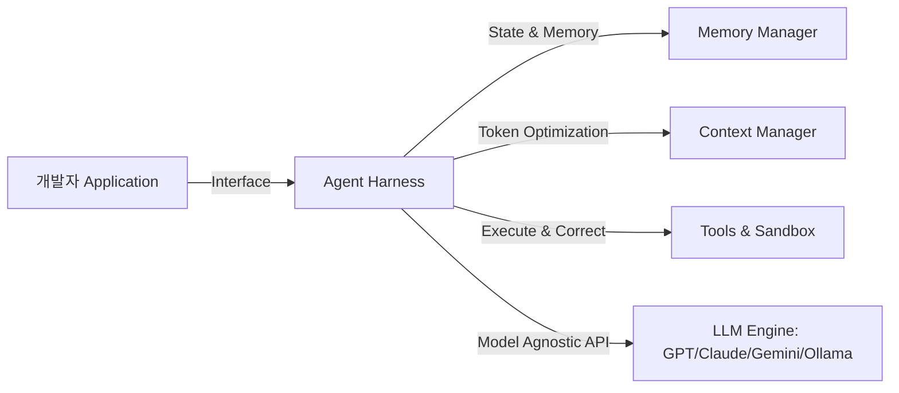

# Strands Agents: Harness SDK 오픈소스 프레임워크 분석

이 문서는 프로덕션 환경에서 확장성 있는 AI 에이전트를 빌드하고 배포하기 위해 고안된 **Strands Agents Harness SDK**의 아키텍처와 엔지니어링 패턴을 정의합니다.

## 1. 아키텍처 개요: Agent Harness Pattern

Strands SDK는 에이전트의 오케스트레이션 루프, 컨텍스트 상태 및 도구 바인딩 환경을 감싸는 **하네스(Harness)** 구조를 중심에 둡니다. 이를 통해 복잡한 AI 모델의 추론 결과를 통제하고 인프라에 결합합니다.



- **모델 추상화 (Model Agnostic)**: Bedrock, OpenAI, Gemini, Claude, Ollama 등 다변화된 LLM 백엔드를 단일화된 SDK 규격으로 연결하여 런타임 스위칭을 제공합니다.
- **다국어 네이티브 SDK**: Python (`strands-agents`)과 TypeScript (`@strands-agents/sdk`) 생태계를 동시 지원하여 클라이언트와 서버 사이드 개발을 커버합니다.

## 2. 핵심 프레임워크 기능

### 2.1. 컨텍스트 압축 및 비용 절감 (Context Management)
에이전트가 긴 대화나 방대한 스크린 히스토리를 가질 때 토큰 소모를 동적으로 제어합니다. 중복되거나 오래된 도구 실행 결과 및 프롬프트 요소를 압축 알고리즘을 통해 줄여 API 비용을 절감합니다.

### 2.2. 자율 예외 수정 (Guardrails & Steering)
LLM이 잘못된 인자로 도구를 호출하거나 런타임 에러(Runtime Error)를 발생시키는 경우, 이를 하네스가 가로채어 에이전트에게 자체 수정용 컨텍스트(Feedback Context)를 주입합니다. 이를 통해 사용자 개입 없이 자율적으로 에러를 복구합니다.

### 2.3. 클라우드 네이티브 배포 인프라
AWS Lambda, Docker, Amazon EKS 및 Fargate와 같이 격리된 서버리스 컴퓨트 환경에 최적화된 리드앤라이트 인터페이스를 구비하고 있습니다.

## 3. 실전 구현 예시

다음은 Python SDK를 활용하여 자율 예외 수정 가드레일이 탑재된 Strands 에이전트를 선언하는 구현 스펙 예시입니다.

```python
from strands_agents.harness import AgentHarness
from strands_agents.tools import ToolRegistry

# 1. 도구 등록 및 선언
registry = ToolRegistry()

@registry.register_tool(name="fetch_user_profile")
def fetch_user_profile(user_id: str) -> dict:
    """사용자의 인적 사항을 DB에서 반환합니다."""
    # 비즈니스 로직
    return {"user_id": user_id, "group": "Enterprise"}

# 2. 에이전트 하네스 초기화
harness = AgentHarness(
    model_provider="anthropic",
    model_name="claude-3-5-sonnet",
    tool_registry=registry,
    enable_self_correction=True,  # 자율 예외 수정 활성화
    context_limit_tokens=8000     # 컨텍스트 최적화 상한치
)

# 3. 에이전트 실행 및 런타임 루프 진입
result = harness.run(
    prompt="Retrieve profile for user ERP-909 and verify access."
)
print("Agent Outcome:", result.output)
```

---
## 🔗 관련 문서 링크
- 로컬 퍼스트 에이전트 프레임워크: [[wiki/Agents/Frameworks/OpenWorker-Agentic-AI.md]]
- 에이전트의 격리된 평가 환경: [[wiki/Agents/Evaluations/Deep-Agents-Benchmarking-Methodology.md]]
