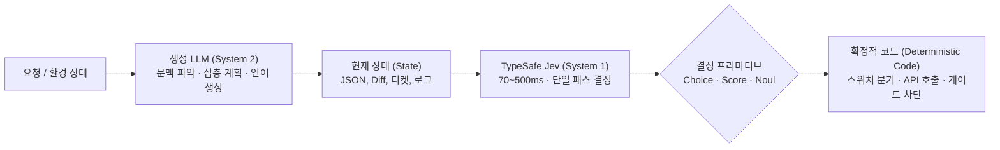
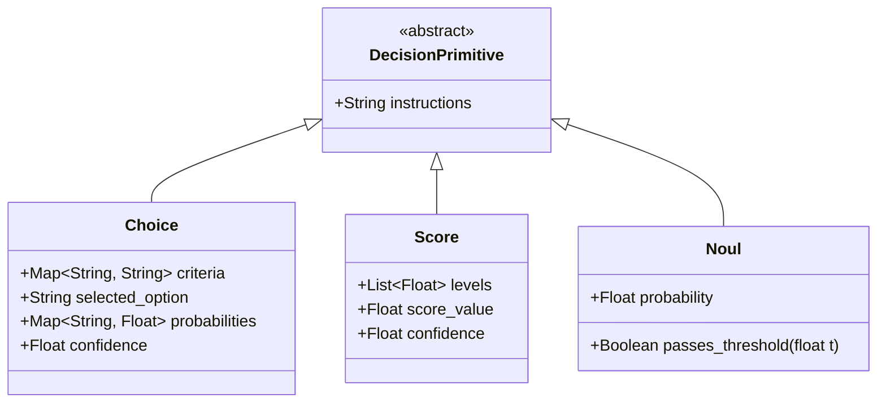

# TypeSafe Jev: 시스템 1(System One) 결정 전용 모델 및 에이전트 분기 아키텍처

## 1. 개요 및 설계 철학

**TypeSafe Jev**는 전 OpenAI 연구원 Diogo Almeida가 공동 창업한 TypeSafe AI가 2026년 9월 출시한 **결정 전용(Decision-only) AI 모델**이다.

기존의 대형 언어 모델(LLM)이 인간과의 대화나 장문 생성, 코드 작성 등 다니엘 카너먼의 **'시스템 2(System 2, 느리고 숙고하는 추론)'**에 집중되어 있다면, Jev는 고성능 소프트웨어 런타임의 핫패스(Hot Path)에서 요구되는 **'시스템 1(System 1, 빠르고 직관적인 자동 판단)'**에 특화되어 있다.



### 1.1. 프론티어 LLM 대비 특성 비교

| 비교 항목 | 전통적 프론티어 LLM (GPT-5 / Claude Fable) | TypeSafe Jev (System 1 Model) |
| :--- | :--- | :--- |
| **출력 형태** | 비정형 자연어 텍스트, 마크다운, 코드 (Autoregressive 토큰 생성) | 구조화된 결정 값 (Choice 라벨, Score 수치, Noul 확률값) |
| **추론 지연 시간** | 수 초 ~ 수십 초 (토큰별 연속 디코딩) | **70ms ~ 500ms** (단일 패스 임베딩 판별) |
| **추론 비용** | 입력/출력 토큰당 고비용 (예: 1M당 USD 3 ~ 15) | **입력 1M 토큰당 USD 0.042** (출력 토큰 무료 / Free) |
| **학습 방법론** | RLHF / SFT (인간 선호도 및 설명 생성 정렬) | **RLCD (Reinforcement Learning for Calibrated Decisions)** |
| **소프트웨어 역할** | 아이디어 구체화, 콘텐츠 생성, 복합 태스크 기획 | **조건문 분기(Switch Statement), 가드레일, 라우팅, 게이트키퍼** |

---

## 2. 3대 결정 프리미티브 (The Three Primitives)

Jev는 장문의 텍스트를 파싱할 필요 없이, 사전 정의된 세 가지 정형 프리미티브를 단일 호출 내에서 일괄(Batch) 평가하여 반환한다.



1. **`Choice` (다중 선택 분류)**:
   - 복수의 후보 라벨과 기준(Criteria)을 전달받아 단 하나의 최적 옵션을 선택.
   - 반환값: 선택된 라벨, 각 후보별 확률 분포, 종합 신뢰도(Confidence).
   - 용도: 고객 문의 부서 라우팅, 에이전트 도구 선택, 에러 카테고리 분류.
2. **`Score` (연속 척도 평가)**:
   - 지정된 수치 척도(예: 1~5, 0~10) 상에서 상태의 강도를 연속값(Float)으로 산출.
   - 반환값: 소수점 형태의 점수(예: 4.2), 신뢰도 점수.
   - 용도: 보안 취약점 심각도 평가, 이슈 긴급도 측정, RAG 검색 청크 연관성 채점.
3. **`Noul` (불리언 확률 판정)**:
   - 특정 진술의 참/거짓(Yes/No) 여부를 `[0.0, 1.0]` 범위의 보정된 확률값으로 반환.
   - 반환값: 진위 확률값 ($P(\text{True})$).
   - 특성: 확률값이 0.5 부근인 경우 모델이 확신하지 못함을 나타내며, 이때는 안전하게 대기하거나 인간 검토로 우회하는 안전 차단(Fail-closed) 정책을 구성할 수 있음.

---

## 3. 에이전트 엔지니어링 패러다임: LLM → Jev → Code 루프

에이전틱 워크플로우에서 모든 단계에 고비용 프론티어 LLM을 호출하면 비용 폭증과 긴 지연 시간(Latency)으로 인해 실시간 인터랙션이 불가능해진다. Jev는 역할을 엄격히 분리한다:

- **"What do I say?" (언어/생성)** $\to$ **LLM**: 고객 응답 메일 작성, PR 코드 생성, 추론 경로 기획.
- **"Which option?" (선택/결정)** $\to$ **Jev**: 다음 브라우저 클릭 대상 선택, PR 머지 가능 여부 판정, 429 에러 트리아지.
- **"Do the thing." (실행/제어)** $\to$ **Code**: 결정된 분기에 따라 DB 커밋, 샌드박스 실행, 배포 트리거.

> [!TIP]
> 만약 단순 `if/else` 분기나 라우팅을 위해 프론티어 LLM을 호출한다면, 스위치문을 실행하기 위해 프론티어 모델 비용을 지불하는 셈이다. 반대로 코드만으로 자연어 상태를 분기하려 하면 유연성을 잃는다. Jev는 이 둘 사이의 완벽한 가교 역할을 수행한다.

---

## 4. 실전 구현 가이드: Python SDK

### 4.1. 설치 및 클라이언트 초기화

```bash
pip install typesafe-sdk
```

환경 변수 `TYPESAFE_API_KEY`를 설정하여 인증을 완료한다.

### 4.2. PR 게이트키퍼 및 에러 트리아지 복합 구현 예제

```python
from typesafe_sdk import Choice, Noul, Score, TypeSafeClient

client = TypeSafeClient()

# 1. 평가 대상 상태(State) 정의 - 구조화된 메타데이터와 컨텍스트 주입
state_payload = {
    "pr_title": "fix: add retry backoff for rate limit errors",
    "diff_summary": "Catch 429 responses, inspect body code, trigger waiting for approval if credit_balance_exhausted.",
    "affected_files": ["api_client.py", "workflow_runner.py"],
    "entropy_score": 0.35,
    "lines_changed": 42
}

# 2. 단일 패스로 다중 프리미티브 질의(Questions) 배치 평가
response = client.system_one(
    state=state_payload,
    questions={
        "risk_level": Score(
            instructions="이 PR이 코어 인프라에 미치는 잠재적 위험도는?",
            levels=[1, 2, 3, 4, 5]
        ),
        "is_safe_to_auto_merge": Noul(
            instructions="인간 리뷰 없이 자율 배포 및 머지가 안전한가?"
        ),
        "routing_lane": Choice(
            instructions="이 PR의 주된 성격과 라우팅 레인은?",
            criteria={
                "hotfix": "긴급 장애 대응 또는 크레딧/인증 차단 수정",
                "feature": "신규 기능 개발 및 아키텍처 확장",
                "routine_nit": "단순 문서 수정, 포맷팅, 사소한 린트 수정"
            }
        )
    }
)

# 3. 확정적 코드(Deterministic Code)를 통한 안전한 실행 제어
risk = response.score("risk_level").value
is_safe = response.noul("is_safe_to_auto_merge").value
lane = response.choice("routing_lane").value

print(f"Detected Lane: {lane} (Risk: {risk:.2f}, Safe Prob: {is_safe:.2f})")

if is_safe >= 0.85 and risk <= 2.0:
    print(">> CI/CD 자동 머지 승인")
elif lane == "hotfix" or risk >= 4.0:
    print(">> [Approval Lane] 인간 엔지니어 검토 대기열로 라우팅")
else:
    print(">> 표준 리뷰 파이프라인 유지")
```

---

## 5. 기존 위키 아키텍처와의 융합 방안

1. **에피스테믹 부채 및 마찰 게이트 연동**:
   - [[wiki/Engineering/AI-Native-Engineering/Epistemic-Debt-ChangeScore-Friction-Gate.md]]에서 정의된 `ChangeScore` 및 friction tier 산출 시, 복잡한 휴리스틱 공식 대신 Jev의 `Score`와 `Noul`을 호출하여 70ms 내에 동적 마찰 수준(`none`, `light`, `full`)을 결정할 수 있다.
2. **비용 한도 및 429 트리아지 게이트**:
   - [[wiki/Engineering/AI-Native-Engineering/OpenAI-HTTP-429-Billing-Vs-Rate-Limit-Triage.md]]의 에러 처리 루틴에서 SDK 에러 발생 시, 단순 문자열 매칭 외에 Jev의 `Choice` 프리미티브를 배치하여 `rate_limit_exceeded`인지 `credit_balance_exhausted`인지를 즉시 분류하고 재시도 여부를 무결정(Fail-safe)으로 확정한다.
3. **추론 노력(Reasoning Effort) 제어와의 보완**:
   - [[wiki/Models/Reasoning-and-Cognition/추론-LLM-추론-노력-제어-및-스케일링.md]]의 System 2 추론 모델(DeepSeek R1, OpenAI o1/o3)을 가동하기 전, Jev를 전진 배치(System 1 Fast Path)하여 "심층 추론이 정말로 필요한 태스크인가?"를 선별함으로써 전체 서빙 비용을 90% 이상 절감할 수 있다.

---

## 🔗 관련 문서 링크
- [[wiki/Models/Reasoning-and-Cognition/추론-LLM-추론-노력-제어-및-스케일링.md]] — System 2 추론 노력 제어 및 가변 CoT
- [[wiki/Engineering/AI-Native-Engineering/Epistemic-Debt-ChangeScore-Friction-Gate.md]] — 변경 비용 기반 개입 게이트
- [[wiki/Engineering/AI-Native-Engineering/OpenAI-HTTP-429-Billing-Vs-Rate-Limit-Triage.md]] — 빌링 고갈 vs 일시 한도 분기 트리아지
- [[wiki/Engineering/AI-Native-Engineering/Agentic-Software-Factory.md]] — 자율 에이전트 기반 소프트웨어 공장
- [[wiki/Agents/Frameworks/000_Frameworks-MOC.md]] — 에이전트 프레임워크 색인
