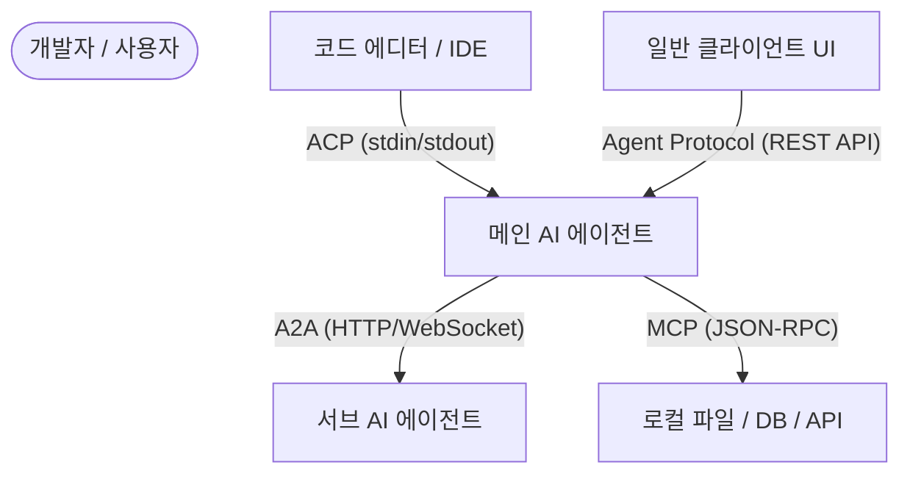

# 🌐 일반 에이전트 통신 프로토콜: Agent Protocol 및 Google A2A

코드 에디터와 코딩 에이전트 간의 연동을 정의하는 ACP(Agent Client Protocol)와 달리, 특정 도메인에 종속되지 않고 일반적인 자율 에이전트(Autonomous Agents)의 가동, 벤치마킹, 그리고 에이전트 간 협업(A2A)을 표준화하기 위해 설계된 오픈 규격 프로토콜들이 존재합니다. 대표적으로 **Agent Protocol**과 **Google Agent-to-Agent (A2A) Protocol**이 있습니다.

---

## 1. Agent Protocol (agentprotocol.ai)

**Agent Protocol**은 개발자가 구축한 자율 에이전트와 클라이언트 애플리케이션(UI, 모니터링 툴 등) 간의 통신을 표준화하는 프레임워크 독립적인 **REST API 규격**입니다.

* **배경**: AutoGPT를 개발하는 AGI, Inc.와 AI Engineer Foundation이 공동 주도하여 제작되었습니다. 서로 다른 프레임워크(AutoGPT, LangChain, 개별 커스텀 코드)로 구축된 에이전트들의 인터페이스가 제각각이어서 발생하는 통합 오버헤드를 해결하기 위해 개발되었습니다.
* **핵심 개념 (Task-Step 모델)**:
  * 에이전트의 작업을 **Task(전체 작업)**와 **Step(개별 실행 단계)**의 개념으로 정형화합니다.
  * 클라이언트는 `POST /ap/v1/agent/tasks`를 호출해 작업을 생성하고, `POST /ap/v1/agent/tasks/{task_id}/steps`를 통해 에이전트에게 다음 단계를 실행하도록 요청(Trigger)합니다.
* **주요 특징**:
  * **프레임워크 비종속성**: Python, JavaScript, Go 등 어떤 언어로 작성된 에이전트든 REST API 엔드포인트 규격만 준수하면 호환됩니다.
  * **범용 툴링 가능**: 개발자는 모든 에이전트에서 동작하는 범용 에이전트 모니터, 디버거 UI, 벤치마크 평가 도구 등을 1회 개발로 구축할 수 있습니다.
  * **일률적 벤치마킹**: 규격화된 입출력 인터페이스를 활용하여 에이전트들의 실질적인 성능과 수행 능력을 비교 평가(Benchmarking)하기 용이합니다.

---

## 2. Google Agent-to-Agent (A2A) Protocol

**Agent-to-Agent (A2A) 프로토콜**은 서로 다른 환경과 프레임워크에서 작동하는 **AI 에이전트 간의 상호 작용 및 협업**을 지원하는 오픈소스 애플리케이션 레이어 프로토콜입니다.

* **배경**: 2025년 4월 Google이 최초 발표한 이후, 에이전트 생태계의 중립적인 성장을 위해 **Linux Foundation**에 기부되어 글로벌 연합(Google, IBM, MS, AWS 등) 체계로 운영되고 있습니다.
* **핵심 기능**:
  * **에이전트 검색 (Agent Discovery)**: 에이전트는 자신의 역할, 가능 도구, 입력 포맷을 명시한 **'Agent Card(에이전트 카드)'**를 통해 네트워크에 자신의 존재를 알리고 다른 에이전트를 검색합니다.
  * **작업 위임 및 협업**: 단일 에이전트가 처리하기 어려운 작업을 타 에이전트에 위임하고, 하위 작업의 진행 상태를 실시간 트래킹하며 결과물(Artifacts)을 공유받습니다.
  * **상태 보호 (Encapsulation)**: 에이전트들이 내부 메모리, 프롬프트 템플릿, 로컬 도구를 외부에 노출하지 않으면서도 보안이 확보된 상태로 결과 데이터만 주고받을 수 있습니다.
* **기술 스택**: 웹 표준 기술인 HTTP, JSON-RPC 2.0 및 실시간 상태 동기화를 위한 **SSE(Server-Sent Events)**를 차용합니다.

---

## 3. 에이전트 표준 프로토콜 지형도 (Mapping)

현대 AI 에이전트 인프라는 각 통신 계층에 따라 다음과 같이 역할이 분담됩니다.

* **MCP (Model Context Protocol)**: **에이전트 $\rightarrow$ 컨텍스트/도구**의 연결을 규격화 (stateless 데이터 제공 중심).
* **ACP (Agent Client Protocol)**: **에디터 $\rightarrow$ 코딩 에이전트**의 연결을 규격화 (IDE 특화 UI/Diff 제어 중심).
* **Agent Protocol**: **클라이언트 $\rightarrow$ 일반 에이전트**의 실행 제어 규격화 (REST API 기반 Task/Step 제어 중심).
* **A2A (Agent-to-Agent)**: **에이전트 $\rightarrow$ 에이전트** 간의 자율적 협업 규격화 (Linux Foundation 주도의 Multi-Agent 연동 중심).

---

**관련 문서**:
* [[wiki/Agents/Frameworks/000_Frameworks-MOC.md]]
* [[wiki/Agents/Frameworks/Agent-Client-Protocol-ACP.md]]
* [[wiki/Agents/Implementation/Supermemory-Architecture-and-MCP.md]]
