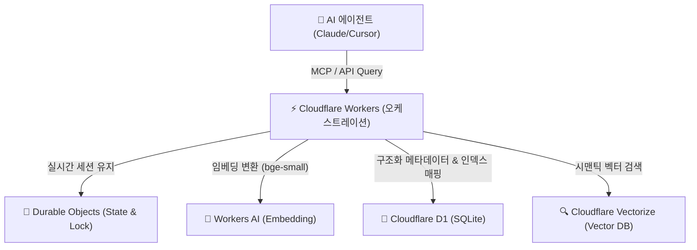

# 🧠 Supermemory: 에이전트 네이티브 메모리 시스템

**Supermemory**는 단순히 정보를 저장하는 벡터 데이터베이스를 넘어, LLM의 영구적이고 구조화된 기억을 관리하고 최적의 컨텍스트를 제공하는 **'Context Engineering'** 플랫폼입니다. 

---

## 1. 아키텍처 및 서버리스 기술 스택 (Cloudflare Ecosystem)
Supermemory는 인프라 관리 부담을 줄이고 극도로 낮은 지연 시간을 유지하기 위해 **Cloudflare**의 에지 서버리스 기술을 적극적으로 활용합니다.



### 🛠️ 구성 요소 상세
*   **컴퓨트 및 라우팅 (Cloudflare Workers)**: API 엔드포인트 오케스트레이션, 실시간 SSE(Server-Sent Events) 스트리밍 및 동적 MCP 서버 인터페이스를 구동합니다.
*   **상태 관리 (Cloudflare Durable Objects)**: 동시성 제어 및 실시간 에이전트 메모리 세션 동기화를 안정적으로 지원합니다.
*   **서버리스 임베딩 (Cloudflare Workers AI)**: 외부 호출 없이 Cloudflare 엣지에서 `bge-small-en-v1.5` 모델을 통해 입력을 고속 벡터화합니다.
*   **메타데이터 저장소 (Cloudflare D1)**: 원본 텍스트, 타임스탬프, 태그, 출처 URL 등 관계형 데이터를 관리하는 SQLite 기반 분산 DB입니다.
*   **벡터 검색 엔진 (Cloudflare Vectorize)**: 생성된 벡터를 고속 유사성 인덱싱하여 개념적 매칭을 수행합니다.

---

## 2. 주요 혁신 기술 및 기능

### 1) SMFS (Supermemory Filesystem)
*   **개념**: 에이전트가 메모리를 로컬 디렉토리 구조처럼 다룰 수 있게 해주는 가상 파일 시스템 레이어입니다 (2026.05 출시).
*   **효과**: 필요한 문맥만 정밀 타겟팅하여 파일 탐색 형태로 메모리를 읽어옴으로써 기존 무차별 RAG 대비 검색 비용을 **최대 55% 절감**합니다.

### 2) 하이브리드 검색 엔진 (Hybrid Retrieval)
단일 질의에 대해 다음 세 가지 요소를 결합해 지연 시간 **300ms 이하**의 고정밀 컨텍스트를 추출합니다.
*   **Vector Similarity**: 개념/주제적 유사성 검색.
*   **Keyword Matching**: 고유 명사 및 고유 ID 기반 텍스트 매칭.
*   **Graph Traversal**: 엔티티(사용자-문서-메모리) 간의 논리적 관계와 계통 추적.

### 3) Dynamic Dreaming & Smart Decay (동적 지식 합성과 감쇠)
*   백그라운드에서 파편화된 메모리 노드들을 연결하고 구조화된 지식으로 재합성합니다.
*   시간 경과에 따라 호출되지 않는 메모리의 가중치를 조절하는 **시간 감쇠(Time-decay) 알고리즘**을 도입하여 컨텍스트 창의 오염을 방지합니다.
*   **사용자 프로필 동적 진화 및 자동 망각**: 사용자의 개발 선호도, 코딩 스타일, 진행 프로젝트 맥락을 지속적으로 업데이트하며 프로필을 실시간 갱신합니다. 시간이 지나 모순되거나 만료된 사실은 자동 망각(Auto-forgetting/Auto-decay) 처리하여 지식의 정합성을 보장합니다.
*   **만료 정책 및 명시적 망각**: Time-to-Live(TTL) 정책을 통해 수명이 다한 임시 정보를 자동 파기하며, 새로운 정보 유입 시 충돌하는 구 정보는 `isLatest` 마크로 무효화(Trace는 보존)합니다. 사용자는 명시적으로 삭제(forget) 명령을 내릴 수 있고, 기본 쿼리에서 제거되나 감사 목적으로 우회 복구가 가능합니다.

### 3.1 Graph Memory 엣지 · Dreaming 모드 (공식 개념 정본)

Documents(원본)와 Memories(추출 사실)를 분리한다. 새 사실은 기존 노드에 세 가지 관계로만 붙는다 ([Graph memory](https://supermemory.ai/docs/concepts/graph-memory)):

| 관계 | 의미 | 검색 |
| :--- | :--- | :--- |
| **Updates** | 이전 사실을 대체 (`isLatest`) | 최신만 |
| **Extends** | 상세 추가, 양쪽 유효 | 둘 다 |
| **Derives** | 명시되지 않은 추론 | relatedMemories |

- **Dreaming 기본값 `dynamic`**: 관련 문서를 묶어 세션 단위로 그래프 갱신 — 대화에 안정 `customId`를 유지할 때 품질↑. 고정 cron이 아니라 **조용한 구간·신규 컨텍스트 양** 휴리스틱으로 주기·깊이를 고른다. 그래프 catch-up은 백그라운드에서 **최대 약 15분**.
- **`dreaming: "instant"`**: 문서 단독 즉시 그래프 반영(데모·add 직후 search). 추가 연산 비용.
- **검색 vs dreaming**: document `status: done`은 청크 인덱싱 완료. 그래프 Memories는 dreaming 2단계에서 온다. 미 dream 문서도 하이브리드 검색(대화 검색 fallback)으로 즉시 조회 가능 — dreamt 상태가 뒤따라 풍부해진다.
- **자동 망각**: 시간 만료 임시 사실 · Updates 모순 해소 · 잡음 필터. 명시 `memory(action:"forget")`는 MCP/API.

```typescript
await client.add({ content: "...", containerTag: "user_123" /* + dreaming */ });
const results = await client.search({
  q: "where does Alex work?",
  containerTag: "user_123",
  include: { relatedMemories: true },
});
```

### 4) Atomic Memory Generation (원자적 기억 생성)
*   일반적인 Chunking과 달리 의미가 완성된 **'원자적 메모리(Atomic Memories)'** 단위로 문서를 분해하여 저장하며, 중복 감지기(Duplicate Detector)를 활용해 유사도 85-95% 이상의 중복 정보가 유입될 경우 자동 병합 및 스킵합니다.

---

## 3. 에코시스템 및 MCP 연동

### 🔌 MCP Server 4.0 Native Support (2026-07-11 PM 업데이트)
Supermemory **MCP Server 4.0**은 Cloudflare Workers + Durable Objects 위에서 동작하며, LongMemEval·LoCoMo·ConvoMem 3대 AI 메모리 벤치마크에서 **#1** 기록을 달성했습니다. Claude Desktop, Cursor, VS Code, Windsurf, Claude Code 등 Model-Agnostic 클라이언트 간 **크로스 세션 영구 메모리**를 공유합니다.

- **무상태(Stateless) 아키텍처 도입 (2026년 7월 말)**: MCP 공식 스펙이 기존의 stateful 커넥션 모델에서 **완전 무상태(stateless)**로 전환됨에 따라, Supermemory 또한 에지 및 Cloudflare Workers 기반의 서버리스 환경에서 통신 오버헤드와 호스팅 유지 비용을 극적으로 낮추는 최적화가 적용되었습니다.

**MCP Resources (URI)**:
- `supermemory://profile` — 안정적 선호도 + 최근 활동
- `supermemory://projects` — 프로젝트별 메모리 스코프 목록
- **설치 명령어**: `npx -y install-mcp@latest https://mcp.supermemory.ai/mcp --client claude --oauth=yes` 를 통해 클라이언트에 연동.
- **MCP Apps 인터랙티브 뷰 (2026-08-01 revamp)**: 스페이스 선택·메모리 저장·파일 업로드·메모리 그래프를 클라이언트 대화 안에서 렌더. 도구는 `search_memory`(optional `includeProfile`) / save·forget / `listMemories`.
- **제공되는 3대 핵심 도구**:
    - `memory`: 대화 중 중요한 사실이나 지식을 Supermemory에 영구 기록(또는 삭제).
    - `recall`: 대화 주제와 유사한 과거의 기억 검색 및 사용자 프로필 요약(Profile Summary) 추출.
    - `context`: 세션 진행에 따라 실시간 사용자 기본 설정 및 활동 이력을 에이전트에 동적으로 주입(Inject).

### ⚡ Memory vs. RAG (개념적 차이 및 벡터 DB 추상화)
- **RAG (Retrieval-Augmented Generation)**: 단순히 문서나 청크를 벡터 데이터베이스에 저장한 후 질의와 가장 유사한 조각을 찾아 모델에 전달하는 stateless 방식입니다. 시간의 흐름에 따른 지식의 변화나 모순 관리가 불가능합니다.
- **Naive RAG의 한계와 실전 실패 (Silent Failure)**: 대다수 Naive RAG 시스템은 정보 검색은 수행하지만, 정교하지 못한 청킹 및 단순 벡터 유사도 매칭으로 인해 문맥적 일관성이 결여된 파편화된 정보를 LLM에 주입하게 되며, 실전 프로덕션 환경의 복잡한 쿼리에 대해 침묵형 실패(Silent Failure)를 야기하기 쉽습니다. Supermemory는 `Smart-Rag-Engine`과 마찬가지로 키워드(BM25) + Dense Vector 하이브리드 검색 정규화 및 의미 단위 재그룹화/압축을 수행하여 이 한계를 보완합니다.
- **벡터 DB 추상화**: 사용자가 직접 청크 크기 설정, 임베딩 모델 선택, 수동 인덱스 정리, 데이터 프루닝 파이프라인을 구축해야 하는 일반 벡터 데이터베이스와 달리, Supermemory는 팩트 추출, 중복 제거, 만료 주기 관리를 내부 API 수준에서 자동화하여 상위 계층의 메모리 엔진으로 작동합니다.
- **Persistent Memory (Supermemory)**: 대화 과정에서 도출되는 사실(Facts), 사용자 취향(Preferences), 프로젝트 컨텍스트를 동적으로 추출하고, 기존의 기억과 충돌하는 새 정보가 수집되면 기존 지식을 업데이트하거나 오래된 정보를 감쇠 및 망각하는 Stateful 지식 진화 메커니즘을 내포합니다.

### 💻 개발자 API 및 자체 호스팅 (Self-Hosting)
- `@supermemory/tools/ai-sdk`를 사용하여 한 줄의 코드로 자사 에이전트에 메모리 레이어 연동 가능.
- **다양한 포맷 통합**: PDF, 이미지, 비디오, 코드베이스 등 멀티모달 데이터를 하나의 인프라로 수집하여 처리합니다.
- MIT 라이선스 하에 배포되어 데이터 보안이 민감한 엔터프라이즈 환경에서는 로컬 또는 전용 클라우드에 온프레미스로 자체 호스팅이 가능합니다. 특히 **Ollama**와 연동하여 네트워크 연결이 전혀 없는 완전한 오프라인 환경에서도 로컬 메모리 레이어를 독립 구동하여 개인정보 및 기업 기밀 누출을 원천 방지할 수 있습니다. 싱글 바이너리로 제공되어 배포 오버헤드가 극도로 적습니다.

### 🖥️ Local Runtime `:6767` · CLI · Profile API (2026-07-12)

로컬 부트 시 graph engine·임베딩·자격증명을 초기화하고 API 키를 출력한다. Memory API 엔드포인트는 **`http://localhost:6767`**. 데이터는 `./.supermemory`(`SUPERMEMORY_DATA_DIR`), 포트는 `PORT`/`SUPERMEMORY_PORT`(기본 6767). `OPENAI_API_KEY` + `OPENAI_BASE_URL`로 Ollama/LM Studio/vLLM 등 OpenAI-compatible 백엔드를 연결한다. **호스팅 전용**(셀프호스트 바이너리 미포함): Drive/Notion/Gmail 커넥터, managed MCP, 최적화 extraction, 글로벌 스케일.

```typescript
const client = new Supermemory({ apiKey: "sm_...", baseURL: "http://localhost:6767" });
const { profile, searchResults } = await client.profile({
  containerTag: "user_123",
  q: "선호 코딩 스타일?",
});
// profile.static → 안정 선호도 / profile.dynamic → 최근 활동
```

- **프로젝트 스코프**: MCP `headers["x-sm-project"]` 또는 tool `containerTag`
- **`context` prompt vs `recall`**: 대화 시작 시 시스템 주입은 `context`, 특정 질의 검색은 `recall`, 원본 프로필은 `supermemory://profile`
- **CLI**: memories/documents/profiles/tags/connectors/API keys 터미널 관리
- **부가**: Instant dreaming, PPTX·오디오(Gemini 2.5 Flash STT) 수집, MemoryBench, Claude Code skill (`npx skills add supermemoryai/skills`), `/v4/profile`

### 3.2 MemoryBench (표준 메모리 벤치 루프)

정본: [MemoryBench overview](https://supermemory.ai/docs/memorybench/overview), repo [`supermemoryai/memorybench`](https://github.com/supermemoryai/memorybench) (MIT).

| 단계 | 의미 |
| :--- | :--- |
| `INGEST → SEARCH → ANSWER → EVALUATE → REPORT` | 전 provider 동일 파이프라인; **단계별 checkpoint** — 장시간 ingest·API 실패 시 마지막 완료 단계부터 resume |
| 내장 벤치 | LoCoMo · LongMemEval · ConvoMem (provider/benchmark/judge 모두 pluggable) |
| 자체 메모리 채점 | Claude skill `/memorybench` (또는 `npx skills add supermemoryai/memorybench` → `/benchmark-context`): init/ingest/search 발견 → adapter 생성 → 경쟁사와 accuracy/latency/context-token 병렬 보고 |

```bash
# 프레임워크 CLI 예
bun run src/index.ts run -p supermemory -b longmemeval -j gpt-4o -r my-run
```

KM raw 품질 루프에 붙일 때는 `dreaming: instant` 문서 단위 형성 직후 MemoryBench adapter로 야간 스모크를 돌리는 패턴을 우선한다(아이디어 백로그와 정합).

```json
{
  "mcpServers": {
    "supermemory": {
      "url": "https://mcp.supermemory.ai/mcp",
      "headers": { "x-sm-project": "your-project-id" }
    }
  }
}
```

### 🔌 OpenClaw · Claude Code 플러그인 (2026-07-13 PM)

에이전트 하네스별 1st-party 플러그인이 MCP 범용 클라이언트 경로를 보완한다 (Pro+; 셀프호스트 시 `baseUrl`/`SUPERMEMORY_API_URL` → `:6767`).

**OpenClaw** ([`@supermemory/openclaw-supermemory`](https://github.com/supermemoryai/openclaw-supermemory)):

```bash
openclaw plugins install @supermemory/openclaw-supermemory
openclaw supermemory setup          # API 키
openclaw supermemory setup-advanced # container / captureMode / customContainers
openclaw gateway restart
```

- Auto-Recall / Auto-Capture 기본 on. Tools: `supermemory_store|search|forget|profile`. Slash: `/remember`, `/recall`.
- `containerTag` 기본값 `openclaw_{hostname}`; `enableCustomContainerTags`로 work/personal 라우팅.

**Claude Code** ([`supermemoryai/claude-supermemory`](https://github.com/supermemoryai/claude-supermemory)):

```bash
/plugin marketplace add supermemoryai/claude-supermemory
/plugin install supermemory
export SUPERMEMORY_CC_API_KEY=sm_...
```

- **Reasoned recall**: 매 턴 Claude가 검색 필요 여부를 판단한 뒤에만 자동 검색(권한 프롬프트 없음) → 플랜 사용량·노이즈 제어.
- Team vs personal: `.claude/.supermemory-claude/config.json`의 `repoContainerTag` / `personalContainerTag`.
- 구 플러그인명 `claude-supermemory` → `supermemory` 리네임으로 in-place 업데이트 불가; marketplace update 후 재설치.

### 🔌 Self-hosted Pluggable Embeddings (server-v0.0.5, 2026-07-10)

[server-v0.0.5](https://github.com/supermemoryai/supermemory/releases/tag/server-v0.0.5)는 셀프호스트 임베딩을 교체 가능하게 만듭니다.

- **기본**: 로컬 ONNX
- **원격**: OpenAI / OpenAI-compatible / Google — 환경변수 `SUPERMEMORY_EMBEDDING_*`
- **잠금**: 최초 부팅 피커 + `embedding-plan.json`에 플랜 고정
- **안전 업그레이드**: lock 없는 기존 스토어는 legacy `local · Xenova/bge-base-en-v1.5 · 768d`로 가정. **동일 차원** 모델 전환만 허용(혼재 벡터 방지, fail-fast)

```bash
curl -fsSL https://supermemory.ai/install | bash
supermemory-server upgrade
# 예: OpenAI-compatible 원격 임베딩 (환경변수명은 릴리스 노트 SUPERMEMORY_EMBEDDING_* 계열)
# export SUPERMEMORY_EMBEDDING_PROVIDER=openai
# export SUPERMEMORY_EMBEDDING_API_KEY=...
```

KM 적용: 야간 린트/로컬 MCP(`:6767`)에서 사내 임베딩 엔드포인트로 바꿔도 기존 768d 스토어와 차원을 맞추면 재인덱싱 없이 전환 가능. 차원 변경 시에는 스토어 재구축이 필요.

### 🪟 Windows Self-Host Binary (server-v0.0.6, 2026-07-19)

[server-v0.0.6](https://github.com/supermemoryai/supermemory/releases/tag/server-v0.0.6)은 셀프호스트 바이너리에 **`supermemory-server-windows-x64.exe`**를 추가합니다. 기존 Darwin(arm64/x64)·Linux(arm64/x64)에 Windows x64가 합쳐져 데스크톱 OS 3종에서 동일 `:6767` 로컬 스택을 올릴 수 있습니다.

```powershell
# Windows: 릴리스 에셋에서 exe 다운로드 후 실행 (install.sh는 Unix용)
# https://github.com/supermemoryai/supermemory/releases/tag/server-v0.0.6
.\supermemory-server-windows-x64.exe
# 기본 Memory API: http://localhost:6767
```

KM/에이전트 적용: Windows 개발 머신에서도 Linux/macOS와 같은 pluggable embeddings(`SUPERMEMORY_EMBEDDING_*`)·MCP 로컬 경로를 공유할 수 있습니다. v0.0.5의 임베딩 lock 규칙은 그대로 따릅니다.

### 🛡️ MCP Tool Safety Annotations (ChatGPT hosts, 2026-07-21)

[PR #1330](https://github.com/supermemoryai/supermemory/pull/1330)이 MCP `tools/list`에 **tool annotations**를 붙입니다. ChatGPT 등 호스트가 읽기 전용 도구를 보수적으로 차단하던 문제를 완화합니다.

| 힌트 프로필 | 도구 | 의미 |
| :--- | :--- | :--- |
| **destructive / mutating** | `memory` (save/forget) | `readOnlyHint=false`, forget 경로 포함 |
| **read-only · idempotent** | `recall`, `listMemories`, `listProjects`, `whoAmI`, `memory-graph`, `fetch-graph-data` | 목록·검색·프로필 조회 안전 |

```text
# 호스트(ChatGPT) 재연결 후 tools/list 재조회
# - listMemories / recall → readOnlyHint=true 기대
# - memory → destructiveHint=true 기대
# 프로덕션 메타데이터가 안 바뀌면 앱 remove→re-add 필요
```

**적용 팁**: KM/에이전트 하네스에서도 MCP 클라이언트가 annotations를 존중하면 `listMemories`를 자동 approve 후보로 두고, `memory`만 확인 프롬프트를 유지할 수 있다.

### 🏢 Company Brain / Team mode GA (2026-07-22)

[PR #1342](https://github.com/supermemoryai/supermemory/pull/1342)이 **Company Brain(Team mode) 가입 게이트를 제거**했습니다. `company-brain-beta` PostHog 플래그·초대 전용 카드·팀 가입 시 `brainMode: "personal"`로 조용히 다운그레이드하던 로직을 없애고, 도메인 확인 단계에 personal workspace로 돌아가는 링크를 추가했습니다(ENG-1106).

**적용 팁**: KM/조직 메모리를 Team mode로 올릴 때 초대 대기가 필요 없다. Slack-first `/brain` 온보딩(#1310) 후 Scale trial 부착(#1313) 경로를 그대로 쓰면 된다. 개인 워크스페이스가 필요하면 도메인 확인 화면의 "Use a personal workspace instead"를 사용한다.

### 🧩 Agents 공유 메모리 워크스페이스 (2026-07-23)

[PR #1290](https://github.com/supermemoryai/supermemory/pull/1290)이 **Claude Code·Codex 컨테이너를 프로젝트 단위로 Agents 아래에 그룹핑**합니다. 에이전트 attribution을 유지하면서 Claude Code / Codex 소스 필터를 추가하고, 프로젝트 전용 라벨(+ Supermemory 로고)을 표시합니다.

**컨테이너 태그 패턴** (`agent-space.ts`):

| kind | 예시 패턴 |
| :--- | :--- |
| `canonical-project` | `repo_<slug>__<16hex>` |
| `personal` | `user_project_<hex>` |
| `project` | `repo_<slug>` |
| legacy | `codex_user_*`, `claudecode_project_*`, `codex_project_*` |

```ts
// 소스 필터 → MCP/플러그인 source 값
"claude-code" → ["claude-code", "claude-code-plugin"]
"codex"       → ["codex"]
```

**적용 팁**: KM에서 Claude Code와 Codex가 같은 레포를 만질 때 `repo_*` 태그로 메모리를 묶고, UI/검색에서 Agents 필터로 소스를 분리한다. `x-sm-project`와 함께 쓰면 Team Brain + 에이전트 하네스별 뷰가 동시에 유지된다.

### 🔓 MCP unscoped recall 스코프 수정 + OpenCode Agents (2026-07-24)

1. **[#1357](https://github.com/supermemoryai/supermemory/pull/1357)** — unscoped `recall`이 `sm_project_default`를 강제해, 다른 org space만 읽을 수 있는 호출자에게 **오해성 403**이 나던 버그 수정. search API가 caller의 **readable scope**를 선택하고, 구체 스코프가 없으면 profile enrichment를 건너뛴다.
2. **[#1354](https://github.com/supermemoryai/supermemory/pull/1354)** — **OpenCode** 컨테이너를 Agents 워크스페이스에 그룹핑(Claude Code/Codex에 이어). 소스 필터 추가, 빈 agent pill 숨김.

```ts
// Agents 소스 필터 확장 (#1290 + #1354)
"claude-code" → ["claude-code", "claude-code-plugin"]
"codex"       → ["codex"]
"opencode"    → ["opencode"]  // Agents space grouping
```

**적용 팁**: 멀티 테넌트 MCP에서 unscoped recall 403이 나오면 클라이언트 권한보다 스코프 강제 여부를 먼저 의한다. OpenCode 하네스는 Claude Code/Codex와 동일하게 Agents 필터·`repo_*` 태그로 KM 메모리를 공유한다.

### 🖱️ Cursor Agents + Company Brain 공유 브랜딩 (2026-07-25)

1. **[#1361](https://github.com/supermemoryai/supermemory/pull/1361)** — **Cursor** 프로젝트를 Agents 스페이스에 추가(소스 필터·레거시 라벨·아이콘·Codex형 structured conversation 렌더링). `agent-space.ts` / `plugin-document.ts` 중심.
2. **[#1360](https://github.com/supermemoryai/supermemory/pull/1360)** — Company Brain 워크스페이스의 share preview가 org possessive + "Company Brain" 브랜딩을 사용(`useHasCompanyBrain`).
3. **[#1359](https://github.com/supermemoryai/supermemory/pull/1359)** — Slack 계정 링킹 확인 UI(Nova).

```ts
// Agents 소스 필터 (#1290 + #1354 + #1361)
"claude-code" → ["claude-code", "claude-code-plugin"]
"codex"       → ["codex"]
"opencode"    → ["opencode"]
"cursor"      → ["cursor"]  // Agents space grouping
```

**적용 팁**: KM을 Cursor·Claude Code·OpenCode가 같이 쓸 때 Agents에서 `cursor` 필터로 소스 attribution을 분리하고, Company Brain 공유 링크는 org 브랜딩이 나오는지 한 번 확인한다.

### 🔌 ChatGPT MCP 설치 경로·플랜 게이트 (2026-07-26)

[PR #1358](https://github.com/supermemoryai/supermemory/pull/1358)이 Connect AI / MCP 모달의 ChatGPT 수동 설치 안내를 갱신했습니다.

| 항목 | 이전 | 현재 (#1358) |
| :--- | :--- | :--- |
| Developer mode | Settings → Apps → Advanced settings | **Settings → Security and Login** (하단) |
| 앱 생성 | “Create an app and paste MCP URL” | **https://chatgpt.com/plugins** |
| 플랜 | (없음) | **Write-capable custom MCP apps = Business & Enterprise only** |

```text
# ChatGPT ↔ Supermemory MCP (운영 체크리스트)
1. ChatGPT → Settings → Security and Login → Developer mode ON
2. https://chatgpt.com/plugins 에서 MCP URL 등록 + OAuth
3. 쓰기 도구(memory 등)가 필요하면 Business/Enterprise 플랜 확인
4. Free/Plus에서는 read-only 또는 호스트 차단 가능 → 로컬 MCP/API 키로 대체
```

**적용 팁**: KM을 ChatGPT 커스텀 MCP로 붙일 때 쓰기(`memory`)가 막히면 플랜 게이트를 먼저 의한다. Cursor/Claude Code OAuth 경로는 이 UI 변경과 무관하다.

### Company Brain CTA · custom MCP 개방 (2026-07-28)

1. **Personal → Company Brain 온보딩** ([#1370](https://github.com/supermemoryai/supermemory/pull/1370)): org에 Company Brain이 없는 personal-brain 사용자에게 대시보드 헤더 dismissible 카드 + 프로필 메뉴 상시 엔트리로 팀 온보딩 CTA. `?mode=team`으로 personal-domain 이메일이 personal onboarding으로 빗나가지 않게 함.
2. **Custom MCP for all CB users** ([#1371](https://github.com/supermemoryai/supermemory/pull/1371)): **Add custom MCP**를 `@supermemory.com` staff 게이트에서 해제 — Company Brain 사용자 전원에게 노출. 실패는 API 응답 기준; non-CB 가드·personal custom MCP 흐름은 유지.
3. **Workspace 선택 수정** ([#1372](https://github.com/supermemoryai/supermemory/pull/1372)) · Nova connector setup cards ([#1071](https://github.com/supermemoryai/supermemory/pull/1071)).

```text
# Company Brain + custom MCP (운영)
1. Personal 대시보드 CTA 또는 Profile → Company Brain 온보딩 (?mode=team)
2. Company Brain 워크스페이스에서 Add custom MCP → MCP URL/OAuth
3. 연결 실패 시 staff-only 메시지 대신 API 에러 본문 확인 (#1371)
```

**적용 팁**: 조직 KM을 Company Brain에 올릴 때 personal 사용자에게 CTA가 보이는지·커스텀 MCP가 staff 없이 등록되는지 회귀한다. 워크스페이스 전환 버그는 #1372 이후 재확인.

### Company Brain proactivity · Nova workspace prompts (2026-07-29)

1. **Proactivity settings UI** ([#1374](https://github.com/supermemoryai/supermemory/pull/1374)): Company Brain 선제 행동(proactivity) 설정 화면 — 에이전트가 언제 먼저 개입할지 워크스페이스 단위로 조절.
2. **Nova workspace prompt settings** ([#1323](https://github.com/supermemoryai/supermemory/pull/1323)): Nova 워크스페이스 프롬프트 설정 추가(커넥터 카드 #1071과 연계).

```text
# CB 운영 체크
1. Company Brain → Proactivity 설정이 저장·재로드되는지
2. Nova workspace prompt가 MCP/커넥터 세션 컨텍스트에 주입되는지
```

**적용 팁**: KM 야간 에이전트가 CB를 쓸 때 proactivity를 off/manual로 두고 배치 창에서만 켜는 정책을 문서화한다. Nova 프롬프트는 프로젝트 스코프(`x-sm-project`)와 충돌하지 않게 짧게 유지한다.

### SpaceState DO · /configure routes · proactivity picker (2026-07-30)

1. **SpaceState Durable Object** ([#1376](https://github.com/supermemoryai/supermemory/pull/1376)): Cloudflare Workers에 `SpaceState` DO 등록 — 스페이스(프로젝트) 단위 상태 sticky 세션.
2. **Configure 실라우트** ([#1378](https://github.com/supermemoryai/supermemory/pull/1378)): Configure 섹션을 `/configure` 하위 실라우트로 분리 — 딥링크·에이전트 내비게이션 가능.
3. **Proactivity exceptions 채널 검색** ([#1377](https://github.com/supermemoryai/supermemory/pull/1377)): proactivity 예외 피커에서 채널 검색.

```text
# CB / MCP 운영
1. SpaceState DO 배포 후 스페이스 전환·재연결이 sticky 한지 확인
2. /configure/* 딥링크로 설정 화면 직접 진입 (에이전트 UI 자동화)
3. Proactivity exceptions에 채널 검색으로 제외 목록 유지
```

**적용 팁**: KM 에이전트가 Company Brain 설정을 자동화할 때 `/configure` 경로를 고정하고, SpaceState sticky 실패 시 DO 재등록(#1376)을 점검한다.

### MCP app contracts · widget graph · OAuth validation (2026-08-01)

1. **MCP app contracts** ([`7e7e820`](https://github.com/supermemoryai/supermemory/commit/7e7e820) / #1394): widget 리소스 **content-hash** + production widget domain; direct tools에 **typed structured outputs**; default-space 호출 스코프; 그래프 렌더가 initial results와 app-side loading 모두 호환.
2. **MCP OAuth login validation** ([`6876920`](https://github.com/supermemoryai/supermemory/commit/6876920) / #1395): credential-validation 전용 로그인 경로 조정(일반 Google/magic-link는 유지).

```text
# MCP 클라이언트 회귀
1. Interactive Memory Graph / widget가 host 간 동일 content-hash로 로드되는지
2. add-memory / fetch-graph-data structured output 스키마가 클라이언트 파서와 맞는지
3. OAuth 연결 시 validation-only 계정과 일반 계정이 섞이지 않는지
```

**적용 팁**: Cursor/Claude MCP에 Supermemory를 붙일 때 그래프 위젯이 빈 화면이면 #1394 widget domain·hash를 먼저 확인한다. OAuth 실패는 #1395 validation flow와 일반 로그인 경로를 구분해 재시도한다.

### Company Brain Skills · trial visibility (2026-08-02)

1. **Skills settings** ([#1322](https://github.com/supermemoryai/supermemory/pull/1322) / [`f14cdd7`](https://github.com/supermemoryai/supermemory/commit/f14cdd7)): Company Brain **Skills** UI — **Org-wide** / **Personal** 섹션 분리, Markdown 업로드 autofill, 스코프별 생성·편집, **approval**, 서버 구동 permissions. 백엔드 하네스: `supermemoryai/mono#2611`.
2. **Trial visibility + setup timeline** ([#1384](https://github.com/supermemoryai/supermemory/pull/1384) / [`a787041`](https://github.com/supermemoryai/supermemory/commit/a787041)): 헤더 trial days pill(Autumn 우선·org metadata fallback); Brain home 타임라인 카드(`/brain/overview` milestones); onboarding Slack/헤더 trial copy. **`/brain/connections` → `/brain/overview`**.

```text
# Company Brain Skills / trial 운영
1. Org Skills = admin create + approval; Personal = member private playbook
2. Markdown 업로드 → autofill 후 스코프(Org/Personal) 확인
3. Brain home이 /brain/overview만 치는지(구 connections fetch 제거) 회귀
4. Trial pill 일수가 Autumn vs org metadata 중 어느 소스인지 확인
```

**적용 팁**: 조직 KM playbook을 Company Brain Skills로 올릴 때 Org 스코프+approval 경로를 쓰고, Personal과 섞지 않는다. 트라이얼 UI가 비면 `/brain/overview`와 Autumn 메타를 먼저 본다.

### MCP docs · graph/file upload fixes (2026-08-04)

1. **MCP docs refresh** ([#1408](https://github.com/supermemoryai/supermemory/pull/1408)): revamped tool/space/widget/OAuth 흐름 — ChatGPT Web 스크린샷 가이드(light/dark), overview·setup·tools·spaces·widget 갱신, manual JSON config는 dropdown.
2. **MCP graph + file uploads** ([#1397](https://github.com/supermemoryai/supermemory/pull/1397)): 그래프·파일 업로드 경로 수정.

```text
# MCP 클라이언트 온보딩
1. ChatGPT Web 가이드의 light/dark 스크린샷이 현재 호스트 UI와 맞는지
2. widget/space/OAuth 문서 경로가 로컬 MCP docs route와 일치하는지
3. 파일 업로드→그래프 반영이 #1397 이후 빌드에서 재현되는지
```

**적용 팁**: MCP 연결 문서를 에이전트 온보딩에 붙일 때 #1408 이후 docs를 쓰고, 그래프 위젯 빈 화면은 #1394 domain/hash와 #1397 upload 경로를 순서대로 본다.

### Custom MCP dialog: API key + extra headers (2026-08-05)

1. **Custom MCP UI** ([#1419](https://github.com/supermemoryai/supermemory/pull/1419)): 웹 다이얼로그에서 **API key**와 **extra headers**를 직접 설정 — JSON-only 편집 없이 `Authorization: Bearer sm_…`, `x-sm-project` 등 주입.
2. **Company Brain skills surface** ([#1412](https://github.com/supermemoryai/supermemory/pull/1412)): CB에서 만든 skills를 UI에 노출.

```json
{
  "mcpServers": {
    "supermemory": {
      "url": "https://mcp.supermemory.ai/mcp",
      "headers": {
        "Authorization": "Bearer sm_...",
        "x-sm-project": "your-project-id"
      }
    }
  }
}
```

**적용 팁**: OAuth 대신 키 경로를 쓸 때 #1419 UI로 헤더를 넣고, 프로젝트 스코프는 `x-sm-project`를 동일 다이얼로그에서 고정한다.

### forget-matching: dryRun preview → ids apply (2026-08-06)

[PR #1367](https://github.com/supermemoryai/supermemory/pull/1367) — `forget-matching`이 **`query`(시맨틱)** 또는 **`ids`(명시 삭제)** 중 하나만 받도록 확장됨(상호 배타).

| 모드 | 파라미터 | 용도 |
| :--- | :--- | :--- |
| preview | `dryRun: true` + `query` (+ optional `threshold`) | 후보 memory `id` 목록 |
| apply | `dryRun: false` + `ids` | preview에서 고른 id만 삭제(결정적) |
| query-only apply | `query` 재실행 | 컨테이너가 바뀌면 preview와 결과가 어긋날 수 있음 → **비권장** |

```text
# 대량/감사 가능한 망각
1. forget-matching dryRun+query → id 리스트 검토
2. 동일 ids로 dryRun=false 적용 (query 재실행 금지)
3. 다른 containerTag의 id는 무시됨 — 스코프 확인
4. query+ids 동시/둘 다 없음 → validation error
```

**적용 팁**: MCP `memory(action:"forget")`는 eventually-consistent·best-effort. 벌크·감사용 삭제는 API `forget-matching`의 **bound preview→ids apply**를 쓴다.

### Team MCP server · cross-editor shared context (2026-08-24)

[Changelog](https://supermemory.ai/changelog/) · [repo](https://github.com/supermemoryai/supermemory) — 업데이트된 **오픈소스 MCP 서버**가 팀 권한과 멀티 에디터 공유 컨텍스트를 정식 지원한다.

| 항목 | 내용 |
| :--- | :--- |
| **Team permissions** | 워크스페이스 단위 권한 제어 — 수동 ACL 없이 팀이 동일 지식 베이스를 공유 |
| **Cross-editor sync** | Claude · Cursor · Codex · OpenCode에서 **동일 shared context** — 에디터 전환 시 메모리 단절 방지 |
| **Self-host / audit** | MCP 연결 전체를 감사·커스터마이즈·셀프호스트 가능 |

```json
{
  "mcpServers": {
    "supermemory": {
      "url": "https://mcp.supermemory.ai/mcp",
      "headers": {
        "Authorization": "Bearer sm_...",
        "x-sm-project": "team-project-id"
      }
    }
  }
}
```

**v3 API 정본** (changelog 2026-08):

```bash
# 문서 ingest
curl -X POST https://api.supermemory.ai/v3/documents \
  -H "Authorization: Bearer $SM_API_KEY" \
  -H "Content-Type: application/json" \
  -d '{"content":"...", "containerTag":"user_123"}'

# 하이브리드 검색
curl -X POST https://api.supermemory.ai/v3/search \
  -H "Authorization: Bearer $SM_API_KEY" \
  -d '{"q":"...", "containerTag":"user_123"}'
```

- OpenAPI: https://supermemory.ai/openapi.json · MCP server card: https://supermemory.ai/.well-known/mcp/server-card.json

**적용 팁**: KM 멀티 에이전트(Cursor+Claude Code+Codex)가 같은 `repo_*`/`x-sm-project`를 쓸 때 team MCP로 권한을 묶고, Agents 소스 필터(#1290·#1354·#1361)와 함께 attribution만 분리한다. 디버깅은 MCP 클라이언트 UI보다 **v3/documents + v3/search HTTP**로 먼저 재현한다([[apidog Supermemory API 가이드](https://apidog.com/blog/supermemory-api/)] 참고).

### Python SDK profile deduplication (commit 42f308b, 2026-08-18)

[42f308b](https://github.com/supermemoryai/supermemory/commit/42f308b224c768afd64e6bd77048ecee9183eb4f) — Python SDK에 **cross-source profile deduplication**을 포팅.

| 규칙 | 내용 |
| :--- | :--- |
| **우선순위** | `static` > `dynamic` > `search` (정규화된 profile 블록) |
| **치환** | 요청당 **owned memory block 1개** — 이전 블록을 **누적하지 않고 교체** |
| **동시성** | dedup은 **request-local**(공유 상태 없음) — 병렬 요청에서도 안전 |

영향 패키지: `agent-framework-python` · `openai-sdk-python` · `pipecat-sdk-python` middleware/utils.

```python
# Pipecat / OpenAI SDK / Agent Framework 경로 공통 패턴
# 동일 요청에서 static+dynamic+search profile이 겹치면 highest-priority만 주입
from supermemory_openai.middleware import SupermemoryMiddleware  # 예시 경로

# containerTag 격리 + dedupe는 SDK가 per-request 처리 — 앱 레벨 이중 주입 금지
```

**적용 팁**: LangGraph·Pipecat·OpenAI Agents에 Supermemory middleware를 **중첩**하면 profile 블록이 다시 쌓일 수 있다 — 한 SDK 경로만 선택. KM 야간 배치는 `containerTag`를 에이전트/프로젝트별로 고정하고 HTTP API로 ingest→search 검증 후 MCP에 연결한다.

### MCP Server 4.0 공식 tool surface (2026-08-25)

[공식 MCP 문서](https://supermemory.ai/docs/supermemory-mcp/mcp) 기준 원격 엔드포인트는 `https://mcp.supermemory.ai/mcp`이다. OAuth가 기본이며 `sm_` API 키를 `Authorization` 헤더에 넣으면 OAuth를 건너뛴다. 프로젝트 스코프는 `x-sm-project` 헤더.

| Tool | 역할 | 핵심 인자 |
| :--- | :--- | :--- |
| `search_memory` | 공간 내 시맨틱 회상 | `query`(필수), `includeProfile`, `containerTag` |
| `add_memory` | 저장·망각 | `content`, `action`(`save` 기본 / `forget`) |
| `listMemories` | 최근 추출 메모리 목록 | `page`, `limit`, `containerTag` |

- **Prompt `context`**: 인자 없음 — 활성 space 프로필 + 최근 활성 space 최대 3개.
- **Resources**: `supermemory://profile`, `supermemory://projects`.
- **로컬**: `supermemory-server` → `http://localhost:6767`, 기본 임베딩 `Xenova/bge-base-en-v1.5`, 데이터 `./.supermemory`.
- **HTTP API v3**: `POST /v3/add`, `POST /v3/search` — [OpenAPI](https://supermemory.ai/openapi.json).

레거시 클라이언트가 `memory`/`recall` 이름을 쓰면 최신 MCP 4.0 도구명으로 매핑해 호출한다.

---

## 4. 2026년 에이전틱 메모리 인프라 지형도 및 거버넌스 (2026-08-28 업데이트)

2026년 AI 생태계는 대용량 컨텍스트 윈도우를 단순 무차별적으로 채우는 "Prompt Stuffing" 관성에서 탈피하여, 에이전트의 효율성과 정합성을 통제하는 **'거버넌스형 메모리 인프라(Governed Memory Infrastructure)'** 구조로 완전히 수렴하였습니다. 특히 **EU AI Act (2026년 8월 전면 시행)** 및 **NIST AI RMF (Risk Management Framework)**의 규제 표준에 따라 AI 메모리 레이어의 데이터 통제권과 프라이버시가 핵심 아키텍처 설계 기준으로 자리 잡았습니다.

### 📊 주요 오픈소스 AI 메모리 엔진 및 플랫폼 비교

| 솔루션 / 도구 | 핵심 아키텍처 특징 | 주요 용도 및 권장 환경 |
| :--- | :--- | :--- |
| **Mem0** | 하이브리드 벡터/그래프/Key-Value 형태 | 애플리케이션 레벨의 간편한 사용자 개인화 및 여러 세션에 걸친 장기 메모리(Universal Memory) 레이어 제공 |
| **Supermemory** | 시맨틱 그래프 + MCP 결합 | 자가 호스팅(Self-hosting)이 유연하고, sub-300ms 초저지연을 제공하는 이식성 높은 다중 플랫폼용 컨텍스트 엔진 (Unified Memory API) |
| **Zep** | 시공간 지식 그래프 (Temporal Knowledge Graphs) | 시간에 따른 사실 관계 진화와 시계열 문맥 추적(언제 사실을 배웠는지)이 중요한 중장기 프로젝트 |
| **Letta** (구 MemGPT) | 에이전트 자율 관리 OS 아키텍처 | 에이전트가 가상 OS처럼 자체 내부 함수 호출을 통해 L1/L2(RAM/Disk) 메모리 영역을 제어하고 수정하는 자율 런타임입니다. 2026년 업데이트를 통해 클라이언트 사이드 스킬(client-side skills) 및 Git 기반 메모리 버전 관리(versioning)를 도입하여 에이전트가 스스로 메모리 이력을 주도적으로 다루도록 고도화되었습니다. |
| **Cognee** | 그래프 기반 지식 검색 | 정형/비정형 문서의 그래프 데이터 파이프라인 생성 및 관계 추적 분석 |

### 🔑 메모리 거버넌스의 핵심 개념 및 설계 방향성
*   **Memory Governance (메모리 거버넌스)**: AI 에이전트의 메모리 활용에 관한 추적, 통제, 감사(Audit) 체계. 
    *   **메모리 오염(Memory Poisoning)** 방지: 잘못된 사실이 메모리에 주입되는 것을 차단.
    *   **권한 누수(Privilege Creep)** 방지: 타 계정의 민감 지식이나 권한이 메모리 참조 중 누출되는 것을 방지.
    *   **낡은 맥락(Stale Context)** 해소: 사용자의 오래된 설정이나 설정 변경으로 만료된 규칙을 메모리에서 정리.
*   **규제 준수를 위한 3대 기술 기둥 (EU AI Act & GDPR 준수)**:
    1.  **Data Provenance & Lineage (데이터 출처 추적)**: 각 메모리 노드와 팩트(Fact)가 어떤 원천 문서(`raw/`), 대화 세션, 또는 에이전트 실행에 의해 기입/수정되었는지 추적하여 데이터 계보를 명확히 유지합니다.
    2.  **Right to Erasure (잊힐 권리) 및 목적 제한**: 사용자의 명시적 요청 또는 개인정보보호법에 따라 특정 기억(엔티티, 관계성)을 물리적으로 영구 삭제할 수 있는 API를 제공하며, 지정된 비즈니스 목적 외의 메모리 접근을 원천 차단합니다.
    3.  **Least Privilege & Scoped Access (최소 권한 격리)**: 멀티 에이전트 및 멀티 테넌트 환경에서 `x-sm-project` 및 `containerTag`를 활용하여 작업 공간별 메모리 범위를 물리적/논리적으로 격리하고, 에이전트 권한 상승(Privilege Escalation)을 제어합니다.
*   **Auto-forgetting & Auto-decay (자동 망각 및 감쇠)**: 에빙하우스 망각 곡선에 기반하여 메모리 노드에 강도(Strength)를 부여합니다.
    *   시간 흐름에 따라 접근 빈도가 낮은 메모리의 강도를 낮추어 **감쇠(Auto-decay)**합니다.
    *   강도가 임계값 미만으로 떨어진 메모리는 자동으로 **망각(Auto-forgetting/Archiving)**하여 컨텍스트 노이즈를 극소화하고 메모리 팽창(Memory Bloat)을 방지합니다.
*   **MCP를 통한 크로스 툴 이식성 (Cross-Tool Portability)**: 하나의 코딩 에이전트나 IDE(예: Cursor)에서 획득한 지식 컨텍스트를 MCP 서버를 경유하여 타 도구(예: Claude Code, CLI)로 원활하게 동기화해 단절 현상을 예방합니다.

---
**관련 문서**:
- [[wiki/Agents/Memory-and-Cognition/000_Memory-and-Cognition-MOC.md]]
- [[wiki/Agents/Implementation/000_Implementation-MOC.md]]
