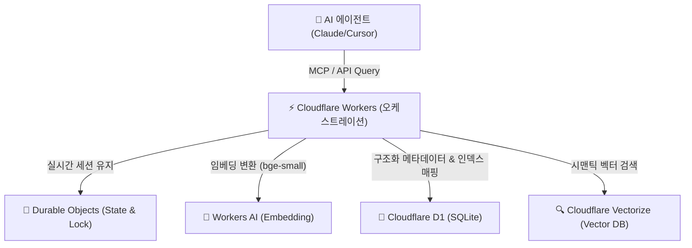

# 🧠 Supermemory: 에이전트 네이티브 메모리 시스템

**Supermemory**는 단순히 정보를 저장하는 벡터 데이터베이스를 넘어, LLM의 영구적이고 구조화된 기억을 관리하고 최적의 컨텍스트를 제공하는 **'Context Engineering'** 플랫폼입니다. 

---

## 1. 아키텍처 및 서버리스 기술 스택 (Cloudflare Ecosystem)
Supermemory는 인프라 관리 부담을 줄이고 극도로 낮은 지연 시간을 유지하기 위해 **Cloudflare**의 에지 서버리스 기술을 적극적으로 활용합니다.



### 🛠️ 구성 요소 상세
*   **컴퓨트 및 라우팅 (Cloudflare Workers)**: API 엔드포인트 오케스트레이션, 실시간 SSE(Server-Sent Events) 스트리밍 및 동적 MCP 서버 인터페이스를 구동합니다.
*   **상태 관리 (Cloudflare Durable Objects)**: 동시성 제어 및 실시간 에이전트 메모리 세션 동기화를 안정적으로 지원합니다.
*   **서버리스 임베딩 (Cloudflare Workers AI)**: 외부 호출 없이 Cloudflare 엣지에서 `bge-small-en-v1.5` 모델을 통해 입력을 고속 벡터화합니다.
*   **메타데이터 저장소 (Cloudflare D1)**: 원본 텍스트, 타임스탬프, 태그, 출처 URL 등 관계형 데이터를 관리하는 SQLite 기반 분산 DB입니다.
*   **벡터 검색 엔진 (Cloudflare Vectorize)**: 생성된 벡터를 고속 유사성 인덱싱하여 개념적 매칭을 수행합니다.

---

## 2. 주요 혁신 기술 및 기능

### 1) SMFS (Supermemory Filesystem)
*   **개념**: 에이전트가 메모리를 로컬 디렉토리 구조처럼 다룰 수 있게 해주는 가상 파일 시스템 레이어입니다 (2026.05 출시).
*   **효과**: 필요한 문맥만 정밀 타겟팅하여 파일 탐색 형태로 메모리를 읽어옴으로써 기존 무차별 RAG 대비 검색 비용을 **최대 55% 절감**합니다.

### 2) 하이브리드 검색 엔진 (Hybrid Retrieval)
단일 질의에 대해 다음 세 가지 요소를 결합해 지연 시간 **300ms 이하**의 고정밀 컨텍스트를 추출합니다.
*   **Vector Similarity**: 개념/주제적 유사성 검색.
*   **Keyword Matching**: 고유 명사 및 고유 ID 기반 텍스트 매칭.
*   **Graph Traversal**: 엔티티(사용자-문서-메모리) 간의 논리적 관계와 계통 추적.

### 3) Dynamic Dreaming & Smart Decay (동적 지식 합성과 감쇠)
*   백그라운드에서 파편화된 메모리 노드들을 연결하고 구조화된 지식으로 재합성합니다.
*   시간 경과에 따라 호출되지 않는 메모리의 가중치를 조절하는 **시간 감쇠(Time-decay) 알고리즘**을 도입하여 컨텍스트 창의 오염을 방지합니다.
*   **사용자 프로필 동적 진화 및 자동 망각**: 사용자의 개발 선호도, 코딩 스타일, 진행 프로젝트 맥락을 지속적으로 업데이트하며 프로필을 실시간 갱신합니다. 시간이 지나 모순되거나 만료된 사실은 자동 망각(Auto-forgetting/Auto-decay) 처리하여 지식의 정합성을 보장합니다.
*   **만료 정책 및 명시적 망각**: Time-to-Live(TTL) 정책을 통해 수명이 다한 임시 정보를 자동 파기하며, 새로운 정보 유입 시 충돌하는 구 정보는 `isLatest` 마크로 무효화(Trace는 보존)합니다. 사용자는 명시적으로 삭제(forget) 명령을 내릴 수 있고, 기본 쿼리에서 제거되나 감사 목적으로 우회 복구가 가능합니다.

### 4) Atomic Memory Generation (원자적 기억 생성)
*   일반적인 Chunking과 달리 의미가 완성된 **'원자적 메모리(Atomic Memories)'** 단위로 문서를 분해하여 저장하며, 중복 감지기(Duplicate Detector)를 활용해 유사도 85-95% 이상의 중복 정보가 유입될 경우 자동 병합 및 스킵합니다.

---

## 3. 에코시스템 및 MCP 연동

### 🔌 MCP Server 4.0 Native Support (2026-07-11 PM 업데이트)
Supermemory **MCP Server 4.0**은 Cloudflare Workers + Durable Objects 위에서 동작하며, LongMemEval·LoCoMo·ConvoMem 3대 AI 메모리 벤치마크에서 **#1** 기록을 달성했습니다. Claude Desktop, Cursor, VS Code, Windsurf, Claude Code 등 Model-Agnostic 클라이언트 간 **크로스 세션 영구 메모리**를 공유합니다.

**MCP Resources (URI)**:
- `supermemory://profile` — 안정적 선호도 + 최근 활동
- `supermemory://projects` — 프로젝트별 메모리 스코프 목록
- **설치 명령어**: `npx -y install-mcp@latest https://mcp.supermemory.ai/mcp --client claude --oauth=yes` 를 통해 클라이언트에 연동.
- **제공되는 3대 핵심 도구**:
    - `memory`: 대화 중 중요한 사실이나 지식을 Supermemory에 영구 기록(또는 삭제).
    - `recall`: 대화 주제와 유사한 과거의 기억 검색 및 사용자 프로필 요약(Profile Summary) 추출.
    - `context`: 세션 진행에 따라 실시간 사용자 기본 설정 및 활동 이력을 에이전트에 동적으로 주입(Inject).

### ⚡ Memory vs. RAG (개념적 차이 및 벡터 DB 추상화)
- **RAG (Retrieval-Augmented Generation)**: 단순히 문서나 청크를 벡터 데이터베이스에 저장한 후 질의와 가장 유사한 조각을 찾아 모델에 전달하는 stateless 방식입니다. 시간의 흐름에 따른 지식의 변화나 모순 관리가 불가능합니다.
- **Naive RAG의 한계와 실전 실패 (Silent Failure)**: 대다수 Naive RAG 시스템은 정보 검색은 수행하지만, 정교하지 못한 청킹 및 단순 벡터 유사도 매칭으로 인해 문맥적 일관성이 결여된 파편화된 정보를 LLM에 주입하게 되며, 실전 프로덕션 환경의 복잡한 쿼리에 대해 침묵형 실패(Silent Failure)를 야기하기 쉽습니다. Supermemory는 `Smart-Rag-Engine`과 마찬가지로 키워드(BM25) + Dense Vector 하이브리드 검색 정규화 및 의미 단위 재그룹화/압축을 수행하여 이 한계를 보완합니다.
- **벡터 DB 추상화**: 사용자가 직접 청크 크기 설정, 임베딩 모델 선택, 수동 인덱스 정리, 데이터 프루닝 파이프라인을 구축해야 하는 일반 벡터 데이터베이스와 달리, Supermemory는 팩트 추출, 중복 제거, 만료 주기 관리를 내부 API 수준에서 자동화하여 상위 계층의 메모리 엔진으로 작동합니다.
- **Persistent Memory (Supermemory)**: 대화 과정에서 도출되는 사실(Facts), 사용자 취향(Preferences), 프로젝트 컨텍스트를 동적으로 추출하고, 기존의 기억과 충돌하는 새 정보가 수집되면 기존 지식을 업데이트하거나 오래된 정보를 감쇠 및 망각하는 Stateful 지식 진화 메커니즘을 내포합니다.

### 💻 개발자 API 및 자체 호스팅 (Self-Hosting)
- `@supermemory/tools/ai-sdk`를 사용하여 한 줄의 코드로 자사 에이전트에 메모리 레이어 연동 가능.
- **다양한 포맷 통합**: PDF, 이미지, 비디오, 코드베이스 등 멀티모달 데이터를 하나의 인프라로 수집하여 처리합니다.
- MIT 라이선스 하에 배포되어 데이터 보안이 민감한 엔터프라이즈 환경에서는 로컬 또는 전용 클라우드에 온프레미스로 자체 호스팅이 가능합니다. 특히 **Ollama**와 연동하여 네트워크 연결이 전혀 없는 완전한 오프라인 환경에서도 로컬 메모리 레이어를 독립 구동하여 개인정보 및 기업 기밀 누출을 원천 방지할 수 있습니다. 싱글 바이너리로 제공되어 배포 오버헤드가 극도로 적습니다.

### 🖥️ Local Runtime `:6767` · CLI · Profile API (2026-07-12)

로컬 부트 시 graph engine·임베딩·자격증명을 초기화하고 API 키를 출력한다. Memory API 엔드포인트는 **`http://localhost:6767`**. 데이터는 `./.supermemory`(`SUPERMEMORY_DATA_DIR`), 포트는 `PORT`/`SUPERMEMORY_PORT`(기본 6767). `OPENAI_API_KEY` + `OPENAI_BASE_URL`로 Ollama/LM Studio/vLLM 등 OpenAI-compatible 백엔드를 연결한다. **호스팅 전용**(셀프호스트 바이너리 미포함): Drive/Notion/Gmail 커넥터, managed MCP, 최적화 extraction, 글로벌 스케일.

```typescript
const client = new Supermemory({ apiKey: "sm_...", baseURL: "http://localhost:6767" });
const { profile, searchResults } = await client.profile({
  containerTag: "user_123",
  q: "선호 코딩 스타일?",
});
// profile.static → 안정 선호도 / profile.dynamic → 최근 활동
```

- **프로젝트 스코프**: MCP `headers["x-sm-project"]` 또는 tool `containerTag`
- **`context` prompt vs `recall`**: 대화 시작 시 시스템 주입은 `context`, 특정 질의 검색은 `recall`, 원본 프로필은 `supermemory://profile`
- **CLI**: memories/documents/profiles/tags/connectors/API keys 터미널 관리
- **부가**: Instant dreaming, PPTX·오디오(Gemini 2.5 Flash STT) 수집, MemoryBench, Claude Code skill (`npx skills add supermemoryai/skills`), `/v4/profile`

```json
{
  "mcpServers": {
    "supermemory": {
      "url": "https://mcp.supermemory.ai/mcp",
      "headers": { "x-sm-project": "your-project-id" }
    }
  }
}
```

### 🔌 OpenClaw · Claude Code 플러그인 (2026-07-13 PM)

에이전트 하네스별 1st-party 플러그인이 MCP 범용 클라이언트 경로를 보완한다 (Pro+; 셀프호스트 시 `baseUrl`/`SUPERMEMORY_API_URL` → `:6767`).

**OpenClaw** ([`@supermemory/openclaw-supermemory`](https://github.com/supermemoryai/openclaw-supermemory)):

```bash
openclaw plugins install @supermemory/openclaw-supermemory
openclaw supermemory setup          # API 키
openclaw supermemory setup-advanced # container / captureMode / customContainers
openclaw gateway restart
```

- Auto-Recall / Auto-Capture 기본 on. Tools: `supermemory_store|search|forget|profile`. Slash: `/remember`, `/recall`.
- `containerTag` 기본값 `openclaw_{hostname}`; `enableCustomContainerTags`로 work/personal 라우팅.

**Claude Code** ([`supermemoryai/claude-supermemory`](https://github.com/supermemoryai/claude-supermemory)):

```bash
/plugin marketplace add supermemoryai/claude-supermemory
/plugin install supermemory
export SUPERMEMORY_CC_API_KEY=sm_...
```

- **Reasoned recall**: 매 턴 Claude가 검색 필요 여부를 판단한 뒤에만 자동 검색(권한 프롬프트 없음) → 플랜 사용량·노이즈 제어.
- Team vs personal: `.claude/.supermemory-claude/config.json`의 `repoContainerTag` / `personalContainerTag`.
- 구 플러그인명 `claude-supermemory` → `supermemory` 리네임으로 in-place 업데이트 불가; marketplace update 후 재설치.

---

## 4. 2026년 에이전틱 메모리 인프라 지형도 및 거버넌스 (2026-07-14 업데이트)

2026년 AI 생태계는 대용량 컨텍스트 윈도우를 단순 무차별적으로 채우는 "Prompt Stuffing" 관성에서 탈피하여, 에이전트의 효율성과 정합성을 통제하는 **'거버넌스형 메모리 인프라(Governed Memory Infrastructure)'** 구조로 완전히 수렴하였습니다.

### 📊 주요 오픈소스 AI 메모리 엔진 및 플랫폼 비교

| 솔루션 / 도구 | 핵심 아키텍처 특징 | 주요 용도 및 권장 환경 |
| :--- | :--- | :--- |
| **Mem0** | 전용 메모리 플랫폼 | 애플리케이션 레벨의 간편한 사용자 개인화 및 개발자 친화적인 SDK 적용 |
| **Supermemory** | 시맨틱 그래프 + MCP 결합 | 자가 호스팅(Self-hosting)이 유연하고, sub-300ms 초저지연을 제공하는 이식성 높은 다중 플랫폼용 컨텍스트 엔진 |
| **Zep** | 시간 인지형 지식 그래프 (Temporal) | 시간에 따른 사실 관계 진화와 시계열 문맥 추적이 중요한 중장기 프로젝트 |
| **Letta** (구 MemGPT) | 에이전트 자율 관리 런타임 | 에이전트가 직접 L1/L2 메모리 영역을 제어하고 수정하는 상시 자율 에이전트 런타임 |
| **Cognee** | 그래프 기반 지식 검색 | 정형/비정형 문서의 그래프 데이터 파이프라인 생성 및 관계 추적 분석 |

### 🔑 메모리 거버넌스의 3대 설계 방향성
1. **의미적 사실 추출 (Fact Extraction)**: 단순 대화 텍스트 chunking 대신, 의미 단위의 핵심 사실을 정제하고 중복을 제거하여 의미적 무결성을 유지합니다.
2. **시계열적 추론 및 망각 (Temporal Reasoning & Auto-decay)**: 시간이 경과함에 따라 불필요하거나 모순되는 구 정보를 동적으로 무효화하여 컨텍스트 노이즈를 극소화합니다.
3. **MCP를 통한 크로스 툴 이식성 (Cross-Tool Portability)**: 하나의 코딩 에이전트나 IDE(예: Cursor)에서 획득한 지식 컨텍스트를 MCP 서버를 경유하여 타 도구(예: Claude Code, CLI)로 원활하게 동기화해 단절 현상을 예방합니다.

---
**관련 문서**:
- [[wiki/Agents/Memory-and-Cognition/000_Memory-and-Cognition-MOC.md]]
- [[wiki/Agents/Implementation/000_Implementation-MOC.md]]
