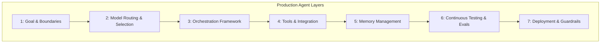

# 프로덕션 AI 에이전트 아키텍처 7대 계층

대부분의 불안정한 AI 데모는 시스템적인 고민 없이 프롬프트 엔지니어링만으로 시작하기 때문에 실제 프로덕션 수준의 작업량을 버티지 못하고 실패합니다. 신뢰할 수 있는 프로덕션 에이전트를 구축하기 위해서는 **시스템 지향적인 아키텍처 구성**이 필수적입니다.

## 1. 에이전트 시스템 7대 구성 레이어

### 1계층: 목표 및 제약 조건 설정 (Goal & Boundaries)
- 에이전트의 구체적 비즈니스 기여 방식과 성공 기준을 정립합니다.
- 지연시간(Latency), 비용(Cost), 안전성(Safety), 규정 준수(Compliance)의 한계선을 사전에 규정합니다.

### 2계층: 모델 라우팅 및 선택 (Model Routing & Selection)
작업의 복잡도와 인프라 한계에 따라 역할을 분산하는 단계입니다.
- **대형 추론 모델(Reasoning Models)**: 고도의 planning, 복합 논리 연산, 주요 결정에 활용합니다.
- **범용 대형 언어 모델(General LLMs)**: 일반 텍스트 생성, 맥락 요약, 질의응답 등에 투입합니다.
- **경량 소형 모델(SLMs / Edge Models)**: 분류(Classification), 라우팅(Routing), 경량 정보 추출, 온디바이스 연산에 매핑하여 성능과 비용을 최적화합니다.

### 3계층: 오케스트레이션 프레임워크 (Orchestration Framework)
비즈니스 로직과 흐름의 스케일에 적절한 오케스트레이션을 채택합니다.
- **단순 연쇄 흐름**: n8n, Gumloop, LangFlow 등 경량 래퍼 및 GUI 툴 적용.
- **엔터프라이즈 MAS 및 자율 루프**: LangChain, CrewAI, LlamaIndex, Google ADK, OpenAI Agent SDK 등을 활용하여 점진적으로 확장합니다.

### 4계층: 도구 및 외부 시스템 통합 (Tools & Integration)
- 에이전트가 행동(Action)할 수 있는 가용 도구를 연결합니다.
- API 앤드포인트, Model Context Protocol (MCP) 서버 연결, REST/GraphQL 연동, DB/FS(SQLite, Vector DB, POSIX Local FS) 바인딩 등을 포함합니다.

### 5계층: 메모리 레이어 (Memory Management)
- **단기 메모리(Short-term)**: 현재 진행 중인 태스크(단일 세션)의 Context 일관성 유지.
- **에피소드 메모리(Episodic)**: 과거 세션과 이벤트 시퀀스의 기록 추적.
- **장기 메모리(Long-term)**: 문서 지식 베이스(RAG), 사용자 선호 프로필 및 정책 아키텍처 연동.

### 6계층: 연속 테스트 및 평가 (Continuous Testing & Evals)
- 완성도 높은 벤치마크 및 테스트 셋을 통해 정확도, 지연시간, 비용을 모니터링합니다.
- 해피 패스(Happy path)뿐 아니라 비정상 입력 및 예외 케이스 위주의 Red-teaming 및 에이전트 하네스 테스트를 매일 수행합니다.

### 7계층: 배포 및 가드레일 (Deployment & Guardrails)
- 실시간 에러 로그 및 호출 속도 제한(Rate limits)을 제어합니다.
- 비정상 동작을 탐지하는 런타임 가드레일(Guardrails)과 CPU/API 폴백(Fallback) 구조를 배치하여 안전한 자율 운용을 지원합니다.

## 🔗 연결된 문서
- [[wiki/Agents/Implementation/000_Implementation-MOC.md]]
- [[wiki/Agents/Implementation/Deep-Agents-Architecture-Patterns.md]]
- [[wiki/Agents/Memory-and-Cognition/AI-Agent-Memory-Architecture.md]]
- [[index.md]]
