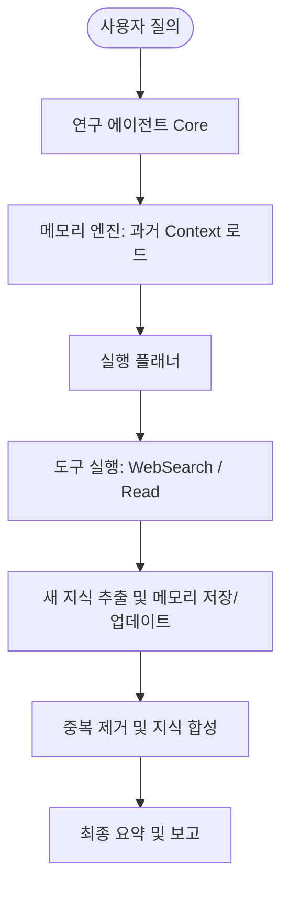

# Hands-On AI Engineering: 메모리 탑재 연구 보조 에이전트 구현 패턴

## 1. 개요
[Sumanth077/Hands-On-AI-Engineering](https://github.com/Sumanth077/Hands-On-AI-Engineering/tree/main/ai_agents/research_assistant_with_memory) 레포지토리의 구현 사례를 바탕으로 한, 지속성 메모리(Persistent Memory)를 탑재한 연구 보조 에이전트(Research Assistant Agent)의 아키텍처 및 구현 패턴입니다. 에이전트가 탐색 과정을 수행하면서 획득한 중간 지식을 보존하고 중복 탐색을 방지하는 실천적인 메모리 결합 설계 방식을 제시합니다.

## 2. 메모리 기반 에이전트 구조
이 설계 패턴은 단발성 프롬프트-답변 구조에서 탈피하여 에이전트가 상태(State)와 이전 작업 기록을 메모리에 누적하는 구조를 지향합니다.



## 3. 기술적 구현 스케치 (Python)
메모리 컨텍스트를 유지하며 연구 및 웹 서치를 자율 수행하는 에이전트 파이프라인의 핵심 구조는 다음과 같습니다.

```python
import os
from typing import List, Dict

class AgentMemory:
    """에이전트의 이전 작업 컨텍스트와 수집된 지식을 관리하는 메모리 클래스"""
    def __init__(self):
        self.history: List[Dict] = []
        self.collected_facts: List[str] = []

    def add_history(self, action: str, result: str):
        self.history.append({"action": action, "result": result})

    def add_fact(self, fact: str):
        if fact not in self.collected_facts:  # 기초 중복 검사
            self.collected_facts.append(fact)

    def get_context(self) -> str:
        history_str = "\n".join([f"- Action: {h['action']}\n  Result: {h['result'][:200]}..." for h in self.history[-3:]])
        facts_str = "\n".join([f"- {f}" for f in self.collected_facts])
        return f"### Recent Actions:\n{history_str}\n\n### Collected Facts:\n{facts_str}"

class ResearchAssistant:
    def __init__(self, memory: AgentMemory):
        self.memory = memory

    def step(self, task: str):
        # LLM 프롬프트에 현재까지 수집된 메모리 컨텍스트 주입
        context = self.memory.get_context()
        prompt = f"""
        당신은 온디바이스/웹 연구 보조 에이전트입니다.
        수행할 태스크: {task}
        
        [현재까지 수집된 지식 및 실행 로그]
        {context}
        
        다음 행동(Search, Read, Finalize)과 인자를 JSON 형식으로 반환하세요.
        예: {{"action": "Search", "arg": "LiteRT NPU 가속"}}
        """
        # response = call_llm(prompt)
        # return parse_json(response)

# 실전 사용례
memory = AgentMemory()
agent = ResearchAssistant(memory)
# 루프 내에서 agent.step()을 실행하며 memory.add_fact() 및 add_history() 갱신
```

## 4. 실전 적용 포인트
- **중복 검색 제어:** 동일 키워드에 대해 여러 번 `WebSearch`를 수행하지 않도록, `AgentMemory`에 이미 검색한 키워드 목록을 보존하여 LLM의 플래닝 과정에서 제외시킵니다.
- **컨텍스트 윈도우 최적화:** 수집된 텍스트가 거대해질 경우, 원문을 메모리에 다 넣지 않고 `ExtractFact` 에이전트 단계를 거쳐 **구조화된 1줄 핵심 사실(Atomic Claims)**로 축소한 뒤 메모리에 삽입합니다.

## 관련 문서
- [[wiki/Agents/Memory-and-Cognition/000_Memory-and-Cognition-MOC.md|메모리 및 인지 아키텍처 MOC]]
- [[wiki/Agents/Implementation/Supermemory-Architecture-and-MCP.md|Supermemory 아키텍처 및 MCP 통합]]
- [[wiki/Agents/Frameworks/000_Frameworks-MOC.md|에이전트 프레임워크 MOC]]
