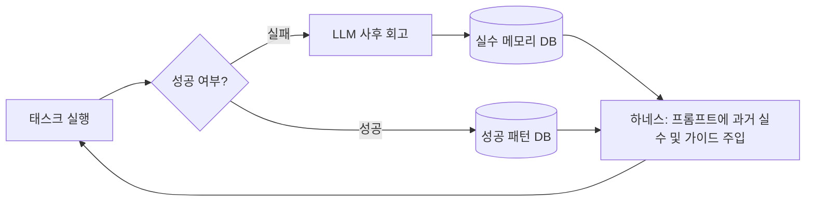

# MemoHarness: 시행착오와 경험 학습 기반 에이전트 하네스

## 1. 개요
[MemoHarness(arXiv:2607.14159v1)](https://arxiv.org/html/2607.14159v1)는 에이전트가 실행 도중 겪은 시행착오(Trial-and-Error)와 성공/실패 경험을 축적하여 스스로 행동 방식(Policy)을 지속 개선하도록 돕는 프레임워크(Harness)입니다. 단순 메모리 버퍼를 넘어 **과거의 실수를 반복하지 않도록 통제하는 네거티브 피드백 루프(Negative Feedback Loop)**와 **성공 경로를 패턴화하는 지식 강화 메커니즘**을 핵심으로 삼습니다.

## 2. 작동 메커니즘
MemoHarness의 경험 학습 파이프라인은 다음과 같은 단계로 구동됩니다.

1. **실행 및 로깅 (Execute & Log):** 에이전트가 작업을 수행하면서 내린 행동 결정과 도구 반환값, 성공 여부를 구조화하여 저장합니다.
2. **사후 회고 (Post-mortem Reflection):** 작업 실패 시, LLM이 '어느 시점의 오판이 실패로 이어졌는지' 분석하여 **실수 레포트(Mistake Report)**를 발행합니다.
3. **메모하네스 주입 (Harness Influx):** 다음 유사 태스크 수행 시, 활성화된 실수 레포트와 성공 경로(Golden Path)를 시스템 프롬프트에 자동으로 로드하여 사전 예방조치를 강제합니다.



## 3. 메모하네스 스키마 명세
경험 데이터는 다음과 같은 정형화된 JSON 형태로 관리되어 에이전트 구동 컨텍스트에 바인딩됩니다.

```json
{
  "experience_id": "EXP-20260724-T2SQL-COLLISION",
  "task_category": "Text-to-SQL / Multi-table Join",
  "trigger_condition": "Schema contains multiple tables with identical column name 'created_at' without clear aliases",
  "past_mistake": "LLM generated raw SELECT created_at without specifying table prefix, leading to 'column reference is ambiguous' database error.",
  "mitigation_rule": "ALWAYS prepend the table name or alias (e.g., t1.created_at) whenever referencing columns in multi-table queries."
}
```

## 4. 실전 가치
- **토큰 절약:** 전체 대화 기록을 슬라이딩 윈도우로 다 넘기는 대신, 압축된 `mitigation_rule`과 `past_mistake`만 선별 주입하므로 토큰 소비량을 최소화할 수 있습니다.
- **스킬 자율 진화:** 야간 가상 샌드박스 등에서 에이전트를 자율 수행시킨 후 생성된 MemoHarness 데이터로 주간 작업의 정밀도를 복리로 향상시킵니다.

## 관련 문서
- [[wiki/Agents/Memory-and-Cognition/000_Memory-and-Cognition-MOC.md|메모리 및 인지 MOC MOC]]
- [[wiki/Agents/Self-Evolving/000_Self-Evolving-MOC.md|자율 진화 에이전트 MOC]]
- [[wiki/Engineering/AI-Native-Engineering/Claude-Code-Karpathy-Guidelines.md|Claude Code 및 에이전트 지침]]
