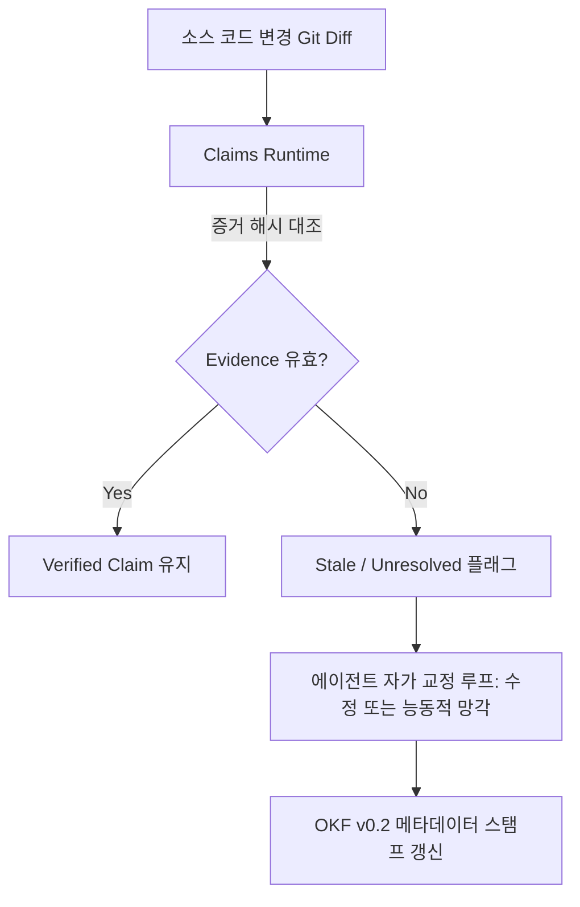

# OpenWiki Claims Runtime: 에이전트 자가 교정 메모리 및 증분 지식 거버넌스

에이전트가 소프트웨어 프로젝트를 유지보수할 때 발생하는 가장 큰 병목은 코드 변경에 따라 이전 메모리와 문서가 "낡은 거짓 지식(Stale Knowledge)"으로 변질되어 환각(Hallucination)을 유발하는 문제입니다. **OpenWiki v0.4.0**의 **Claims 런타임**은 위키를 단순 텍스트가 아닌 '증거 기반의 지속적 사실 원장'으로 다룸으로써 에이전트 메모리의 능동적 망각(Proactive Forgetting)과 자가 교정(Self-Correction)을 구현합니다.



---

## 1. 2계층 거버넌스: Claims vs OKF

OpenWiki 0.4.0은 검증 책임을 두 계층으로 완전히 분리합니다:

| 계층 | 역할 | 담당 메트릭 / 질문 |
| :--- | :--- | :--- |
| **Claims Runtime** | **내용 수준의 진실 (Content-level Truth)** | "이 문장이 주장하는 사실이 실제 코드의 어떤 라인에서 비롯되었는가?", "코드 변경 후에도 여전히 참인가?" |
| **OKF v0.2 Standard** | **페이지 수준의 신뢰 (Page-level Trust)** | "어떤 원천(Sources)에서 페이지가 빌드되었는가?", "전체 페이지가 인증(Verified)되었는가?", "어떤 에이전트(Actor)가 언제 생성했는가?" |

---

## 2. 핵심 메커니즘

### 2.1. 증거 기반 링킹 (Evidence-Based Linking)
- 각 마크다운 단락에 명시된 기술적 사실은 내부적으로 `claim_id`와 해당 소스 코드의 `(filepath, git_sha, line_range)` 튜플로 매핑됩니다.
- 단순한 벡터 유사도 검색과 달리, 결정론적(Deterministic) 증거 트리를 추적합니다.

### 2.2. 스테일 지식 자동 감지 및 능동적 망각
- Git 커밋이나 파일 수정 발생 시, OpenWiki 런타임은 변경된 파일 범위에 바인딩된 Claim만을 즉시 찾아내어 `status: stale`로 마킹합니다.
- 전체 위키를 처음부터 다시 컴파일할 필요 없이, 오염된 Claim만을 타깃팅하여 재평가하거나 완전히 삭제(Proactive Forgetting)합니다.

### 2.3. 에이전트 액터 스탬프 (Actor Stamping)
- OKF v0.2 프런트매터에 페이지 작성 주체를 명시적으로 기록합니다.
  - `actor: "native-openwiki"`
  - `actor: "claude-code-agent"`
  - `actor: "cursor-agent"`
- 다중 에이전트가 협업하는 환경에서 어떤 에이전트가 언제 해당 지식을 갱신했는지 추적 가능하여 감사(Auditability)를 보장합니다.

---

## 3. CLI 및 실무 파이프라인 연동

```bash
# 1. 특정 커밋 변경 사항에 바인딩된 Claims 무결성 검증
openwiki claims check --since=HEAD~1

# 2. Stale로 플래그된 Claim 자동 교정 프롬프트 실행
openwiki claims repair --agent=claude-code --model=sonnet

# 3. OKF v0.2 표준 메타데이터 감사
openwiki lint --standard=okf-0.2
```

---

## 🔗 관련 문서
- [[wiki/RAG/OpenWiki-OKF-Codebase-Documentation.md|OpenWiki OKF 코드베이스 문서화]]
- [[wiki/Agents/Memory-and-Cognition/000_Memory-and-Cognition-MOC.md|Memory-and-Cognition MOC]]
- [[wiki/Agents/Memory-and-Cognition/AI-Agent-Memory-Architecture.md|AI Agent Memory Architecture]]
- [[wiki/Agents/Memory-and-Cognition/Mem0-vs-Cognee-Comparison-2026.md|Mem0 vs Cognee 비교 2026]]
