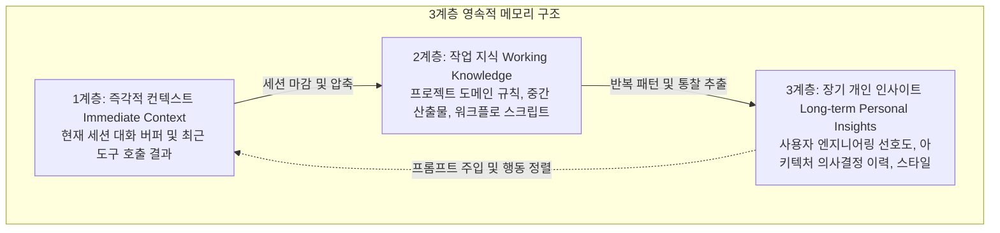

# QwenPaw: 3계층 영속적 메모리와 커널 격리 기반 자가 진화 AI 비서

## 1. 개요 및 설계 철학
대다수의 상용 AI 어시스턴트는 세션이 종료되면 이전 대화 맥락과 결정 사항, 도구 사용 이력이 초기화되어 매번 0에서 다시 시작해야 합니다. 이로 인해 장기 프로젝트를 진행할수록 사용자의 선호나 도메인 맥락과 무관한 일반론적 응답으로 회귀하는 한계가 발생합니다.

Alibaba AgentScope 생태계에서 공개된 오픈소스 AI 비서 및 런타임인 **QwenPaw**([GitHub: agentscope-ai/QwenPaw](https://github.com/agentscope-ai/QwenPaw))는 사용자의 상호작용 데이터로부터 **3계층 영속적 메모리(Three-Layer Persistent Memory)**를 구축하고 세션을 거듭하며 자가 진화(Self-evolving)하는 구조를 제공합니다.

---

## 2. 3계층 영속적 메모리 아키텍처

QwenPaw의 핵심 차별점은 단일 벡터 데이터베이스에 모든 기억을 뭉뚱그려 저장하지 않고, 생명주기와 추상화 수준이 다른 3개의 계층으로 메모리를 분리한 것입니다:

1. **즉각적 컨텍스트 (Immediate Context)**:
   - 현재 진행 중인 세션 대화, 최근 도구 호출 I/O 버퍼 등 즉시 참조해야 하는 초단기 메모리.
2. **작업 지식 (Working Knowledge)**:
   - 현재 진행 중인 프로젝트 문서, 저장소 코드 구조, 중간 데이터 분석 결과물 등 태스크 완결에 필요한 중기 작업 지식.
3. **장기 개인 인사이트 (Long-term Personal Insights)**:
   - 사용자가 선호하는 라이브러리, 코딩 컨벤션, 의사결정 원칙 등 세션이 바뀌어도 지속적으로 유지되어야 하는 상위 통찰.
- **독립적 업데이트**: 세 레이어는 상호 간섭 없이 비동기적으로 업데이트되며, 사용 빈도와 유효 시간에 따라 자가 감쇠(Auto-decay) 및 승격(Promotion)을 거칩니다.

---

## 3. 커널 레벨 샌드박스 격리 (Kernel-level Sandbox Security)
에이전트가 로컬 파일시스템이나 외부 셸 도구를 직접 실행할 때 발생하는 보안 위협을 통제하기 위해, 모델 프롬프트의 "위험한 명령을 실행하지 말라"는 식의 소프트 가드레일에 의존하지 않습니다.
- **OS 커널 격리**: cgroups, seccomp 및 경량 마이크로 샌드박스를 통해 모든 도구 실행 프로세스를 OS 커널 레벨에서 격리.
- 파일 읽기/쓰기 권한 및 네트워크 아웃바운드 트래픽을 엄격히 제한하여 비인가 명령 실행을 원천 차단합니다.

---

## 4. 하이브리드 로컬 서빙 (QwenPaw-Flash)
- **온디바이스 완전 오프라인 배포**: 14개 이상의 클라우드 API 외에도, 경량화된 소형 로컬 모델인 **QwenPaw-Flash (2B, 4B, 9B)**를 내장 지원하여 민감한 개인/기업 데이터를 외부로 전송하지 않고 로컬 머신에서 완결 구동할 수 있습니다.
- **멀티 채널 통합**: CLI뿐만 아니라 DingTalk, Lark, WeChat, Discord, Telegram, iMessage 등 10개 이상의 커뮤니케이션 채널에 연동 가능한 엔드포인트를 제공합니다.

---

## 5. 제어 시스템으로서의 영속적 메모리 (Memory as Control System)
로컬 에이전트 환경(예: Nova 시스템)에서 영속적 메모리는 단순한 과거 대화의 아카이브가 아니라, **에이전트 루프의 안정적 제어 시스템(Control System)** 역할을 수행합니다:
- 긴 실행 주기 동안 누적된 **개발 이력, 실패 사례, 검증된 성공 결과, 성능 메트릭**을 구조화하여 보존.
- 자율 계획(Autonomous Planning) $\rightarrow$ 도구 실행 $\rightarrow$ 코드 검사 $\rightarrow$ 가설 생성 $\rightarrow$ 독립 검증 $\rightarrow$ 자가 수정(Self-Modification)으로 이어지는 폐루프(Closed-loop) 제어에서 방아쇠 역할을 담당합니다.

---

## 🔗 관련 문서
- [[wiki/Agents/Memory-and-Cognition/000_Memory-and-Cognition-MOC.md|Memory-and-Cognition MOC]]
- [[wiki/Agents/Memory-and-Cognition/Hierarchical-Memory-for-LLMs-계층적-메모리-구조.md|Hierarchical Memory for LLMs]]
- [[wiki/Agents/Memory-and-Cognition/AI-Agent-Memory-Architecture.md|AI Agent Memory Architecture]]
- [[wiki/Engineering/Security/Heimel-Consequence-Time-Authorization-Infrastructure.md|Heimel 결과 시점 권한 통제 인프라]]
