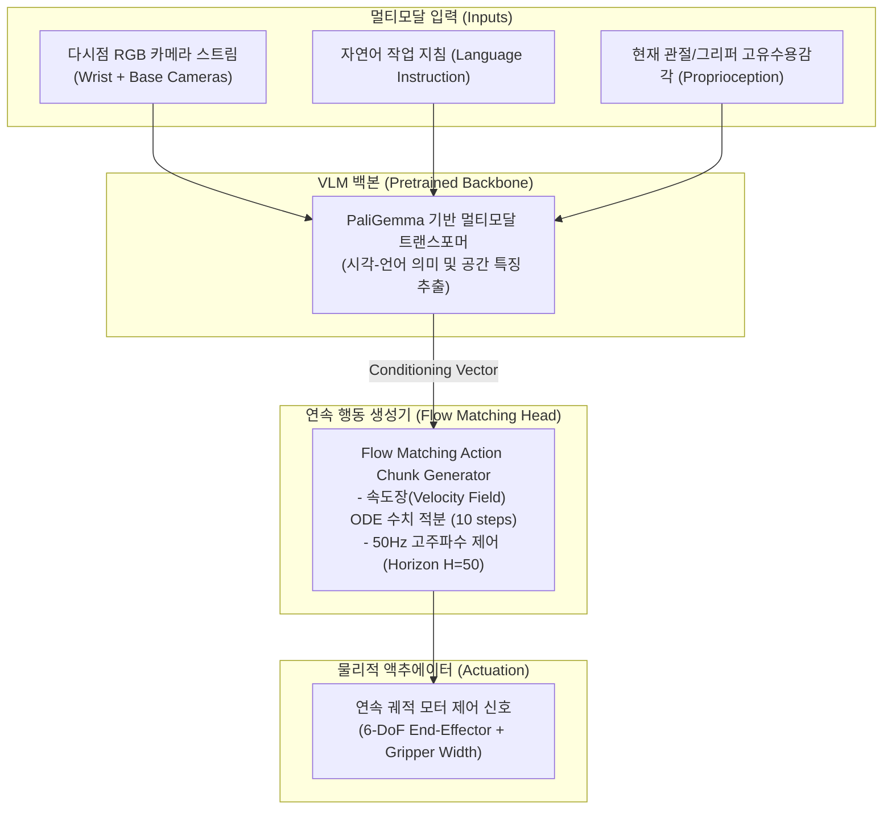

# Physical Intelligence $\pi_0$ (pi-zero) 및 openpi VLA 아키텍처

Physical Intelligence(Pi)가 발표한 **$\pi_0$(pi-zero)**는 이종(Heterogeneous) 로봇 하드웨어 전반에서 작동하도록 설계된 31억(3.1B) 파라미터 규모의 범용 **시각-언어-행동(Vision-Language-Action, VLA)** 파운데이션 모델입니다. 오픈소스 구현체인 `openpi` 프레임워크와 함께 공개되었으며, 기존 VLA의 저주파수 토큰 이산화 한계를 **Flow Matching 연속 행동 청킹(Action Chunking)**으로 극복했습니다.



---

## 1. 기존 VLA 한계와 $\pi_0$의 혁신

### 1.1. 토큰 이산화 vs Flow Matching
- **기존 VLA (RT-1, RT-2, OpenVLA)**:
  - 연속적인 로봇 관절 각도와 엔드이펙터 변위를 256개의 이산형(Discrete) 토큰으로 양자화하여 LLM 어휘 집합에 추가함.
  - 단점: 자기회귀(Autoregressive) 생성 시 서열 길이가 급증하여 제어 주기(Frequency)가 3~5Hz에 머물며, 양자화 오차로 인해 옷감이나 종이 같은 유연 물체(Deformable Objects) 조작 시 떨림 현상 발생.
- **$\pi_0$의 접근 (Flow Matching Action Head)**:
  - 비전-언어 백본의 출력 임베딩을 조건(Conditioning)으로 수신하여, 연속 확률 분포 간의 최적 운송(Optimal Transport) 경로를 따르는 **Flow Matching ODE**를 10회 미만의 스텝으로 수치 해석.
  - **행동 청킹(Action Chunking)**: 1초 분량의 50개 연속 행동 벡터(50Hz Horizon)를 한 번에 생성하여, 부드럽고 역동적인 물리 제어 달성.

### 1.2. $\pi_0$-FAST (Flow-Action Autoregressive Sub-Trajectory)
- 초저지연 온디바이스 서빙을 위해 토큰 기반 대략적 궤적 계획과 Flow Matching 정밀 액션을 계층화한 변형 모델로, 에지 로보틱스 NPU 환경에서 실시간 50Hz 제어를 경량화함.

---

## 2. 하드웨어 범용성 및 `openpi` 오픈소스 생태계

Physical Intelligence는 단일 로봇 전용 모델을 탈피하여 다양한 매니퓰레이터 환경에서 수만 시간의 시연(Demonstration) 데이터를 수집하여 사전 훈련했습니다:

| 플랫폼 유형 | 지원 하드웨어 구성 | 주요 검증 태스크 |
| :--- | :--- | :--- |
| **양팔 모바일 매니퓰레이터** | Bimanual Arms + 이동 베이스 | 세탁물 바구니 정리, 옷 개기, 식기세척기 수납 |
| **싱글 암 산업용 협동로봇** | UR5e, Franka Emika Panda | 박스 조립, 테이프 부착, 델타 픽앤플레이스 |
| **저가형 오픈 로보틱스** | Aloha, SO-100/101 Arm | 식기 닦기, 장난감 분류, 달걀 집기 |

### 2.1. `openpi` 프레임워크 아키텍처
`openpi`는 PyTorch 및 JAX 기반으로 개발된 로보틱스 정책 라이브러리로, 다음 구성 요소를 제공합니다:
- **정책 서빙 서버 (Policy Server)**: WebSocket / gRPC를 통해 로봇 온보드 컴퓨터(NUC, Jetson)와 50Hz 비동기 통신.
- **데이터 로더 파이프라인**: LeRobot 데이터셋 포맷 및 RLDS(Robotics Learning Dataset Standard) 네이티브 호환.
- **체크포인트**: `pi0-base`, `pi0-aloha-sim`, `pi0-fast` 사전 훈련 가중치 공개.

---

## 3. 잠재 공간 월드 모델(JEPA/LeWM)과의 비교 및 시너지

| 비교 축 | Physical Intelligence $\pi_0$ (VLA) | LeWorldModel (LeWM / JEPA) |
| :--- | :--- | :--- |
| **주요 역할** | 단기 반응적 고주파수(50Hz) 액션 실행기 | 장기 환경 상태 동역학 예측 및 월드 시뮬레이터 |
| **아키텍처** | VLM 백본 + Flow Matching Action Head | Joint-Embedding Predictive Architecture (비모수 잠재 공간) |
| **예측 대상** | 모터 액추에이터 제어 신호 ($A_{t:t+H}$) | 미래 잠재 상태 벡터 ($s_{t+k}$) (픽셀 복원 배제) |
| **핵심 장점** | 정교한 접촉 역학 및 변형 물체 조작 성공률 | 장기 계획(Long-horizon Planning) 및 반사실적(Counterfactual) 탐색 |

### 3.1. 계층적 피지컬 AI(Hierarchical Physical AI) 결합 구조
1. **상위 계획 (LeWM 월드 모델)**: 현재 시각 임베딩에서 향후 5~10초간의 작업 분할 및 안전 영역을 잠재 공간에서 예측하고 계획(Planning).
2. **하위 실행 ($\pi_0$ VLA)**: 계획된 하위 목표(Sub-goal) 상태를 언어/임베딩 조건으로 입력받아 50Hz 고주파 Flow Matching을 통해 모터 액션 청크를 밀리초 단위로 생성.

---

## 4. $\pi_{0.7}$ — Steerable Generalist (2026-04-16)

[π 0.7 블로그](https://www.pi.website/blog/pi07) / [PDF](https://www.pi.website/download/pi07.pdf). **클로즈드 웨이트**(openpi의 $\pi_0$/$\pi_{0.5}$와 별선). Gemma 3 4B급 VLM 백본 + 다중 모달 프롬프트 조건화.

### 4.1. 핵심 아이디어: *what*뿐 아니라 *how*를 프롬프트에

| 프롬프트 축 | 역할 | 구현 함의 |
| :--- | :--- | :--- |
| 언어 (태스크·서브스텝) | 목표·코칭 시퀀스 | 단계별 verbal coaching → 고수준 정책으로 증류 가능 |
| 전략 메타데이터 | 속도·품질 태그 | 실패/저품질 자율 에피소드를 **버리지 않고** 라벨로 흡수 |
| 제어 모달리티 | joint vs end-effector | 이종 로봇·제어 공간을 한 모델에 병합 |
| 시각 서브골 이미지 | 서브스텝 종료 장면 | 테스트 시 경량 월드 모델로 합성 서브골 주입 |

이질 데이터(멀티 로봇 데모·휴먼 비디오·자율/실패 롤아웃·Recap RL 경험)를 **단일 프롬프트 프레임**으로 합치면, naive mix보다 조합적 일반화가 나온다.

### 4.2. 보고된 창발 능력 (재사용 체크리스트)

1. **조합적 태스크 일반화**: 에어프라이어 등 미수집 가전 — zero-shot 한 줄 프롬프트는 부분 성공, 단계별 언어 코칭은 완수. 코칭 로그로 고수준 서브골 정책을 추가 텔레옵 없이 파인튜닝.
2. **크로스 엠보디먼트**: 빨래 접기 데이터가 없는 양팔 UR5e에서도 성공률이 “원본 로봇 숙련 텔레옵의 UR5e 첫 시도”와 동급.
3. **단일 범용 = Recap 전문가**: laundry / espresso / box folding에서 $\pi^*$0.6 전문가와 동등·상회 처리량·성공률 (전략 메타데이터로 RL 경험 증류).

### 4.3. 로컬 Physical AI 파이프라인에의 적용 힌트

```text
# 개념 스택 (구현 시)
observation + language_cmd
  + optional(strategy_meta: speed|quality)
  + optional(control_modality: joint|ee)
  + optional(visual_subgoal from world_model)
    → VLA policy → action chunk (50Hz)
```

- 실패 롤아웃을 폐기하지 말고 `quality=low`/`speed=slow`로 태그해 재학습 배치에 넣는다.
- 새 가전/도구는 데모 수집 전에 **언어 코칭 루프 → 고수준 서브골 정책**을 먼저 시도한다.
- openpi 체크포인트(`pi0_base` / `pi05_base`)는 오픈 라인; $\pi_{0.7}$은 파트너십·API 경로(`research@physicalintelligence.company`).

---

## 🔗 관련 문서
- [[wiki/Agents/Robotics-and-VLA/NVIDIA-Physical-AI-GR00T-Cosmos-물리적-AI-혁신.md|NVIDIA Physical AI GR00T & Cosmos 물리적 AI 혁신]]
- [[wiki/Models/RL/World-Models-JEPA-LeWorldModel-Generative-Simulation.md|JEPA 및 LeWorldModel 생성 시뮬레이션]]
- [[wiki/Models/RL/LeWorldModel-JEPA-2026.md|LeWorldModel JEPA 2026]]
- [[wiki/Agents/Robotics-and-VLA/Google-RT-3-Open-Source-Robotics.md|Google RT-3 오픈소스 로보틱스]]
- [[wiki/Agents/Robotics-and-VLA/2026-04-09-VLA-Robotics.md]]
- [[wiki/Agents/Robotics-and-VLA/Figure-PI-VLA-Update-2026-04-09.md]]

