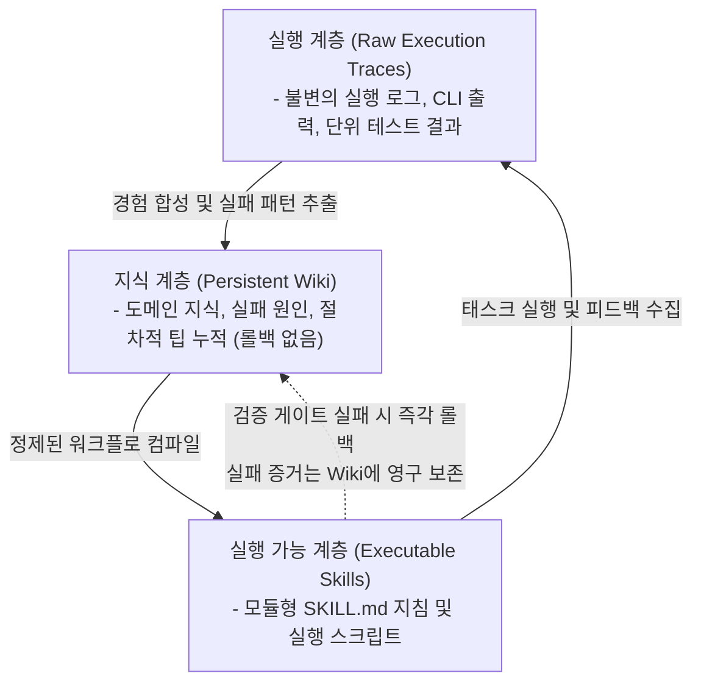

# WikiSkill: 에이전틱 시스템의 절차적 지식 자가 진화 및 3계층 아키텍처

Google Research에서 발표한 **WikiSkill**(arXiv:2608.27454, 2026년 8월, *WikiSkill: Co-evolving Procedural Knowledge in Agentic Systems*)은 태스크 완료 후 학습 내용이 휘발되는 "최적화 기억상실(Optimization Amnesia)"을 극복하고, 모델 가중치(Weights) 수정 없이 절차적 지식(Procedural Knowledge)을 장기 축적·진화시키는 에이전트 자가 진화 프레임워크입니다.



---

## 1. 3계층 아키텍처 (The Three-Layer Architecture)

기존 스킬 진화 시스템(Voyager, Memento 등)이 실행 이력과 스킬 코드를 단일 저장소에 혼재시켜 지식 오염 및 회귀(Regression)를 겪었던 반면, WikiSkill은 세 계층을 엄격히 분리합니다:

1. **원천 실행 경험 계층 (Raw Execution Traces)**:
   - 에이전트의 태스크 수행 궤적(Trajectories), 환경 반응, 도구 호출 시퀀스, 실패 로그 및 최종 메트릭이 불변(Immutable) 상태로 저장되는 원천 데이터.
2. **지속적 위키 계층 (Persistent Wiki of Accumulated Knowledge)**:
   - 실행 이력으로부터 추출된 승리 전략, 실패 패턴, 도구 호출 함정, 도메인 가이드가 마크다운 형태로 축적되는 비모수(Non-parametric) 지식 베이스.
   - **무삭제/단조 누적성(Monotonic Accumulation)**: 스킬 배포가 실패하여 롤백되더라도, 위키 계층은 절대 롤백되지 않고 실패 경험과 제약 사항을 영구 보존하여 향후 동일 오류 재발을 차단합니다.
3. **실행 가능한 스킬 계층 (Executable Skills)**:
   - 에이전트가 실행 시 동적으로 인젝션하거나 CLI 도구로 호출하는 모듈형 스킬 (`SKILL.md` 포맷).
   - 위키에 축적된 패턴을 바탕으로 자동 컴파일·업데이트되며, 엄격한 검증 게이트(Validation Gate) 통과 시에만 운영 환경에 승격(Promote)됩니다.

---

## 2. 핵심 작동 메커니즘 및 벤치마크 검증

### 2.1. 상호 공진화 (Co-Evolution) 및 벤치마크 성능
- 에이전트가 과업을 수행할 때마다 경험이 위키로 먼저 합성(Consolidation)되며, 후속 스킬 업데이트는 개별 실행 로그가 아닌 **합성된 위키 지식**을 바탕으로 생성됩니다.
- **정량적 벤치마크 (GAIA, SWE-bench Verified, WebArena)**:
  - 절제 실험(Ablation Study) 결과, 단순 프롬프트 튜닝이나 1계층 스킬 저장소 대비 위키 지식 계층이 전체 성능 향상의 **64%**를 견인했습니다.
  - **소형 모델의 역전(Smaller Beats Larger)**: 진화된 WikiSkill 지식 베이스를 탑재한 경량 모델(Gemini 1.5 Flash / GPT-4o-mini 급)이 사전 훈련된 초대형 모델(Gemini 1.5 Pro / GPT-4o 급 baseline) 대비 태스크 성공률에서 **14% ~ 22%p 우위**를 기록했습니다.
  - 추론 시점의 무작위 시행착오(Trial-and-Error) 횟수가 54% 감소하여 엔드투엔드 토큰 소비량과 지연 시간(Latency)이 50% 이상 절감되었습니다.

### 2.2. 검증 게이팅 및 롤백 가드 (Validation Gating & Rollback Guard)
- 새롭게 합성된 스킬은 즉시 메인 워크스페이스에 반영되지 않고 격리된 마이크로VM(Firecracker / Docker gVisor) 샌드박스에서 골든 테스트 셋을 평가받습니다.
- 성능 저하가 발생한 스킬은 즉각 **롤백(Rollback)**되지만, **실패 원인과 스택 트레이스는 위키에 영구 기록**되어 에이전트의 자기 반성(Reflection) 컨텍스트로 제공됩니다.

### 2.3. 모델 독립적 스킬 전이 (Cross-Model Transferability)
- 스킬이 특정 LLM 파라미터나 특정 토크나이저에 결합되지 않은 고수준 절차적 추상화(Procedural Abstraction) 및 표준 Markdown/Python 코드로 작성되므로, 이종 모델 패밀리(Anthropic Claude, OpenAI GPT, Google Gemini, Open-Weights Llama) 간 제로샷 전이가 입증되었습니다.

---

## 3. 타 자가 진화 프레임워크와의 비교

| 비교 항목 | WikiSkill (Google Research) | SkillOpt | Memento | Voyager |
| :--- | :--- | :--- | :--- | :--- |
| **핵심 메커니즘** | 3계층 (Traces → Wiki → Skills) 상호 공진화 | 다중 에이전트 토론 기반 텍스트 파라미터 최적화 | 사례 기반 메모리(Case-Based) 검색 및 재활용 | 마인크래프트 코드 스킬 점진적 라이브러리화 |
| **지식 저장 형태** | 마크다운 Persistent Wiki + `SKILL.md` | 텍스트 프롬프트 파라미터 벡터 | 질의-응답 궤적 임베딩 인덱스 | 실행 가능한 JS 함수 모듈 |
| **롤백 정책** | 스킬만 롤백, 위키 지식은 영구 축적 | Pareto 프론티어 기반 프롬프트 갱신 | 단순 최근 성공 사례 덮어쓰기 | 실행 실패 시 코드 폐기 |
| **소형 모델 전이** | 강력함 (추상화된 위키 지식 기반) | 보통 (모델별 프롬프트 민감도 존재) | 낮음 (임베딩 유사도 의존) | 제한적 (특정 도메인 코드 의존) |

---

## 4. 스킬 문서 구조 및 구현 패턴

WikiSkill 표준 스킬 정의 예시 (`SKILL.md`):

```markdown
---
name: web-research-synthesis
description: 웹 검색 결과에서 고신뢰성 원천 지식을 추출하고 위키에 구조화하여 기록함
dependencies: [search_web, view_file, write_to_file]
version: 1.2.0
---

# Web Research Synthesis Protocol

## Trigger Conditions
- 최신 논문, 릴리스 노트, 하드웨어 사양에 관한 기술 검증 과업 발생 시

## Execution Sequence
1. 원천 검색어 정제 및 2차 인용(소셜 미디어 등)에서 원저작물(arXiv, GitHub) URL 재귀 추적.
2. 관측된 신규 엔티티 및 스펙을 기존 Wiki MOC와 대조.
3. 3단계 검증 게이트(Schema Lint -> Claim Cross-check -> Rollback Guard) 통과 후 커밋.
```

---

## 5. 지식 거버넌스 및 운영 과제

1. **지식 가지치기(Pruning) 및 감쇠(Decay)**: 위키가 무제한 누적될 경우 지식 충돌, 중복 및 컨텍스트 윈도우 낭비가 발생할 수 있어 정기적인 린트([[wiki/Engineering/AI-Native-Engineering/Epistemic-Debt-ChangeScore-Friction-Gate.md|인식 부채 거버넌스]])와 비활성 지식 감쇠 알고리즘이 필수적입니다.
2. **모델 특화 보상 편향(Compensatory Heuristics)**: 특정 소형 모델의 추론 결함을 땜질하기 위해 생성된 기형적인 스킬 지침이 타 모델로 전이될 때 성능 저하를 유발하는 부정적 전이(Negative Transfer)를 방지하기 위해, 멀티 모델 교차 평가 게이트가 요구됩니다.

---

## 🔗 관련 문서
- [[wiki/Agents/Self-Evolving/000_Self-Evolving-MOC.md|Self-Evolving MOC]]
- [[wiki/Agents/Self-Evolving/SkillOpt-및-과학적-탐구-멀티-에이전트-시스템.md|SkillOpt 및 과학적 탐구 멀티 에이전트 시스템]]
- [[wiki/Agents/Self-Evolving/Memento-에이전트-스킬-자가-학습-프레임워크.md|Memento 에이전트 스킬 자가 학습 프레임워크]]
- [[wiki/Engineering/AI-Native-Engineering/Agentic-Software-Factory.md|에이전틱 소프트웨어 팩토리 아키텍처]]
- [[wiki/Engineering/AI-Native-Engineering/Epistemic-Debt-ChangeScore-Friction-Gate.md|인식 부채 통제 및 에이전트 마찰 게이트]]

