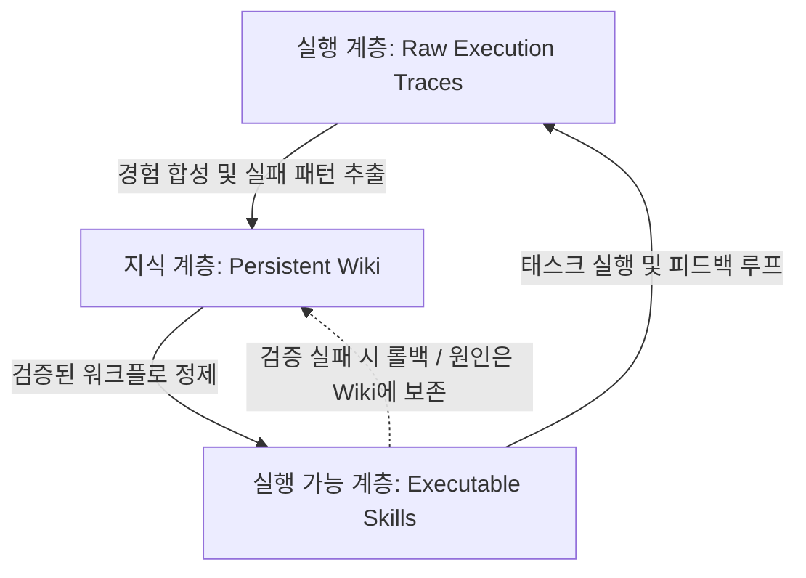

# WikiSkill: 에이전틱 시스템의 절차적 지식 자가 진화 및 3계층 아키텍처

Google Research에서 제안한 **WikiSkill**은 태스크 완료 후 학습 내용이 휘발되는 "최적화 기억상실(Optimization Amnesia)"을 극복하고, 모델 가중치(Weights) 수정 없이 절차적 지식(Procedural Knowledge)을 장기 축적·진화시키는 에이전트 아키텍처 프레임워크입니다.



---

## 1. 3계층 아키텍처 (The Three-Layer Architecture)

기존 스킬 진화 시스템(Voyager, Memento 등)이 실행 이력과 스킬 코드를 단일 저장소에 혼재시켰던 반면, WikiSkill은 세 가지 역할을 명확히 분리합니다:

1. **원천 실행 경험 (Raw Execution Experience / Traces)**:
   - 에이전트의 태스크 수행 궤적(Trajectories), 환경 반응, 실패 로그 및 최종 결과 메트릭이 기록되는 불변의 원천 데이터.
2. **지속적 위키 (Persistent Wiki of Accumulated Knowledge)**:
   - 실행 이력으로부터 추출된 승리 전략, 실패 패턴, 도구 호출 함정, 도메인 가이드가 마크다운 형태로 축적되는 비모수(Non-parametric) 지식 베이스.
   - 단일 최적화 기록에 종속되지 않고, 지식이 연대기적으로 누적 및 통합됨.
3. **실행 가능한 스킬 (Executable Skills)**:
   - 에이전트가 실행 시 인젝션하거나 호출할 수 있는 모듈형 지침 및 스크립트 (`SKILL.md` 포맷).
   - 위키에 축적된 패턴을 바탕으로 자동 컴파일/업데이트됨.

---

## 2. 핵심 작동 메커니즘

### 2.1. 상호 공진화 (Co-Evolution)
에이전트가 과업을 수행할 때마다 경험이 위키로 먼저 합성(Consolidation)되며, 후속 스킬 업데이트는 개별 실행 로그가 아닌 **합성된 위키 지식**을 바탕으로 생성됩니다. 절제 실험(Ablation Study) 결과, 단순 프롬프트 수정보다 **위키 지식 계층이 성능 향상의 가장 큰 비중을 견인**함이 확인되었습니다.

### 2.2. 검증 게이팅 (Validation Gating)
- 새롭게 제안된 스킬은 즉시 배포되지 않고 검증 샌드박스에서 성능 메트릭을 평가받습니다.
- 성능 저하가 발생한 스킬은 즉각 **롤백(Rollback)**되지만, **실패 원인과 분석 데이터는 위키에 영구 보존**되어 차후 동일한 실수를 방지합니다.

### 2.3. 모델 간 스킬 전이 (Cross-Model Transferability)
- 스킬이 특정 LLM 파라미터에 종속되지 않는 고수준 절차적 추상화(Procedural Abstraction)로 작성되므로, 이종 모델 패밀리 간 전이가 가능합니다.
- **실험적 입증**: 진화된 스킬을 장착한 소형 모델(Smaller Models)이 스킬이 없는 초대형 모델(Larger Models)의 벤치마크 성능을 상회하는 현상이 관측되었습니다.

---

## 3. 스킬 문서 구조 및 구현 패턴

WikiSkill 표준 스킬 정의 예시 (`SKILL.md`):

```markdown
---
name: web-research-synthesis
description: 웹 검색 결과에서 고신뢰성 원천 지식을 추출하고 위키에 구조화하여 기록함
dependencies: [search_web, view_file, write_to_file]
version: 1.2.0
---

# Web Research Synthesis Protocol

## Trigger Conditions
- 최신 논문, 릴리스 노트, 하드웨어 사양에 관한 기술 검증 과업 발생 시

## Execution Sequence
1. 원천 검색어 정제 및 2차 인용(소셜 미디어 등)에서 원저작물(arXiv, GitHub) URL 재귀 추적.
2. 관측된 신규 엔티티 및 스펙을 기존 Wiki MOC와 대조.
3. 3단계 검증 게이트(Schema Lint -> Claim Cross-check -> Rollback Guard) 통과 후 커밋.
```

---

## 4. 확장 시의 한계 및 거버넌스 과제

1. **지식 가지치기(Pruning) 및 감쇠(Decay)**: 위키가 무제한 누적될 경우 지식 충돌, 중복 및 컨텍스트 윈도우 낭비가 발생할 수 있어 정기적인 린트와 비활성 지식 감쇠 알고리즘이 필수적입니다.
2. **모델 특화 보상 편향(Compensatory Heuristics)**: 특정 모델의 약점을 보완하기 위해 만들어진 스킬이 다른 모델로 전이될 때 오히려 성능 저하를 유발하는 부정적 전이(Negative Transfer)를 사전에 필터링하는 검증 절차가 요구됩니다.

---

## 🔗 관련 문서
- [[wiki/Agents/Self-Evolving/000_Self-Evolving-MOC.md|Self-Evolving MOC]]
- [[wiki/Agents/Self-Evolving/SkillOpt-및-과학적-탐구-멀티-에이전트-시스템.md|SkillOpt 및 과학적 탐구 멀티 에이전트 시스템]]
- [[wiki/Agents/Self-Evolving/Memento-에이전트-스킬-자가-학습-프레임워크.md|Memento 에이전트 스킬 자가 학습 프레임워크]]
- [[wiki/Agents/Multi-Agent-and-Orchestration/자율수행-멀티-에이전트-시스템-오케스트레이션-및-보안-격리-2026.md|자율수행 멀티 에이전트 시스템 오케스트레이션 및 보안 격리 2026]]
