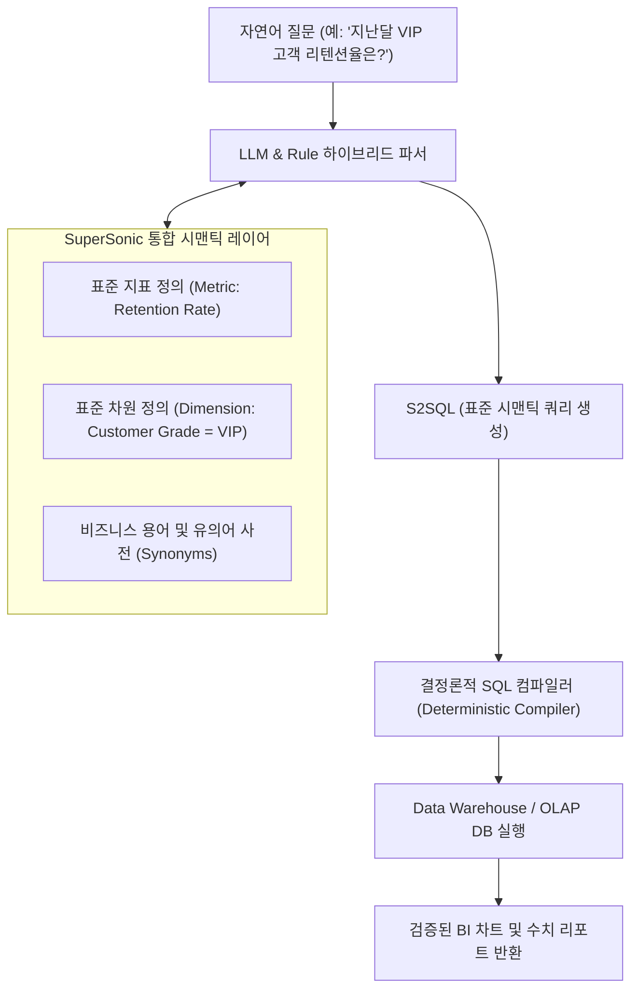

# SuperSonic: 시맨틱 레이어 일체형 ChatBI 아키텍처 및 메트릭 거버넌스

## 1. 개요 및 배경

엔터프라이즈 환경에서 Text-to-SQL(자연어 질의를 SQL로 변환)을 도입할 때 발생하는 가장 큰 실패 요인은 **"비즈니스 맥락과 지표 정의(Metric Definition)가 배제된 원시 테이블 스키마에 LLM을 직접 바인딩하는 것"**입니다.
- 원시 데이터베이스의 테이블명이나 컬럼명은 축약어, 레거시 네이밍, 또는 복합 계산 로직을 내포하고 있어, LLM이 임의로 JOIN을 걸거나 SUM/AVG를 계산하면서 환각(Hallucination) 쿼리를 양산합니다.
- 텐센트뮤직(Tencent Music)이 오픈소스로 공개한 **SuperSonic**은 이러한 한계를 극복하기 위해 **ChatBI와 시맨틱 레이어(Semantic Layer)를 하나의 몸체로 통합 설계**한 차세대 데이터 에이전트 프레임워크입니다.

---

## 2. 핵심 설계 철학: "시맨틱 레이어가 먼저다 (Semantic Layer First)"

SuperSonic의 핵심 원칙은 **"비즈니스 지표와 차원이 사전에 정의되지 않은 상태에서는 AI가 SQL을 직접 작성하도록 방치하지 않는다"**는 것입니다.

1. **지표 거버넌스 선행**:
   - 데이터 분석가와 엔지니어가 비즈니스 지표(매출, 활성 유저수, 전환율 등)의 산출 공식을 시맨틱 레이어에 단일 진실의 원천(Single Source of Truth, SSoT)으로 등록합니다.
2. **제약된 쿼리 생성**:
   - AI는 임의의 SQL 방언을 생성하는 것이 아니라, 시맨틱 레이어에 등록된 지표와 차원을 결합하는 고수준 추상 쿼리(S2SQL)를 생성합니다.
3. **결정론적 컴파일**:
   - 생성된 시맨틱 쿼리는 규칙 기반 컴파일러에 의해 데이터 웨어하우스(ClickHouse, StarRocks, Trino, MySQL 등)의 최적화된 SQL로 결정론적으로 변환되어 실행됩니다.

---

## 3. SuperSonic 아키텍처 구성요소

### 1) Headless 시맨틱 모델러 (Semantic Modeler)
- 원시 데이터 소스를 연결하고 데이터 모델, 디멘션, 메트릭, 뷰(View)를 웹 UI 또는 선언적 설정을 통해 정의.
- 동일한 지표를 여러 하위 분석 도구 및 REST/MCP API로 재사용 가능.

### 2) 하이브리드 파서 (Rule-based & LLM Parser)
- 사용자의 모호한 질의를 비즈니스 사전 및 벡터 유사도 검색으로 매핑.
- Few-shot 및 맥락 인식을 통해 날짜 범위, 필터 조건, 지표 명칭을 정확히 분리.

### 3) ChatBI 대화형 분석 런타임
- 다중 턴(Multi-turn) 대화를 지원하여, "지난달 수치는?"에 이어 "그중 모바일 유저는?"과 같은 연속 질의 컨텍스트를 유지.
- 결과 데이터를 표, 꺾은선형, 막대형 등 최적의 차트로 시각화하여 반환.

---

## 4. 데이터 엔지니어링 툴체인 비교

| 도구명 | 주관/출처 | 주요 목적 및 차별점 |
| :--- | :--- | :--- |
| **SuperSonic** | Tencent Music | ChatBI + 시맨틱 레이어 일체형, 엔터프라이즈 메트릭 거버넌스 |
| **DB-GPT** | eosphoros-ai | 사내 프라이빗 배포 중심, 격리 샌드박스에서 SQL/Python 코드 자율 실행 |
| **MinerU** | OpenDataLab | PDF/스캔본의 표, 수식, 레이아웃을 마크다운으로 무결성 변환 (RAG 전처리) |
| **RAGFlow** | InfiniFlow | 문서의 표와 복합 레이아웃 구조 이해 기반의 RAG 엔진 |
| **WrenAI** | Canner | 오픈소스 시맨틱 엔진(MDL 기반) 연동 생성형 BI 에이전트 |

---

## 🔗 관련 문서
- [[wiki/Agents/Text-to-SQL/Agentic-Semantic-Layer.md|에이전틱 시맨틱 레이어]]
- [[wiki/Agents/Text-to-SQL/AV-SQL-Agentic-Views-Spider-2-0.md|AV-SQL: Agentic Views 기반 Spider 2.0 최적화]]
- [[wiki/Agents/Text-to-SQL/WrenAI-Generative-BI-Agent.md|WrenAI 생성형 BI 에이전트]]
- [[wiki/Agents/Text-to-SQL/000_Text-to-SQL-MOC.md|Text-to-SQL MOC]]
