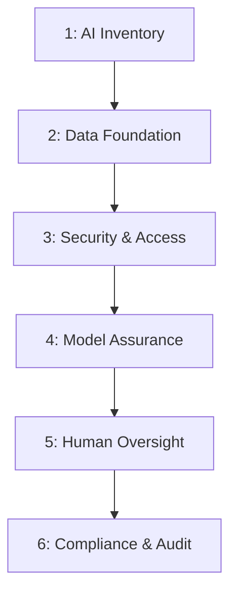

# AI 거버넌스 6대 시스템 계층 및 안전한 스케일링

많은 기업들이 AI 거버넌스를 단순한 서류 정책 문서나 윤리 가이드라인 수준으로 취급하여 실제 제품 배포 단계에서 보안 사고와 비즈니스 정지를 경험합니다. 성공적인 AI 도입을 위해 거버넌스는 단순 규범이 아닌 **실시간 통제력을 가진 실행 플랫폼(Operating System)**으로 구축되어야 합니다.

## 1. AI 거버넌스 시스템 6대 구축 레이어

### 1계층: AI 시스템 카탈로그 (AI Inventory)
- 사내에서 배포·운용 중인 모든 AI 에이전트, 프롬프트 파이프라인, 파인튜닝 모델의 소유자(Owner)와 용도를 실시간 추적하고 기록합니다.

### 2계층: 데이터 신뢰성 확보 (Data Foundation)
- AI 학습 및 RAG 검색에 활용되는 소스의 원천지(Source lineage)를 투명하게 인덱싱합니다.
- 개인정보(PII) 유출 방지 및 라이선스 위반이 없는 정제된 데이터를 보증합니다.

### 3계층: 보안 및 접근성 통제 (Security & Access)
- 역할 기반의 에이전트 도구/API 실행 권한(RBAC)을 부여합니다.
- API 키 유출 방지, 프롬프트 인젝션 및 데이터 오남용을 막는 샌드박스를 상시 가동합니다.

### 4계층: 모델 품질 및 편향 보증 (Model Assurance)
- AI 성능 저하(Drift), 환각(Hallucination) 지표, 도메인 편향성을 지속 평가(Evaluation)합니다.
- 시스템의 실패 모드(Failure modes)와 엣지 케이스에서의 CPU 폴백 동작 방안을 사전 설계합니다.

### 5계층: 인간 개입 및 감시 구조 (Human Oversight)
- 중요한 재무적·법률적·보안적 결정을 내릴 때 Human-in-the-loop (인간 개입형) 결재선과 에스컬레이션 메커니즘을 정의합니다.
- 에이전트의 단독 자율 행위가 가할 수 있는 물리적·재무적 한계를 설정합니다.

### 6계층: 규정 준수 및 감사 이력 (Compliance & Audit)
- 규제 기관의 요건(예: AI Act 등)에 상시 대응합니다.
- AI가 내린 비즈니스 의사결정의 논리 흐름과 근거(Decision history)를 최소 6개월 이상 역추적 및 설명 가능하도록 보관합니다.

## 2. 기업 AI 스케일링의 지향점
- **속도 경쟁에서 시스템 경쟁으로**: 단순히 똑똑한 모델을 빠르게 붙이는 것보다, 모델과 에이전트 주변을 둘러싼 거버넌스 시스템을 탄탄하게 구축한 기업이 장기적으로 규제 리스크와 보안 사고를 방지하여 생존할 확률이 높습니다.
- **객체 중심 거버넌스 시너지**: FDE(Forward Deployed Engineer) 의존도를 낮추고 사내 AI Engineer가 독립적으로 운영권을 쥐기 위해, 거버넌스 6계층 규약들을 데이터 객체의 상태와 정책 메타데이터로 시스템 내재화해야 합니다.

## 🔗 연결된 문서
- [[wiki/Business/Trends/000_Trends-MOC.md]]
- [[wiki/Agents/Implementation/FDE-대비-AI-엔지니어-및-객체-중심-에이전트-거버넌스.md]]
- [[wiki/Engineering/Data-and-Security/000_Data-and-Security-MOC.md]]
- [[index.md]]
