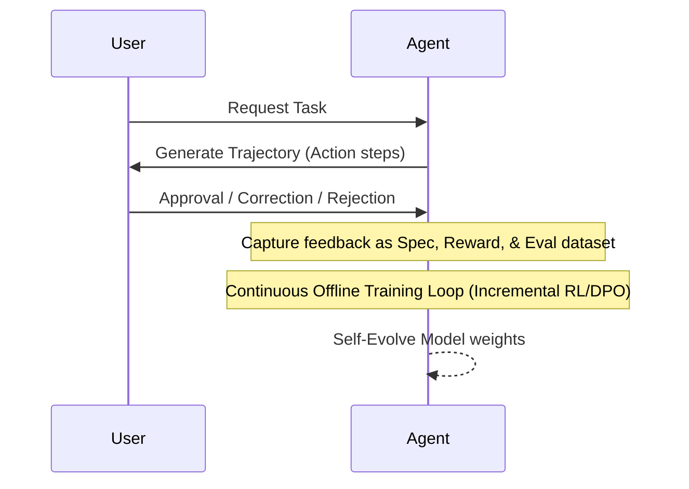

# 🛡️ AI 에이전트 거버넌스 및 하비(Harvey)의 Vertical Lab 모델 학습 스택

## 1. 패러다임 전환: 1사 1학습 스택, 다중 모델 (Many Models)
과거 기업들은 전체 비즈니스를 단 하나의 범용 대형 파운데이션 모델에 의존해 처리하려 했습니다. 그러나 보안 리스크, 비정형 컴플라이언스 규칙, 비용 관리의 한계로 인해 현대 엔터프라이즈는 **'1개의 독점적 학습 스택 하에, 직무별로 고도화된 수많은 다중 버티컬 모델(Many Models)'**을 연동하는 아키텍처로 선회하고 있습니다.

## 2. Harvey의 Vertical Lab 구축 전략
대표적인 리걸테크(LegalTech) 유니콘인 Harvey는 에이전트가 중대 과실을 범하거나 할루시네이션(Hallucination)으로 계약을 오염시키는 리스크를 방어하기 위해 **Vertical Lab** 훈련 체계를 수립했습니다.
- **다중 프레임워크 통합**: 오픈소스 백본(Qwen, GLM) 및 파트너십 API(GPT, Kimi)를 기초 인프라로 수용.
- **RL 하네스(Reinforcement Learning Harness)**: 리걸 분야 특화 평가 테이블, M&A 계약 실사 프로세스 규칙, 법률 서적 정합성을 규율하는 맞춤형 강화학습 피드백 시스템 가동.
- **자율 기동 및 기각**: 모델이 모호한 영역에서 아는 척(Hallucination)을 하기보다 답변을 거부(Abstention)하고 서브 리스크 해소용 REPL Subagent에게 분석을 위임하도록 집중 유도. 훈련의 최종 결과물로 법률 Generalist 모델인 **Tenet**을 가동.

## 3. Trajectory Continual Learning (지속 학습 아키텍처)
사용자 및 도메인 전문가의 상호작용 피드백을 실시간 모델 성능 점진 가속 훈련으로 환원하는 파이프라인입니다.

- 에이전트가 행동한 궤적(Trajectory) 내에서 유입되는 인간 사용자의 승인(Approval), 미세 조정(Correction), 최종 거절(Rejection) 등의 상호작용 신호를 즉시 필터링함.
- 수집된 실제 사용자 피드백 데이터를 Reward 및 Eval 데이터셋으로 자동 정제하여, 백그라운드 오프라인 훈련 기기에서 증분 학습(Incremental DPO/RL)으로 자동 회수 및 모델 업데이트.

## 4. 앤트로픽 Claude Code의 ELI5 Confirmation Step 기법
코드 수정과 같은 고위험 동작을 실행하기 전 발생할 수 있는 대형 사고를 미연에 방지하기 위해 앤트로픽 사내에서 활용하는 안전 거버넌스 기법입니다.
- **개념**: 에이전트가 코드베이스를 마구 고쳐버리기 전에, 자신이 해석한 구조와 계획을 직관적인 다이어그램/그림(HTML 등 시각화 매체)으로 작성해 사람에게 선제 검토 및 승인을 요청하는 **시각적 정렬(Visual Confirmation Step)** 절차를 수행.
- **워크플로우**: 
  1. 사용자 수정 요청 유입 
  2. 에이전트의 로컬 코드베이스 탐색 
  3. **ELI5 HTML 시각 다이어그램 출력 및 멈춤 (Human Check)** 
  4. 사용자가 시각적 구조도 내 누락이나 오판 검토 및 승인 
  5. 에이전트가 안전하고 일치된 정밀 구현 착수.
- 이를 통해 복잡한 텍스트 기획서 diff 단계에서 인간이 발견하지 못하는 대규모 로직 버그와 아키텍처 오류를 사전 차단함.
