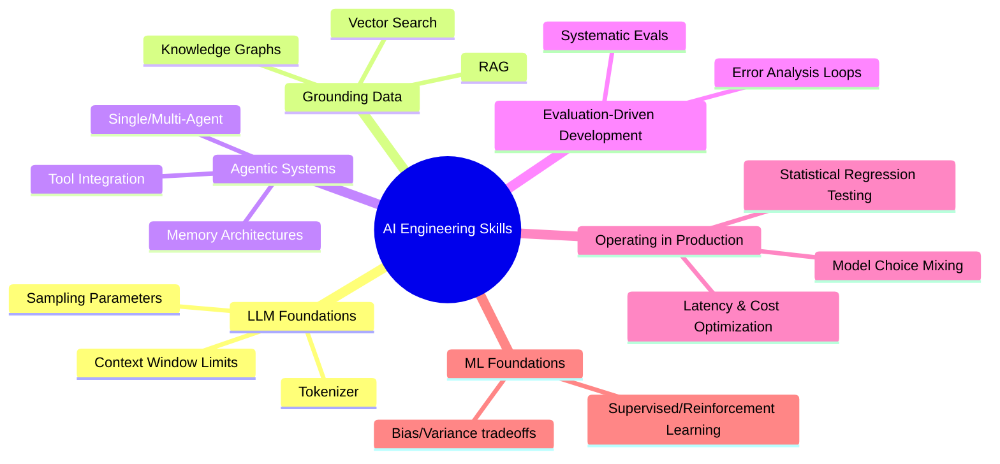

# 🗺️ AI 엔지니어링 핵심 역량 맵 (AI Engineering Core Skills Map)

## 1. AI 소프트웨어 개발의 고유 특성
AI 엔지니어링이 일반 소프트웨어 공학과 구분되는 가장 결정적인 차이는 **결과의 예측 불가능성(Unpredictability)**입니다. LLM의 최종 출력이나 지도학습 모델의 예측을 사전에 완전히 규정하기 어려우므로, AI 애플리케이션 개발은 **고도로 반복적(Iterative)이며 실험적인 프로세스**가 요구됩니다.

## 2. 6대 핵심 역량 도메인

### 1) LLM Foundations (LLM 기초 기초학)
- Tokenizer의 특징 및 토큰 제약 사항 이해.
- Context window의 한계 제어 및 입력 압축 기법.
- Temperature, Top-p, Top-k 등 Sampling Parameters 튜닝.
- 시스템 프롬프트(System Prompts) 및 추론 깊이(Reasoning path) 분석.

### 2) Grounding Models with Data (데이터 접지)
- RAG(Retrieval-Augmented Generation) 설계 및 구현.
- 벡터 검색(Vector Search), 시맨틱 청킹(Semantic Chunking), 하이브리드 검색.
- 비정형 지식을 구조화하여 지식 그래프(Knowledge Graphs)를 구축하는 지식 주입 기술.

### 3) Building Agentic Systems (에이전트 아키텍처)
- 단일 에이전트 및 멀티 에이전트 협업 체계 설계.
- 에이전트 도구 연동: Model Context Protocol (MCP), CLI, Web APIs 연동 규정.
- Long-term Memory, Short-term Memory, stateful 관리.
- 오작동 방지를 위한 가드레일(Guardrails) 및 안전장치 설계.

### 4) Evaluation-Driven Development (평가 기반 개발)
- 출력의 불확실성을 체계적으로 검증하기 위한 데이터셋 구축 및 evals 도구 활용.
- 정량/정성적 에러 분석 루프(Error Analysis Loops)를 통한 정밀 튜닝.

### 5) Operating in Production (프로덕션 운영 및 최적화)
- 비용과 지연시간(Latency)을 낮추기 위한 모델 믹싱, fine-tuning, distillation 기법 활용.
- 프롬프트 인젝션 등 보안 위협 실시간 모니터링 및 감지.
- 통계적 회귀 테스트(Statistical Regression Testing) 및 CI/CD 구축.

### 6) Machine Learning Foundations (머신러닝 기초)
- 지도 학습, 비지도 학습, 강화 학습(RL)의 코어 메커니즘 이해.
- 편향(Bias)과 분산(Variance) 트레이드오프 분석 및 학습용 데이터 가공(Data engineering).
