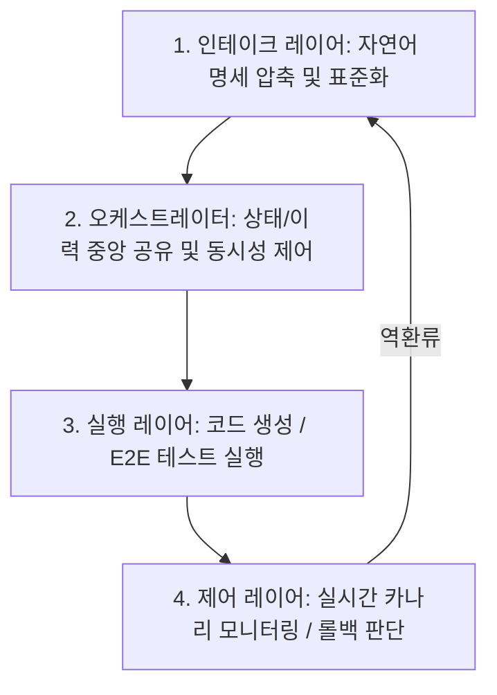

# 에이전트 네이티브 소프트웨어 팩토리(Agentic Software Factory) 아키텍처 및 자동화 방안

이 문서는 2022년형 고정 CI/CD 파이프라인에서 탈입하여, AI 에이전트 오케스트레이션을 기반으로 소프트웨어 개발 생명주기(SDLC)의 전 과정을 자율 구동하는 **에이전트 네이티브 소프트웨어 팩토리(Agentic Software Factory)**의 핵심 레이어 설계, 스프린트 계획 자동화, E2E 자가 치유 테스트, PR 자동 리뷰 및 안정성 제어 기술을 정의합니다.

## 1. 아키텍처 개요: 패러다임 전환 및 4개 레이어

기존 2022년형 모델은 인간이 수동으로 기획하고, DOM 선택자를 하드코딩해 테스트를 작성하며, 평균 6시간 이상 소요되는 수동 코드 리뷰를 수행했습니다. 2026년형 에이전트 네이티브 팩토리는 백그라운드에 상주하는 멀티 에이전트 오케스트레이터가 자율적으로 SDLC 순환 구조를 전담 제어합니다.

### 에이전트 네이티브 팩토리 가동을 위한 4대 핵심 조건
1.  **인풋 표준화**: 비정형 요구사항(이메일, 메시지 등)을 정형화된 명세로 자동 파싱.
2.  **툴링의 일관성 보장**: 에이전트가 통제 가능한 표준 CLI 및 API 포맷 제공.
3.  **측정 지표의 체계화**: 작업 성공 여부를 테스트 커버리지 및 실 작동 지표로 정량화.
4.  **재생성 가능성 (Replayability)**: 에러 발생 시 특정 컨텍스트 시점으로 롤백해 동일 연산을 재현 가능한 상태로 보존.

---

## 2. 기획 및 스프린트 계획 자동화 (JIRA 오딧 및 스크럼 마스터)

AI 스크럼 마스터 에이전트는 기획 실행 상태의 정합성을 감독하며, JIRA API 데이터를 주기적으로 스캔하여 형상 왜곡을 방지하는 실시간 오딧(Audit) 규칙을 수행합니다.

### JIRA 오딧 점검 및 에이전트 자율 대응 테이블

| 오딧 점검 항목 | 유발되는 정량적 부작용 | 에이전트의 실시간 자율 권장 대응 규칙 |
| :--- | :--- | :--- |
| **빈 스프린트로 시작** | 초기 확약(Commitment) 데이터 유실로 스프린트 완료 평가 불가능 | 활성 스프린트가 비어 있을 시 인입 로그 차단 및 가이드 티켓 자동 생성 |
| **스프린트 개시 후 공수 산정** | 스토리 포인트를 사후 입력하여 정량적 개발 속도(Velocity) 메트릭 교란 | 추정치 누락 티켓을 역추적해 담당자에게 슬랙/팀즈 입력 유도 알림 전송 |
| **진행 중 임의 이슈 주입** | 스프린트 도중 티켓 추가로 번다운 차트 베이스라인 교란 | 임의 유입 이슈 영향력 리포트 발행 및 태스크 가중 피로 감시 알림 발송 |
| **상태 매핑(Status Mapping) 누락**| '배포 대기' 등의 상태 컬럼이 지라 보드 열에 미배정되어 이슈가 은폐됨 | 미매핑 컬럼 상태 감지 시 보드 레이아웃 보정안 어드민 제안 |
| **잘못된 상태 전이(Transition) 오염**| 포스트 펑션 구동 로직 오류 등으로 동일한 상태(Done → Done)로 무의미하게 전이되어 히스토리 훼손 | 전이 히스토리 역탐색을 통해 워크플로우 설계 수정용 어드민 태스크 자동 생성 |

> [!IMPORTANT]
> **인간 스크럼 마스터의 영역 보존 (거버넌스 장벽)**
> 에이전트의 오딧 감사 능력이 뛰어나더라도, 갈등을 유발하는 정서 조율, 비즈니스 이해관계 절충에 따른 로드맵 조율, 정성적 회고 미팅의 심리적 안전성 통제 등 **소프트 스킬 영역**은 가치 판단을 수행할 수 없는 영역이므로 인간의 거버넌스로 잔존해야 합니다.

---

## 3. AI 네이티브 E2E 테스트 및 자가 치유 (Self-Healing)

고정된 HTML/CSS 선택자(Selector)에 의존하는 플레이라이트(Playwright) 검사는 UI 개편 시 대량 오탐을 발생시킵니다. E2E 테스트 에이전트는 런타임 환경의 화면 픽셀 이미지와 의미론적 속성을 종합 판단하여 자가 치유(Self-Healing) 조작을 수행합니다.

### 주요 AI 네이티브 E2E 테스트 도구 비교

*   **Autonoma**: 기획 및 차분 에이전트가 주축이 되어 테스트 생명주기 전체를 자율 자가 치유.
*   **Magnitude**: 컴퓨터 비전 모델을 내장하여 DOM 구조를 무시하고 렌더링 픽셀로 요소를 식별하여 실제 사용자 관점 UI 검증 수행.
*   **Shortest**: 플레이라이트(Playwright) 엔진의 실행 레이어를 자연어 명령 코드로 변환 (MIT 라이선스).
*   **Keploy**: 실제 트래픽과 가상 환경 모킹 데이터를 모방해 통합 연동 테스트 시뮬레이터를 자동 빌드하여 Mock 서버 작성 비용 전면 소멸.

### 테스트 이중화 전략 (Cost & Latency Control)
매번 실행할 때마다 전체 DOM을 고비용 외부 API 모델에 송신하는 방식은 파이프라인 지연과 비용 파산을 초래합니다.
- **초반 탐색/시나리오 정립 단계**: 고비용 모델을 배치해 뼈대 플레이라이트 코드를 도출 및 고정.
- **드리프트/회귀 테스트 단계**: 단순 컴파일 검증을 수행하다가, 검증 실패 및 화면 변경 드리프트가 포착되는 시점에만 에이전트 지능을 부분 가동(하이브리드 아키텍처).

### nl2sql Playwright UI 스모크 (2026-07-29 → PR#18 머지 2026-07-30)
제품 레포는 `.factory/quality.yaml` `e2e:` → `frontend/e2e/*.spec.ts`, `npm run test:e2e`(vite webServer, backend/LLM 불필요). `page.route`로 `/api/metadata/fs` mock. Pod IPv6 CDN 실패 시 apt chromium + `PLAYWRIGHT_SKIP_BROWSER_DOWNLOAD=1`. **PR#18** merged (`1da8b2c`); CI Ruff/Clippy red는 main 선재. 상세: [[wiki/Engineering/AI-Native-Engineering/nl2sql-Playwright-E2E-Smoke.md]]. Spider2 EX 게이트와 축 분리: [[wiki/Agents/Text-to-SQL/Spider2-Quality-Gate-nl2sql.md]].

---

## 4. 멀티 에이전트 기반 PR(Pull Request) 코드 리뷰

코드 생성 에이전트의 높은 처리량으로 PR 큐가 폭증하는 현상을 해결하기 위해 분야별 특화 에이전트(보안, 논리 적합성, 타입 정합성 등)들이 동시다발적으로 변경 로그(Diff) 및 의존성 관계 맵을 스캔하고, 최종 **중재(Judge) 에이전트**가 피드백을 축약 제어합니다.

### 대표적인 PR 코드 리뷰 도구

1.  **Qodo (구 PR-Agent)**: 코드베이스 전역의 의존성 관계 그래프를 탐색해 단순 변경 파일 외에 기 구축 정책과의 연계 대조를 수행하여 대규모 레포지토리에 적합.
2.  **CodeRabbit**: 다중 형상관리 환경(GitHub, GitLab, Azure 등)에 바로 결합되며 시간 흐름에 따른 개발팀 패턴 지식을 학습.
3.  **Ellipsis**: 버그 발견 시 코멘트에 그치지 않고 즉시 머지 가능한 커밋 패치안을 자동 생성.
4.  **Greptile**: 레거시 코드베이스의 문맥을 분석하여 특정 모듈 수정 시 타 모듈에 미치는 파장을 사전 감지.

---

## 5. 지속적 배포(CD)와 탈출 장치(Escape Hatch)

프로덕션 배포 단계의 제어 에이전트는 **AI-Evaluation SDK**를 활용하여 카나리(Canary) 배포 도중 기존 버전과 신규 버전의 예외 스택 트레이스 및 API 에러율을 실시간 대조 평가합니다. 이상 징후 감지 시 게이트웨이 인그레스 룰을 리다이렉트하여 즉각 자동 롤백을 수행합니다.

### CD 에이전트 오작동 방지용 안전 설계 (Fail-Safe)

- **무한 루프 방지 예산 (Max Retries Budget)**: 마이그레이션 실패 등 영구 빌드 오류 상황에서 에이전트가 `npm install` 등 동일 빌드 명령을 반복 실행하여 토큰을 전량 소모하는 현상을 방지하기 위해 최대 재시도 임계값을 할당하고, 명령 실행 페이로드 해시 비교를 통한 조기 구동 차단을 의무화합니다.
- **긴급 탈출 장치 (Escape Hatch)**: 치유 불가능한 미지의 예외나 DB 락(Lock) 충돌 인지 즉시 프로세스를 자동 중지하고 상태 로그를 구조화된 JSON 패키지로 정제하여 어드민 이슈를 개설한 후 **인간 운영진에게 제어권을 즉각 긴급 이양**하도록 구성합니다.

---
## 🔗 관련 문서 링크
- 프로덕션 RAG 및 위키 구조 표준(OKF): [[wiki/RAG/OpenWiki-OKF-Codebase-Documentation.md]]
- 에이전트 하네스 설계 및 자율 예외 수정: [[wiki/Agents/Frameworks/Strands-Agents-Harness-SDK.md]]
- 에이전트 다단계 피드백 루프 평가 및 Harbor: [[wiki/Agents/Evaluations/Deep-Agents-Benchmarking-Methodology.md]]
- 적응형 추론 모델 라우팅 기술: [[wiki/Models/Optimization-and-Serving/Adaptive-Inference-Routing-Fastino-Pioneer.md]]
