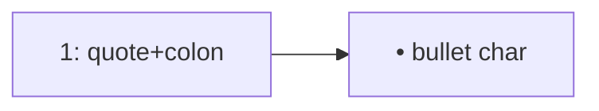

# Quartz Mermaid 노드 라벨: 선두 N. / - 리스트 파싱

Mermaid11(Quartz 등) flowchart에서 노드 텍스트가 **마크다운 리스트**로 파싱되면 `Unsupported markdown: list`가 나고 노드가 비어 보인다.

## 함정

- 따옴표만으로 감싼 `Node["1. …"]` / `Node["- …"]`도 **선두 `\d+\.` / `- `** 가 list로 해석될 수 있다.
- CDN/`max-age` 때문에 배포 직후 “여전히 깨짐” 보고는 **캐시**일 수 있다 — hard refresh 후 재현.

## 권장 패턴

| 피하기 | 쓰기 |
| :--- | :--- |
| `A[1. 단계]` (bare) | `A["1: 단계"]` (콜론) |
| `A["1. 단계"]`만 신뢰 | `A["1\. 단계"]` 또는 `A["• 단계"]` |
| 회귀 없음 | fence 내 선두 `\d+\.`·`- ` 금지 테스트 |



## 회귀 테스트 아이디어

```python
# fence 본문에서 노드 라벨 선두가 \d+\. 또는 "- " 이면 fail
import re
BAD = re.compile(r'\["(\d+\.|- )')
assert not BAD.search(mermaid_fence_body)
```

## 🔗 관련 문서

- [[wiki/Engineering/AI-Native-Engineering/Wiki-Synthesis-Policy.md]]
- [[wiki/Engineering/AI-Native-Engineering/Agentic-Software-Factory.md]]
