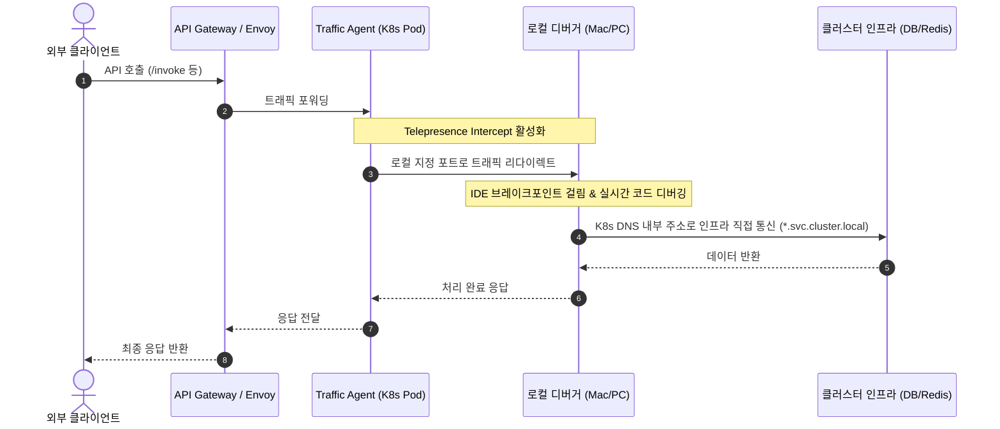

# Telepresence 기반 Kubernetes 로컬 디버깅 가이드

이 가이드는 Kubernetes(k8s) 클러스터에서 동작 중인 특정 마이크로서비스(Deployment/Pod)의 네트워크 트래픽을 로컬 개발 컴퓨터로 인터셉트(Intercept)하여, 로컬 IDE(VS Code, Cursor 등) 환경에서 브레이크포인트(Breakpoint)를 걸고 실시간으로 디버깅할 수 있는 범용적인 개발 환경 구축 방법을 설명합니다.

---

## 1. 개요 및 동작 아키텍처

**Telepresence**는 로컬 개발 머신을 Kubernetes 클러스터의 가상 Pod처럼 양방향 네트워킹(Two-way Networking)으로 연결하는 도구입니다.

### 1.1 트래픽 흐름 비교
* **일반 런타임**: 클라이언트 요청 → API 게이트웨이 → 대상 K8s Pod (클러스터 내부에서 처리)
* **Telepresence Intercept 런타임**: 클라이언트 요청 → API 게이트웨이 → 대상 K8s Pod (Traffic Agent가 트래픽 가로챔) → 로컬 개발 컴퓨터 (디버거 프로세스에서 처리 및 브레이크포인트 검출) → 로컬 가공 후 클러스터 내 인프라(DB, Redis 등)로 직접 쿼리



---

## 2. 사전 준비

### 2.1 로컬 CLI 도구 설치 및 설정
1. **Telepresence CLI** (v2.29+ 권장)
   ```bash
   # macOS (Homebrew)
   brew install datawire/blackbird/telepresence
   
   # 버전 확인
   telepresence version
   ```
2. **kubectl** 및 클러스터 컨텍스트 설정
   ```bash
   # 현재 연결된 컨테이너 클러스터 확인
   kubectl config current-context
   
   # 디버깅 대상 서비스 상태 조회
   kubectl -n <namespace> get deployment <deployment-name>
   ```

### 2.2 클러스터 측 요건
* 대상 네임스페이스 내에 Telepresence **Traffic Manager**가 설치 및 동작 중이어야 합니다.
* 개발자 계정에 Traffic Manager와 연동할 수 있는 RBAC 권한이 확보되어야 합니다.

---

## 3. 포트 설계 및 환경 변수 병합 전략

### 3.1 로컬 포트 맵 설계 (충돌 방지)
다중 마이크로서비스를 동시에 실행하거나 개별적으로 디버깅할 때 로컬 포트가 충돌하는 것을 방지하기 위해 서비스별로 고유한 로컬 디버그 포트를 사전 정의해야 합니다.

| 서비스 구분 | 대상 K8s Deployment / Service | 로컬 디버그 포트 | K8s Pod 내부 포트 |
| :--- | :--- | :--- | :--- |
| **Service A** (예: `compiled_graph`) | `service-a-deployment` | `8091` | `8080` |
| **Service B** (예: `adk`) | `service-b-deployment` | `8092` | `8080` |
| **Service C** (예: `fastmcp`) | `service-c-deployment` | `8093` | `8080` |
| **Service D** (예: `mcp_sdk`) | `service-d-deployment` | `8094` | `8080` |
| **Service E** (예: `hermes`) | `service-e-deployment` | `8095` | `8080` |

> [!TIP]
> 로컬 인터셉트 포트는 `로컬_포트:컨테이너_포트` 형식으로 매핑하여 실행합니다 (예: `8091:8080`).

### 3.2 환경 변수 병합 전략 (Hybrid Env)
Telepresence를 사용하면 K8s Pod가 가지고 있는 실제 배포 환경 변수(DB DSN, 외부 API Key, Redis DSN 등)를 로컬 `.env` 파일로 덤프할 수 있습니다. 

* **Pod 환경 변수 (자동 확보)**: `telepresence intercept` 명령 실행 시 `--env-file` 옵션을 통해 로컬에 스냅샷 파일(예: `.env.telepresence-<service>`)로 다운로드합니다.
* **로컬 전용 환경 변수 (수동 오버라이드)**: 로컬 개발 소스 경로(`PYTHONPATH`, `NODE_PATH` 등)나 로컬 캐시 디렉터리, 로컬 포트 정보 등은 IDE 설정(`launch.json` 등)에서 직접 오버라이드하여 덮어씁니다.

---

## 4. VS Code 및 Cursor 디버깅 설정

자동 인터셉트, 디버거 실행, 인터셉트 해제(Cleanup)를 원클릭으로 수행할 수 있도록 IDE 설정을 아래와 같이 구성합니다.

### 4.1 `.vscode/tasks.json` 설정
디버거 실행 전/후에 실행할 Telepresence 라이프사이클 태스크를 정의합니다.

```json
{
  "version": "2.0.0",
  "tasks": [
    {
      "label": "telepresence-connect",
      "type": "shell",
      "command": "telepresence connect -n <target-namespace>",
      "problemMatcher": []
    },
    {
      "label": "telepresence-intercept-service-a",
      "type": "shell",
      "command": "telepresence intercept service-a-deployment -n <target-namespace> -p 8091:8080 --env-file ${workspaceFolder}/.env.telepresence-service-a",
      "dependsOn": "telepresence-connect",
      "problemMatcher": []
    },
    {
      "label": "telepresence-leave-service-a",
      "type": "shell",
      "command": "telepresence leave service-a-deployment -n <target-namespace>",
      "problemMatcher": []
    }
  ]
}
```

### 4.2 `.vscode/launch.json` 설정
`.env.telepresence-<service>` 파일을 연동하고 로컬 디버거를 구동합니다.

```json
{
  "version": "0.2.0",
  "configurations": [
    {
      "name": "Debug: Service A (Telepresence)",
      "type": "python",
      "request": "launch",
      "module": "uvicorn",
      "args": [
        "app.main:app",
        "--port",
        "8091"
      ],
      "jinja": true,
      "justMyCode": true,
      "envFile": "${workspaceFolder}/.env.telepresence-service-a",
      "env": {
        "PYTHONPATH": "${workspaceFolder}/src",
        "SERVICE_NAME": "service-a-deployment",
        "LOCAL_DEBUG_MODE": "true"
      },
      "preLaunchTask": "telepresence-intercept-service-a",
      "postDebugTask": "telepresence-leave-service-a"
    }
  ]
}
```

---

## 5. CLI 기반 수동 가동 스펙

스크립트나 자동화 작업 없이 CLI 상에서 직접 디버그 서버를 가동하고자 할 때의 표준 절차입니다.

### 5.1 Step 1: 클러스터 터널링 연결
로컬 머신의 DNS를 클러스터 네트워킹과 동기화합니다.
```bash
telepresence connect -n <namespace>
```

### 5.2 Step 2: 트래픽 인터셉트 및 환경변수 덤프
실제 K8s Deployment의 복제본(Replica) 트래픽을 가로채고 환경변수를 로컬 파일로 저장합니다.
```bash
telepresence intercept <deployment-name> \
  -n <namespace> \
  -p <local-port>:<container-port> \
  --env-file .env.telepresence-<service-name>
```

### 5.3 Step 3: 로컬 디버그 프로세스 기동 (예: Python FastAPI)
덤프된 환경 변수를 로드하고, 로컬 디버그 오버라이드 환경 변수를 추가하여 수동으로 실행합니다.
```bash
# 덤프된 환경변수 적용 (예시)
export $(grep -v '^#' .env.telepresence-<service-name> | xargs)

# 로컬 고유 변수와 함께 애플리케이션 실행
PYTHONPATH=./src \
  PORT=<local-port> \
  uv run uvicorn app.main:app --port <local-port>
```

### 5.4 Step 4: 인터셉트 해제 및 정리
디버깅이 끝나면 클러스터의 원본 Pod가 정상 트래픽을 처리할 수 있도록 인터셉트를 명시적으로 끊어줍니다.
```bash
telepresence leave <deployment-name> -n <namespace>
```

### 5.5 상태 점검 명령어
```bash
telepresence status                      # 현재 연결 및 데몬 상태 확인
telepresence list                        # 인터셉트 가능/진행 중인 목록 확인
```

---

## 6. 트러블슈팅 가이드

| 증상 | 발생 원인 | 조치 사항 |
| :--- | :--- | :--- |
| `Cluster configuration changed...` | 로컬 Telepresence 데몬과 클러스터의 연결 정보가 일치하지 않음 | 데몬을 강제 종료 후 재설정합니다:<br>`telepresence quit -s` 후 다시 `telepresence connect` 실행 |
| `Traffic Manager Not connected` | K8s 클러스터 내 매니저 파드가 다운되었거나 RBAC 권한이 없음 | 클러스터 관리자에게 Traffic Manager Pod 상태 및 네임스페이스 접근 RBAC 권한을 확인합니다. |
| `ready to engage (traffic-agent...)` | 대상 Pod에 intercept용 가이드 에이전트가 최초 설치 중이거나 지연됨 | 최초 1회 빌드 및 인젝션 대기 시간이 수 분 소요될 수 있습니다. 계속 실패 시 클러스터 리소스 가용량을 확인합니다. |
| `Address already in use` | 지정한 로컬 디버그 포트(`<local-port>`)를 다른 프로세스가 이미 점유 중 | `lsof -i :<local-port>` 명령으로 PID를 확인하여 종료하거나, 포트 맵 설정을 변경합니다. |
| `DB/Redis 연결 실패` | 로컬 격리 실행(Port-forward) 환경과 Telepresence 환경의 DNS가 혼용됨 | `telepresence connect`가 정상 연결되면 `localhost` 주소가 아닌 K8s 내부 서비스 주소(예: `postgres-service.infra.svc.cluster.local`)로 직접 통신해야 합니다. |

---

## [부록] 로컬 격리 실행(Isolate) vs Telepresence Intercept 비교

| 구분 | 로컬 격리 실행 (Port-Forward 기반) | Telepresence Intercept |
| :--- | :--- | :--- |
| **K8s 클러스터 리소스** | 대상 서비스 Pod의 Replica를 0으로 줄이거나 독립 가동 | 원본 Replica를 유지하면서 트래픽만 로컬로 전환 |
| **외부 자원 접근 (DB/Redis)** | `127.0.0.1:<forward-port>` 개별 포트포워딩 필요 | `connect` 후 K8s 내부 서비스 DNS 주소로 즉시 접근 |
| **환경 변수 구성** | 로컬에 정적 `.env.local` 파일을 별도로 구성하여 관리 | K8s Pod 실제 환경 변수를 실시간 덤프 및 병합 |
| **E2E 트래픽 경로 검증** | 로컬 포트로 수동 REST Client(`curl`, `Postman`) 요청만 가능 | Gateway를 타는 실제 운영 트래픽 라우팅 경로 그대로 검증 |
| **추천 시나리오** | 클러스터 의존성이 낮고 단일 모듈을 빠르게 개발/테스트할 때 | Gateway, Auth, 타 마이크로서비스 간 연쇄 호출(Call-chain)을 디버깅할 때 |
