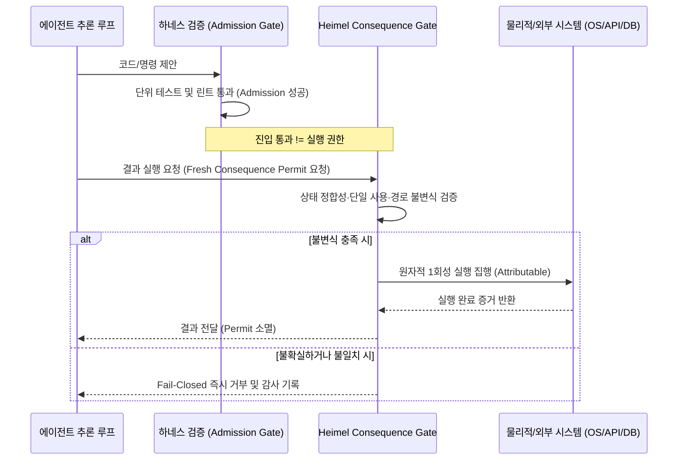

# Heimel: 의도에서 결과로의 전이를 통제하는 결과 시점 실행 인가 인프라

## 1. 개요 및 배경
자율 에이전트(Autonomous Agents)가 파일시스템 수정, API 호출, 인프라 배포 등 외부 세계에 물리적·논리적 영향(Side Effects)을 미치는 단계로 진화함에 따라, 기존의 '프롬프트 가드레일'이나 '하네스 테스트 통과'만으로는 시스템의 파괴적 오작동이나 탈옥(Jailbreak)을 방어하기 어렵다는 점이 명확해졌습니다.

**Heimel**([GitHub: Heimel-open/Heimel](https://github.com/Heimel-open/Heimel))은 에이전트의 내부 '의도(Intent)'가 실제 시스템의 '결과(Consequence)'로 전이되는 경계면을 수학적·암호학적으로 통제하는 오픈 거버넌스 인프라입니다. 클라우드 계정이나 중앙 라이선스 서버 없이 로컬 환경에서 독립적으로 실행 가능한 인가(Authorization), 집행(Enforcement), 증거 감사 파이프라인을 제공합니다.

---

## 2. 핵심 원칙: 진입 검사(Admission)와 결과 시점 인가(Consequence Authorization)의 분리

Heimel 아키텍처의 가장 명확한 경계는 다음과 같습니다:

> **"모델/하네스 진입 검사(Model/Harness Admission)는 이전 단계의 검증일 뿐이며, 테스트나 안전성 평가를 통과했다고 해서 결과 실행 권한(Execution Authority)이 부여되는 것은 아니다."**

---

## 3. Heimel의 7대 실행 불변식 (The 7 Invariants)

Heimel은 결과 실행 직전 다음 7가지 불변식을 기계적으로 강제합니다:

1. **직접 영향 경로 검증 (Direct Effect Path)**:
   - 인가 요청된 페이로드와 실제 외부 시스템에 전달되는 호출 경로 사이에 은닉된 우회로(Side-channel)가 없음을 검증.
2. **결과 시점 신선한 권한 부여 (Fresh Authority at Consequence Time)**:
   - 과거에 발급받았던 권한이나 사전 캐시된 세션 토큰을 인정하지 않고, 오직 '결과가 실행되는 바로 그 시점'에 새로 발급된 신선한 권한만 유효.
3. **단일 사용 허가증 (Single-Use Permits)**:
   - 발급된 인가 퍼밋은 정확히 1회 사용 즉시 폐기되며, 재사용(Replay Attack)을 원천 차단.
4. **인가 후 결과 불변성 (Immutable Effect Post-Authorization)**:
   - 승인 검사가 완료된 이후 실행 페이로드를 단 1바이트도 수정할 수 없음.
5. **지연 및 불일치 상태 거부 (Rejection of Stale or Mismatched State)**:
   - 인가 시점의 시스템 상태와 실제 집행 시점의 시스템 스냅샷이 조금이라도 어긋나면 즉시 트랜잭션 중단.
6. **재현 가능하고 귀속 가능한 결과 (Replayable and Attributable Consequences)**:
   - 실행된 모든 부수 효과는 결정론적으로 감사 로그에 기록되어 재현 가능해야 하며, 실행 주체가 명확히 귀속되어야 함.
7. **미확인 상태 시 폐쇄 실패 (Fail-Closed on Unknown)**:
   - 에러나 타임아웃, 예외 상황 등 상태를 100% 확신할 수 없을 때는 무조건 작업을 차단하고 실행하지 않음(Fail-Closed).

---

## 4. 에이전틱 엔지니어링 거버넌스 시사점
- **Intent Anchor와 결합**: [[wiki/Engineering/AI-Native-Engineering/The-End-of-Software-Engineering-Intent-Architecture.md|The-End-of-Software-Engineering-Intent-Architecture]]에서 제안하는 $G=1$ 원칙(인간의 의도와 하드웨어 실행의 1:1 바인딩)을 런타임에서 실제로 강제하는 구체적 구현체 역할을 수행합니다.
- **소프트웨어 팩토리 방어**: 자율 CI/CD 및 코드 합성 팩토리([[wiki/Engineering/AI-Native-Engineering/Agentic-Software-Factory.md|Agentic Software Factory]])에서 에이전트가 배포 스크립트나 데이터베이스 마이그레이션을 실행할 때 최종 관문(Consequence Barrier)으로 동작할 수 있습니다.

---

## 🔗 관련 문서
- [[wiki/Engineering/Security/000_Security-MOC.md|Security MOC]]
- [[wiki/Engineering/Security/AI-Development-Regulation-and-Safety.md|AI Development Regulation and Safety]]
- [[wiki/Agents/Memory-and-Cognition/QwenPaw-Three-Layer-Persistent-Memory.md|QwenPaw 3계층 영속적 메모리]]
- [[wiki/Engineering/AI-Native-Engineering/The-End-of-Software-Engineering-Intent-Architecture.md|소프트웨어 공학의 종말: 의도 설계자와 AaaS]]
- [[wiki/Engineering/AI-Native-Engineering/Agentic-Software-Factory.md|Agentic Software Factory]]
