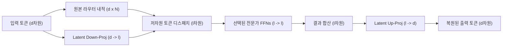
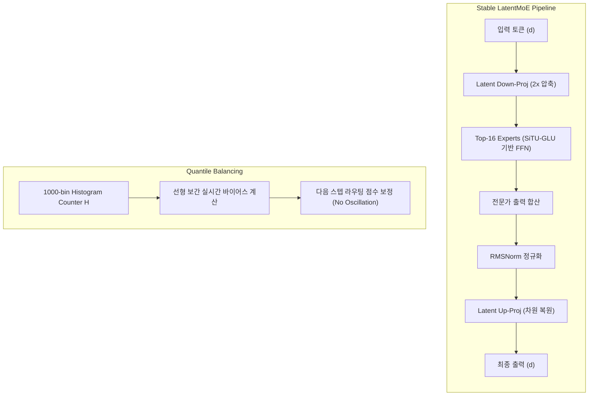

# LatentMoE 및 Stable LatentMoE 아키텍처: 잠재 공간 압축과 극한 희소성 제어

## 1. 배경 및 문제 의식
초거대 혼합 전문가(Mixture-of-Experts, MoE) 모델은 파라미터 희소성을 극대화하기 위해 수백 개의 전문가(Expert)를 활용하는 방향으로 진화하고 있습니다. 예를 들어 Moonshot AI의 Kimi K3는 896개의 전문가를 배치하여 운영됩니다.

과거 MoE 연구는 주로 "최소 연산량(FLOPs)으로 최대 성능을 달성하는 것"에 초점을 맞추었으나, 분산 클러스터 기반 실서비스 환경에서의 진짜 병목은 연산량이 아니라 **통신 비용(All-to-All Communication Overhead)과 메모리 대역폭(Memory Bandwidth)**입니다:
- **지연 시간(Latency) 환경**: 거대한 전문가 가중치를 불러오는 메모리 대역폭이 주된 지연 요인입니다.
- **처리량(Throughput) 환경**: 다중 GPU 노드 간 토큰을 분배하고 집계(Dispatch & Combine)하는 All-to-All 통신 비용이 심각한 네트워크 병목을 초래합니다.

이에 따라 2026년 NVIDIA와 Moonshot AI는 통신과 대역폭을 고려한 **서빙 인식(Serving-Aware) MoE 아키텍처**로 **LatentMoE**와 **Stable LatentMoE**를 제시하였습니다.

---

## 2. LatentMoE (NVIDIA)

### 핵심 개념: "압축을 통해 절감한 자원으로 전문가 수 확장"
LatentMoE는 라우팅 메커니즘 자체는 원본 차원에서 정밀하게 유지하되, 실제 통신과 전문가 FFN 연산이 수행되는 데이터 통로를 좁은 **잠재 공간(Latent Space)**으로 선형 압축하는 아키텍처입니다.



### 아키텍처 세부 구성
1. **라우터 내적 연산 (원본 차원 유지)**:
   - 라우터 행렬은 파라미터 수가 작아 통신이나 메모리 대역폭 병목을 유발하지 않습니다.
   - 따라서 기존 MoE와 동일하게 원본 크기의 입력 토큰($d$차원)과 원본 라우터 행렬($d \times N$, $N$은 전문가 수)을 내적하여 최적의 전문가를 선별합니다.
2. **저차원 잠재 공간 선형 투영 (Down-Projection)**:
   - 입력 토큰을 선형 레이어인 Latent Down-Projection ($d \times l$)을 통해 $l$차원($l \ll d$)으로 압축합니다.
   - 전문가 FFN의 가중치 역시 $l$차원의 입출력 크기로 설계됩니다.
3. **전문가 연산 및 원본 차원 복원 (Up-Projection)**:
   - 각 전문가의 $l$차원 연산 결과물을 합산한 뒤, Latent Up-Projection ($l \times d$) 레이어를 거쳐 원래 임베딩 차원($d$차원)으로 복원하여 다음 트랜스포머 레이어로 전달합니다.

### 이점 및 자원 절감 효과
- 입출력 통로를 4배 압축($l = d/4$)할 경우, GPU 간 All-to-All 통신 데이터양과 VRAM 메모리 적재 부담이 **1/4로 감소**합니다.
- 이에 따라 전체 전문가 수($N$)와 토큰당 활성화되는 전문가 수($K$)를 동시에 4배로 확장하더라도 전체 연산량과 총 파라미터 용량을 이전과 동일한 수준으로 통제할 수 있습니다.

---

## 3. Stable LatentMoE (Moonshot AI Kimi K3)

### 2.8조(A104B) 스케일에서의 극한 희소성 제어
Moonshot AI의 Kimi K3는 총 **2.8조 파라미터(활성 파라미터 1,040억, A104B)** 규모의 플래그십 모델로, 896개의 전문가 중 토큰당 16개의 라우팅 전문가와 2개의 공유 전문가(Shared Experts)를 활성화합니다.

수많은 GPU를 병렬 연결해야 하는 초거대 스케일과 극단적인 희소성 조건에서는 연산 값이 발산(Overflow)하거나 부하 불균형이 발생하는 문제가 발생합니다. Kimi K3는 이를 완화하기 위해 LatentMoE에 **3대 안정화 장치**를 추가한 **Stable LatentMoE**를 구축하였습니다.



### 1) SiTU-GLU (Sigmoid-Tanh Unit GLU)
기존 SwiGLU는 Gate 행렬과 Up-projection 행렬의 곱으로 구성되어, 초거대 스케일에서 활성화 값이 상한 없이 커져 오버플로우를 유발하는 취약점이 있었습니다. SiTU-GLU는 Scaled Tanh를 도입하여 활성화 값에 명시적 상한선을 부여합니다:
- **Gate 경로**: Swish의 무한 발산 요소를 제거하고 $4 \times \tanh(x)$와 Sigmoid를 결합하여 절댓값이 4 이하로 유지되도록 제약.
- **Up-projection 경로**: $25 \times \tanh(x)$를 적용하여 출력 범위를 $[-25, 25]$로 제어.
- **최종 출력 한계**: 두 경로의 곱으로 계산되는 FFN 활성화 값이 반드시 **$[-100, 100]$** 범위 내에 머물도록 엄격히 차단.

### 2) RMSNorm 단계 추가
Top-16으로 선별된 전문가들의 연산 결과 벡터를 하나로 결합(Combine)한 직후, 원래 차원으로 복원(Up-projection)하기 바로 전 단계에 **RMSNorm 정규화**를 수행합니다:
- 다수 전문가의 출력값이 중첩되면서 발생하는 벡터 크기의 비정상적 요동(Fluctuation)을 방지.
- 출력 벡터 스케일을 상시 1 근처로 일정하게 유지하여 전체 심층 레이어의 훈련 안정성을 보장.

### 3) Quantile Balancing (정밀 부하 분산)
896개 전문가 간의 작업 부하를 고르게 분산하기 위해 기존 DeepSeek-V3 스타일의 고정 보폭 바이어스(Fixed-step bias) 업데이트 대신 **분위수 기반 히스토그램 밸런싱**을 채택했습니다:
- **고정 스텝 방식의 한계**: 바이어스 업데이트 속도가 너무 느리거나 목표 지점을 지나쳐 바이어스가 진동(Oscillation)하는 문제 발생.
- **Quantile Balancing 메커니즘**:
  - 896개의 전문가마다 라우팅 점수 범위를 **1,000개 구간(Bin)으로 세분화한 히스토그램 카운터 행렬($H$)**을 유지.
  - 매 훈련 스텝 순전파 시 전체 토큰의 점수 분포를 실시간 집계.
  - 선형 보간(Linear Interpolation) 공식을 통해 각 전문가가 균등하게 할당될 수 있는 수학적 최적 바이어스를 직접 산출.
  - 토큰이 과밀하게 몰린 전문가는 바이어스 감점, 부족한 전문가는 가점하여 다음 스텝 라우팅에 적용.
  - 이 과정은 모델 학습 시에만 수행되며, 추론 시에는 학습 완료된 바이어스를 고정 적용하여 오버헤드 없이 고속 라우팅을 수행.

---

## 4. 성능 및 스케일링 효율

| 모델 구성요소 | 기존 표준 MoE (Kimi K2 등) | Stable LatentMoE (Kimi K3) |
| :--- | :--- | :--- |
| **전체 전문가 수 ($N$)** | 수십~수백 개 수준 | **896개** |
| **토큰당 활성 전문가 ($K$)** | 2~8개 | **16개 + 2개 공유 전문가** |
| **잠재 차원 압축률** | 미압축 (1.0x) | **2.0x (K3) / 최대 4.0x (NVIDIA)** |
| **활성화 제어 함수** | SwiGLU (발산 가능) | **SiTU-GLU ($[-100, 100]$ 클리핑)** |
| **부하 분산 기법** | 보조 손실(Auxiliary Loss) or 고정 바이어스 | **Quantile Balancing (1000-bin $H$)** |
| **스케일링 효율성** | 기준선 (1.0x) | **2.5x 향상 (KDA + AttnRes 결합)** |

Kimi K3는 2배 잠재 압축률을 적용한 Stable LatentMoE와 선형 델타 어텐션(KDA), 잔차 우회 어텐션(AttnRes)을 결합하여 이전 세대 대비 스케일링 효율을 **2.5배** 향상시켰습니다.

---

## 5. 실무 구현 가이드 (vLLM / SGLang 연동)

```python
# LatentMoE 전문가 블록 개념 구현 (PyTorch pseudo-code)
import torch
import torch.nn as nn
import torch.nn.functional as F

class SiTUGLU(nn.Module):
    def __init__(self, in_features, hidden_features):
        super().__init__()
        self.w_gate = nn.Linear(in_features, hidden_features, bias=False)
        self.w_up = nn.Linear(in_features, hidden_features, bias=False)

    def forward(self, x):
        # Gate: 4 * tanh(x) * sigmoid(x) -> bound to [-4, 4]
        gate = 4.0 * torch.tanh(self.w_gate(x)) * torch.sigmoid(self.w_gate(x))
        # Up: 25 * tanh(x) -> bound to [-25, 25]
        up = 25.0 * torch.tanh(self.w_up(x))
        # Output is strictly bounded within [-100, 100]
        return gate * up

class StableLatentMoEBlock(nn.Module):
    def __init__(self, d_model, d_latent, num_experts, top_k):
        super().__init__()
        self.router = nn.Linear(d_model, num_experts, bias=False)
        self.latent_down = nn.Linear(d_model, d_latent, bias=False)
        self.experts = nn.ModuleList([
            SiTUGLU(d_latent, d_latent * 2) for _ in range(num_experts)
        ])
        self.expert_out = nn.ModuleList([
            nn.Linear(d_latent * 2, d_latent, bias=False) for _ in range(num_experts)
        ])
        self.combine_norm = nn.RMSNorm(d_latent)
        self.latent_up = nn.Linear(d_latent, d_model, bias=False)
        self.top_k = top_k

    def forward(self, x, expert_bias=None):
        # 1. 원본 차원에서의 라우팅 스코어 계산
        logits = self.router(x)
        if expert_bias is not None:
            logits = logits + expert_bias
        scores, indices = torch.topk(F.softmax(logits, dim=-1), self.top_k, dim=-1)

        # 2. 입력을 저차원 잠재 공간으로 압축
        x_latent = self.latent_down(x)

        # 3. 선별된 전문가 FFN 연산 및 결합 (실제 분산 환경에서는 All-to-All 통신 최소화)
        combined_latent = torch.zeros_like(x_latent)
        for i in range(self.top_k):
            expert_idx = indices[:, i]
            # ... 전문가별 토큰 디스패치 및 연산 ...

        # 4. 결합 직후 RMSNorm 정규화
        normalized_latent = self.combine_norm(combined_latent)

        # 5. 원본 임베딩 차원으로 복원
        out = self.latent_up(normalized_latent)
        return out
```

---

## 🔗 관련 문서
- [[wiki/Models/Architectures/Kimi-K3-Sparse-MoE-Model.md|Kimi K3 모델 아키텍처]]
- [[wiki/Models/Architectures/MoE 모델 분석.md|MoE 모델 분석]]
- [[wiki/Models/Optimization-and-Serving/Speculative-MoE.md|Speculative MoE]]
- [[wiki/Models/Architectures/000_Architectures-MOC.md|모델 아키텍처 MOC]]
