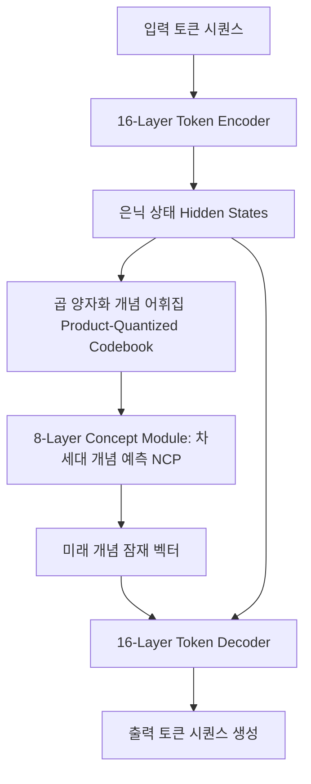

# NCP-ArchPreview: 잠재 공간 언어 모델과 차세대 개념 예측(Next Concept Prediction)

## 1. 개요 및 패러다임 전환
ChatGPT, Claude, Gemini를 비롯한 대형 언어 모델(LLM)은 지난 수년간 **다음 토큰 예측(Next-Token Prediction, NTP)**이라는 단일 목적 함수를 바탕으로 스케일링을 거듭해 왔습니다. 그러나 개별 하위 단어(Sub-word) 토큰을 순차적으로 맞추는 방식은 인간이 고차원적 '개념(Concept)'과 의미 덩어리를 먼저 떠올린 뒤 문장을 발화하는 인지 구조와 괴리가 있으며, 장기 의존성 모델링 시 불필요하게 많은 토큰 연산을 소모한다는 지적이 지속되었습니다.

2026년 9월, 상하이 AI 랩(Shanghai AI Lab)과 상하이 교통대학교 LUMIA Lab 연구진은 이산 잠재 공간(Discrete Latent Space) 상에서 개념을 예측하고 이를 바탕으로 텍스트를 생성하는 8.9B 규모의 오픈 가중치 파운데이션 모델 **NCP-ArchPreview**([arXiv:2609.10715](https://arxiv.org/abs/2609.10715), 선행 개념 [arXiv:2602.08984](https://arxiv.org/abs/2602.08984))를 발표했습니다.

---

## 2. NCP-ArchPreview 아키텍처 구조

NCP-ArchPreview는 OLMo-3-7B 백본을 기반으로 설계된 8.9B 파라미터 규모의 잠재 공간 언어 모델(Latent Space Language Model)입니다.

### 2.1 주요 3단계 모듈 구성
1. **16-Layer Token Encoder**:
   - 입력 텍스트 시퀀스를 입력받아 문맥화된 풍부한 은닉 상태(Contextualized Hidden States)를 형성합니다.
2. **Product-Quantized (PQ) Concept Codebook & Concept Module (8-Layer)**:
   - 인코더의 은닉 상태 벡터들을 여러 토큰에 걸친 이산적 개념(Discrete Concept)으로 양자화하여 '개념 어휘집'을 형성합니다.
   - 전용 8계층 개념 모듈은 다음 표면 토큰이 무엇인지에 앞서, **다음에 전개되어야 할 상위 개념(Next Concept)의 잠재 표현을 먼저 예측**합니다.
3. **16-Layer Token Decoder**:
   - 예측된 상위 개념 잠재 표현의 강력한 유도(Guidance) 하에 구체적인 세부 토큰들을 디코딩합니다.

---

## 3. 학습 경제성 및 벤치마크 평가

NCP-ArchPreview는 Allen AI의 Dolma 3 데이터셋(5.73T 토큰)을 활용하여 표준 NTP 손실과 NCP 손실을 결합한 다중 목표 함수로 사전 훈련되었습니다.

### 3.1 훈련 토큰 및 연산 효율성
- **토큰 사용량 51.3% 달성**: 최고 수준의 오픈 소스 모델인 OLMo-3-7B의 최종 Stage-1 사전 훈련 손실(Reference Loss)에 도달하는 데 기준 모델 훈련 토큰의 **51.3%만 소모**했습니다.
- **연산량(FLOPs) 15% 절감**: 동일 파라미터 기준 모델 대비 **85%의 연산량만으로 완전한 수렴 손실**에 도달하여 데이터 및 컴퓨팅 집약적 LLM 훈련 비용을 획기적으로 낮출 수 있음을 보였습니다.

### 3.2 다운스트림 태스크 성능 비교
단순히 손실 함수만 낮춘 것이 아니라 복합 추론 및 코딩 벤치마크에서 기존 토큰 단위 모델을 능가했습니다:

| 벤치마크 | OLMo-3-7B (NTP 기준) | NCP-ArchPreview (8.9B) | 성능 차이 |
| :--- | :--- | :--- | :--- |
| **다운스트림 평균** | Baseline | **+2.45점** | 전반적 지능 우세 |
| **GSM8K (수학 추론)** | Baseline | **+5.99점** | 고차원 개념 계획 우위 |
| **HumanEval (코딩)** | Baseline | 향상 | 구조적 코드 블록 생성 개선 |

---

## 4. 경량 모듈식 도메인 적응 (17M VQ Adaptation)
NCP 아키텍처의 가장 큰 실무적 장점 중 하나는 **파라미터 효율적 도메인 특화(PEFT)** 가능성입니다.
- 모델의 8.9B 메인 가중치를 완전히 동결(Frozen)한 상태에서, 은닉 벡터를 개념으로 변환하는 **17M 파라미터 크기의 Vector Quantization (VQ) 모듈만 교체 훈련**함으로써 특정 법률, 의학, 금융 등 도메인 고유 개념 집합으로 모델을 초고속 적응시킬 수 있습니다.
- 이는 수십 GB의 전체 가중치 파인튜닝 없이도 온디바이스 및 프라이빗 클라우드 환경에서 도메인 전이 비용을 최소화합니다.

---

## 5. 엔지니어링 분석 및 비판적 한계 (Technical Critique)
1. **개념 손실과 토큰 생성의 관계**:
   - NCP가 토큰 디코딩 과정을 완전히 배제하는 것은 아닙니다. 실제로는 개념 공간에서의 거시적 안내와 토큰 공간에서의 미시적 생성이 결합된 이중 구조입니다.
2. **51.3% 수치의 해석 주의**:
   - 51.3%는 OLMo-3-7B의 Stage-1 손실 도달 기준이며, 이는 파라미터가 8.9B로 다소 증가한 아키텍처적 요인도 일부 반영되어 있습니다.
3. **추론 오버헤드(Inference Latency)**:
   - 토큰 생성 전에 개념 모듈을 통과하는 계층 분할 구조로 인해, First-Token Latency(TTFT)가 표준 트랜스포머 디코더 대비 약간 증가할 수 있으며 이를 극복하기 위한 파이프라이닝 최적화가 요구됩니다.

---

## 🔗 관련 문서
- [[wiki/Models/Architectures/000_Architectures-MOC.md|Architectures MOC]]
- [[wiki/Models/Architectures/LLM 아키텍처 비교.md|LLM 아키텍처 비교]]
- [[wiki/Models/Architectures/Transformers-v5.md|Transformers v5]]
- [[wiki/Models/Architectures/Recent-LLM-Architecture-Developments.md|Recent LLM Architecture Developments]]
