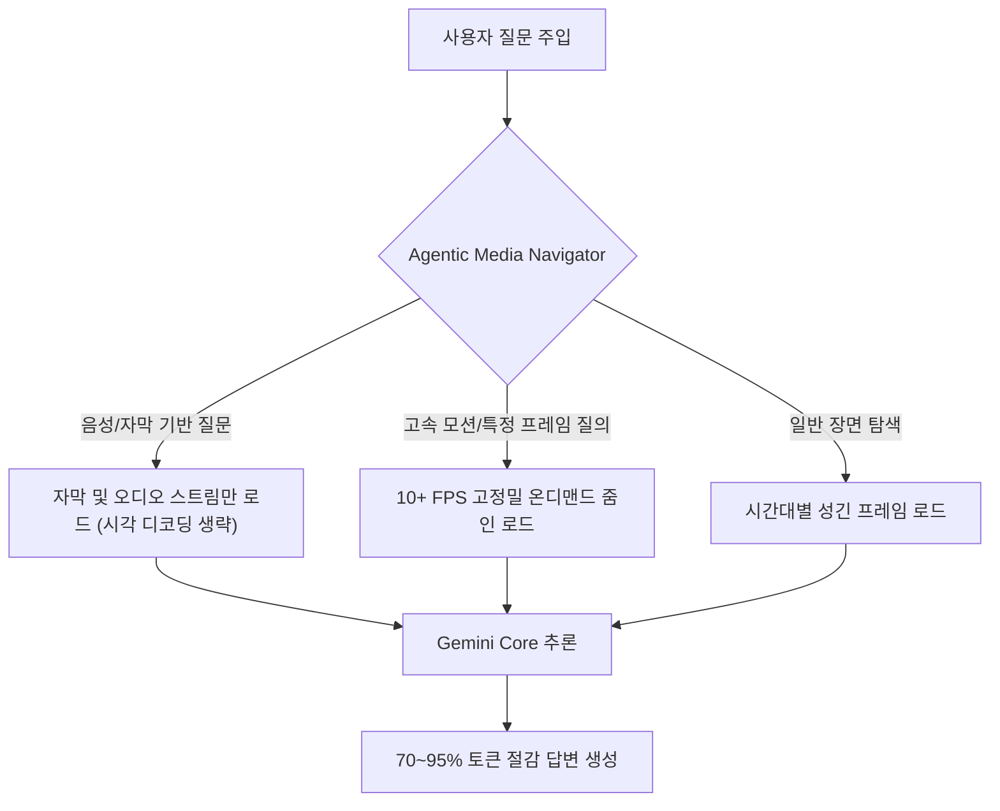

# Gemini Agentic Video 및 Omni 1.1 Flash: 멀티모달 비디오 추론 및 생성 API 아키텍처

## 1. 개요 및 배경

기존 비디오 대형 멀티모달 모델(LMM)의 가장 큰 기술적 문제는 **비디오 전체 프레임을 고정된 프레임 레이트(예: 1 FPS)로 무조건 디코딩하여 컨텍스트에 밀어넣는 수동적(Passive) 파이프라인**이었습니다.
- **토큰 폭증**: 1시간 분량의 영상은 단순 1 FPS 처리만으로도 약 **40만 토큰(400K+ tokens)** 이상을 소모합니다. 사용자의 질문이 "회의 중 사라가 언급한 액션 아이템이 무엇인가?"처럼 음성이나 자막만으로 답할 수 있는 단순 질의라 할지라도 수천 장의 정적 비디오 프레임을 디코딩해야 했습니다.
- **사전 대기열(Pre-ingestion Queue)**: 1시간 영상을 처리하는 데 2분 이상의 전처리 및 인제스천 시간이 소요되어 실시간 사용자 대화에 적용하기 어려웠습니다.

Google은 이를 근본적으로 해결하기 위해 Gemini 제품군에 **Agentic Video**와 세밀한 제어 인터페이스를 갖춘 **Gemini Omni 1.1 Flash** API를 출시하였습니다.

---

## 2. Gemini Agentic Video 메커니즘

Agentic Video는 모델이 비디오를 프레임 단위로 수동 소비하지 않고, 질문의 의도에 따라 **비디오 타임라인을 능동적으로 탐색(Active Navigation)**하며 필요한 스트림과 시간대만 선택적으로 로드합니다.



### 1) 핵심 기술 사양 및 이점
- **70%~95% 토큰 소모량 절감**:
  - 60분 길이의 회의 영상 질의 시, 영상 프레임을 건너뛰고 자막/오디오 트랙을 중심으로 처리함으로써 토큰 소비가 기존 **~407K에서 ~23K 토큰으로 급감**합니다.
- **서브세컨드(Sub-second) 정밀도**:
  - 고속 액션, 스포츠 분석, 또는 100~300ms 단위의 UI 깜빡임/제조 설비 결함 탐지 시 필요한 구간에서만 **10+ FPS로 온디맨드 줌인**하여 디코딩합니다 (+17% 정확도 향상).
- **TTFB(초단위 최초 바이트 수신) 단축**:
  - 강의, 팟캐스트, 긴 통화 녹음에서 수 분에 달하던 인제스천 대기 시간을 완전히 제거합니다.
- **다중 비디오 교차 비교 (Multi-video Analysis)**:
  - 컨텍스트 윈도우 폭증 없이 30분 이상의 비디오 여러 편(예: 복수 카메라 각도, 제품 비교 영상)을 단일 프롬프트에서 동시에 교차 검토할 수 있습니다.

### 2) 활용 주요 시나리오
1. **회의 및 콜 인텔리전스 (Call Intelligence)**: 60분 이상의 통화 요약 시 수천 장의 정적 프레임 디코딩 비용 제거.
2. **건초더미 속 바늘 찾기 (Needle in a Haystack Search)**: 별도의 벡터 DB 및 파이프라인 구축 없이 특정 슬라이드, 다이어그램, 장면 전환 탐색.
3. **이상 탐지 (Anomaly Detection)**: 1 FPS 샘플링 사이에서 누락되던 100~300ms 수준의 결함 포착.

---

## 3. Gemini Omni 1.1 Flash API: 제어 가능한 비디오 생성

Gemini Omni 1.1 Flash는 단순한 데모 수준의 영상 생성을 넘어 프로덕션 엔지니어링 파이프라인에 통합할 수 있는 **세부 제어 빌딩 블록(Controllable Building Blocks)**을 제공합니다.

### 1) 제어 기능 블록
- **Scene Extensions (장면 연장)**:
  - 기존 비디오 클립을 10초 단위로 점진 연장(최대 40초까지).
  - 이전 10초의 컨텍스트를 분석하여 시각적 및 서사적 연속성(Visual & Narrative Continuity)을 보장.
- **Keyframe & Reference Control (키프레임 및 레퍼런스 제어)**:
  - 개발자가 시작 프레임과 종료 프레임을 정확히 지정하여 매끄러운 카메라 무빙 및 트랜지션 연출.
  - 최대 3초 분량의 참조 비디오 입력을 통해 특정 캐릭터의 외형이나 스타일을 유지.
- **2단계 프로토타이핑 (Draft to 4K Pipeline)**:
  - 360p 초안(Draft)을 60% 빠른 속도와 1/3 비용으로 신속히 생성하여 파이프라인과 스토리를 검증.
  - 검증 완료된 결과물에 대해서만 1080p 및 4K 해상도로 최종 업스케일링 렌더링을 수행.

---

## 4. 실무 코드 예시 (Google GenAI SDK)

```python
# Gemini Agentic Video 설정 예시
from google import genai
from google.genai import types

client = genai.Client()

# 1. 대용량 비디오 파일 업로드
video_file = client.files.upload(file="team_meeting_60m.mp4")

# 2. media_processing="agentic" 플래그를 통한 동적 타임라인 탐색 활성화
response = client.models.generate_content(
    model="gemini-2.5-flash",
    contents=[
        video_file,
        "회의 중 사라가 Q3 인프라 마이그레이션 예산에 대해 발언한 핵심 액션 아이템을 타임스탬프와 함께 정리해줘."
    ],
    config=types.GenerateContentConfig(
        # Agentic 비디오 모드 활성화: 시각 프레임 무차별 로드를 차단하고 자막/오디오/필요 구간만 선별
        media_processing_config=types.MediaProcessingConfig(
            mode="agentic"
        )
    )
)

print(response.text)
```

---

## 🔗 관련 문서
- [[wiki/Models/Optimization-and-Serving/On-Device-Agentic-Video-Pipeline-and-Thermal-Optimization.md|온디바이스 에이전틱 비디오 파이프라인 및 서멀 최적화]]
- [[wiki/Models/Optimization-and-Serving/온디바이스-AI-및-AI-PC-기술-트렌드-2026.md|온디바이스 AI 기술 트렌드 2026]]
- [[wiki/Models/000_Models-MOC.md|모델 MOC]]
