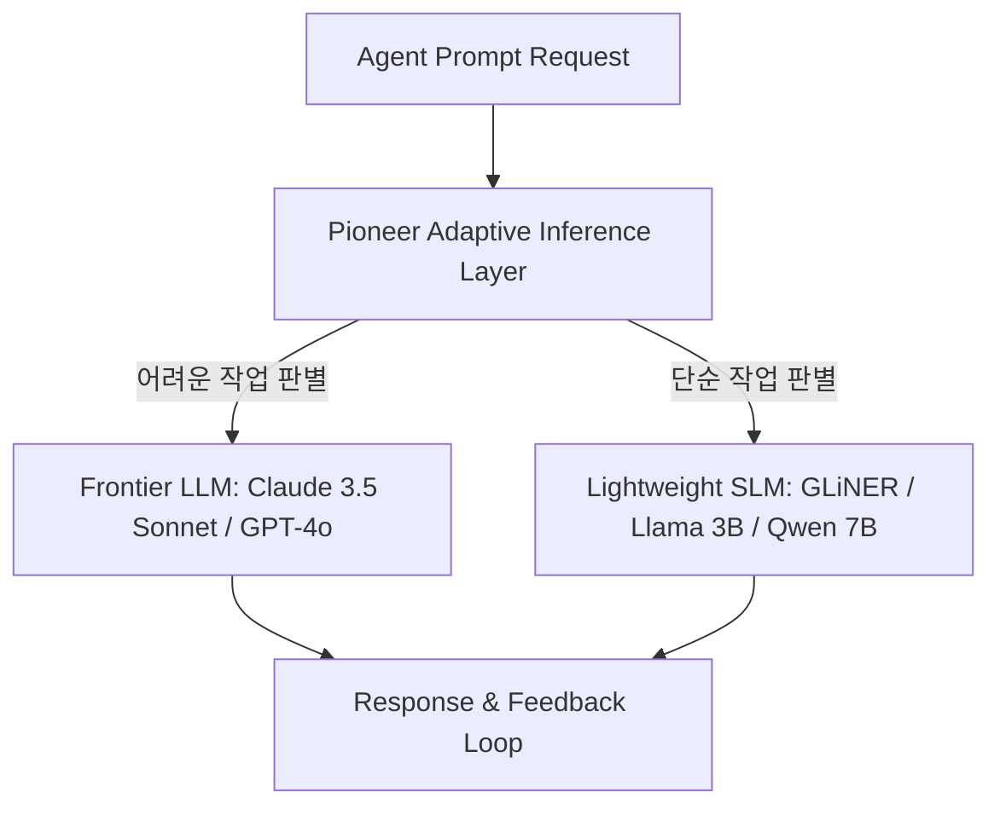

# Fastino Labs: Pioneer 적응형 추론 라우팅 아키텍처

이 문서는 Fastino Labs가 제안하는 에이전트 다단계 피드백 루프 최적화를 위한 **적응형 추론(Adaptive Inference)** 및 지능형 **인퍼런스 레이어(Inference Layer)** 라우팅 아키텍처를 기술합니다.

## 1. 아키텍처 개요: Inference-Level Routing

자율 에이전트(Autonomous Agent)가 동작할 때 가장 큰 장애물은 긴 실행 루프(Iterative Loop)로 인한 API 호출 누적, 지연 시간(Latency) 및 비용 폭증입니다. Fastino Labs의 **Pioneer** 아키텍처는 개별 호출(Per-call) 시점에 동적으로 모델을 선별하는 프록시 레이어를 구축하여 이를 해결합니다.



## 2. 핵심 메커니즘 및 최적화 기법

### 2.1. 루프 엔지니어링 (Loop Engineering)
- 에이전트는 계획(Planning) -> 코드 작성(Coding) -> 실행(Execution) -> 에러 복구(Self-correction) 등의 긴 피드백 루프를 반복 수행합니다.
- Pioneer는 이 과정에서 발생하는 매 추론 단계의 복잡도를 계산하여 모델 분배 정책을 결정합니다.

### 2.2. 적응형 프록시 라우터 (Adaptive Proxy Router)
- **작동 원리**: LLM 호출 요청이 들어오면, 질문의 문맥과 과거 대화 이력을 가벼운 분류 알고리즘 또는 로컬 라우터 모델을 통해 스캔합니다.
- **성능 판별**: 문법 검사, 단순 파일 리딩, 고정된 포맷의 JSON 생성 등은 3B 내외의 소형 언어 모델(SLM)로 포워딩하고, 고도의 추론과 아키텍처 설계 등 복잡한 논증이 필요한 작업만 프론티어 거대 모델로 포워딩합니다.
- **GLiNER의 쓰임**: Fastino Labs가 개척한 open-vocabulary 개체명 인식 모델인 **GLiNER**를 추론 전처리 단에서 활용하여, 인풋 내의 핵심 엔티티와 민감 정보를 로컬에서 빠르게 인덱싱하고 라우팅에 참조합니다.

## 3. 실무 라우팅 스크립트 설계 예시

다음은 Pioneer와 같은 적응형 추론 라우터를 미들웨어 형태로 가동하여 비용을 최적화하는 아키텍처 코드 스펙의 개념안입니다.

```python
import time
from typing import Dict

class AdaptiveInferenceRouter:
    def __init__(self):
        # 로컬 라우팅 조건 정의
        self.cheap_model = "ollama/llama3:3b"
        self.expensive_model = "anthropic/claude-3-5-sonnet"
        
    def determine_complexity(self, prompt: str) -> bool:
        """
        간단한 규칙 또는 로컬 분류기로 고도 추론이 필요한지 판별
        """
        high_complexity_keywords = ["architect", "optimize", "design", "refactor", "debug"]
        # 프롬프트의 복잡도 판단
        if any(kw in prompt.lower() for kw in high_complexity_keywords) or len(prompt) > 2000:
            return True  # High Complexity
        return False  # Low Complexity

    def route_request(self, prompt: str) -> Dict:
        start_time = time.time()
        is_complex = self.determine_complexity(prompt)
        
        selected_model = self.expensive_model if is_complex else self.cheap_model
        
        # 모델 호출 시뮬레이션
        # response = call_provider(selected_model, prompt)
        
        return {
            "routed_to": selected_model,
            "latency_ms": int((time.time() - start_time) * 1000),
            "estimated_cost_saved": "80%" if not is_complex else "0%"
        }

# 라우터 구동 예시
router = AdaptiveInferenceRouter()
print(router.route_request("Read the local directory list and verify if index.md exists."))
```

---
## 🔗 관련 문서 링크
- SFT와 RL 데이터셋 최적 일반화 전략: [[wiki/Models/Reasoning-and-Cognition/SFT-vs-RL-Compositional-Generalization.md]]
- 소형 모델 파인튜닝 실무: [[wiki/Models/Small-Models/HuggingFace-Smol-Course.md]]
