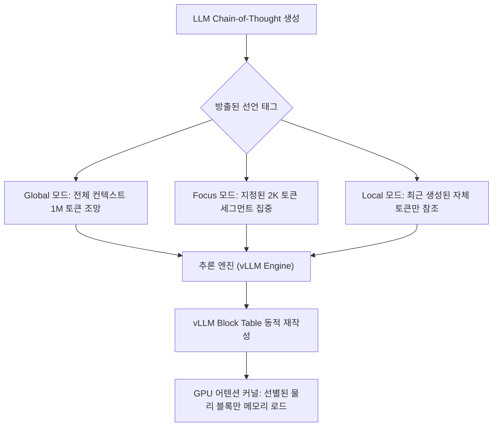

# Declarative Attention: 모델 자기 주도적 KV 캐시 탐색 및 추론 가속 (arXiv:2609.02737)

## 1. 개요 및 배경

초장문(Long-context) 대형 언어 모델(LLM) 서빙에서 가장 심각한 병목은 **디코딩 스텝마다 전체 KV 캐시(Key-Value Cache)를 읽어와야 하는 메모리 I/O 대역폭**입니다.
- **메모리 이동 비용의 심각성**: 예를 들어 `Qwen-3.5-397B-A17B` 모델이 100만 토큰(1M) 컨텍스트를 처리할 때, 매 토큰을 생성할 때마다 시퀀스당 약 **15GB**의 KV 캐시 데이터가 메모리에서 이동합니다. 이는 모델의 활성 파라미터(17B) 전체를 매 스텝마다 다시 로드하는 것과 맞먹는 수준입니다.
- **기존 희소 어텐션(Sparse Attention) 기법의 한계**:
  - H2O, StreamingLLM, SnapKV 등 기존 방식은 외부의 저비용 프록시 스코어(Proxy Scores)나 휴리스틱을 사용하여 어떤 토큰이 중요한지 "추측(Guess)"합니다.
  - 이 추측 연산은 매 디코딩 스텝마다 $O(N)$의 연산 복잡도를 요구하며, 외부 스코어러와 실제 모델 주의 집중 간의 근사 오차(Approximation Error)로 인해 복잡한 추론 태스크에서 성능 저하가 발생합니다.

KAIST AI와 Google DeepMind의 연구진(arXiv:2609.02737, *"Language Models Can Control Their Own Attention"*)은 외부에서 중요도를 추측하는 대신, **"모델 스스로가 어디를 봐야 할지 알고 있으므로 모델에게 직접 묻는다"**는 발상의 전환을 통해 **Declarative Attention (선언적 어텐션, DA)**을 제안하였습니다.

---

## 2. Declarative Attention 핵심 메커니즘

Declarative Attention은 언어 모델이 생각의 연쇄(Chain-of-Thought, CoT) 과정에서 자신이 참조할 컨텍스트 범위를 **명시적인 구조화 태그**로 선언하도록 설계되었습니다.



### 1) 3대 선언적 컨텍스트 태그
1. **`<global>`**:
   - 질문의 초기 파악이나 전체 문맥 조망이 필요한 시점에 방출.
   - 전체 컨텍스트 윈도우(Full Context)에 접근하여 정보를 전역 탐색.
2. **`<focus magic_chunks="N">`**:
   - 세부 정보를 찾아 특정 텍스트 구간을 정독해야 할 때 방출.
   - 예: `magic_chunks="7"` 선언 시 특정 2,048(2K) 토큰 세그먼트 블록에만 어텐션을 집중.
3. **`<local>`**:
   - 이미 수집된 사실을 바탕으로 자체적인 논리 추론, 계산, 포맷팅을 수행할 때 방출.
   - 최근에 자신이 생성한 출력 토큰(Generated Tokens)에만 어텐션을 수행하고 거대한 입력 컨텍스트 KV 캐시 읽기를 완전히 차단.

### 2) 서빙 엔진 연동: vLLM 블록 테이블 동적 재작성 (Block Table Rewriting)
- **도구 호출(Tool Call) 방식의 해석**:
  - 추론 서빙 엔진(vLLM)은 생성 스트림에서 `<global>`, `<focus>`, `<local>` 태그를 감지하면, 이를 마치 함수 호출을 가로채듯 인터셉트합니다.
- **물리 블록 필터링**:
  - PagedAttention 구조에서 모델이 선언한 범위에 해당하지 않는 가상 페이지 블록들을 해당 스텝의 **Block Table 매핑에서 즉각 제외**시킵니다.
  - 결과적으로 GPU 어텐션 커널(FlashAttention/PagedAttention)은 오직 선별된 블록 페이지만 메모리에서 읽어오게 되며, 메모리 전송량이 대폭 감소합니다.
- **비간섭적 배포(Zero-shot & Non-invasive)**:
  - **보조 스코어러 불필요**: 외부 프록시 평가 네트워크가 필요 없습니다.
  - **파인튜닝 불필요**: 사전 학습된 지시 준수 모델의 CoT 유도만으로 제로샷 동작합니다.
  - **커널 무수정**: vLLM의 기존 PagedAttention 커널을 수정할 필요 없이 블록 테이블 관리 계층만 연동합니다.

---

## 3. 실험 및 성능 검증

15개 장문 컨텍스트 벤치마크(Long-Context Benchmarks) 평가 결과:

| 평가 모델 | 참조 토큰 절감률 (Attended Tokens) | 정확도 변화 (Accuracy Trade-off) | 비고 |
| :--- | :--- | :--- | :--- |
| **Gemma-4-31B** | **52.0% 절감** | -1.27%p | 모델 스케일이 클수록 정확도 보존력 우수 |
| **Qwen-3.6-27B** | **31.1% 절감** | -2.75%p | 제로샷 적용 기준 |
| **디코드 레이턴시** | **0.71x (벽시계 기준)** | 루프라인 투영치 | 메모리 I/O 병목 해소에 따른 처리 속도 가속 |

- **스케일링 특성**: 모델 규모가 4B에서 27B, 31B로 커질수록 모델 자신의 주의 집중 위치에 대한 메타인지(Self-awareness) 능력이 정교해져 정확도 하락 폭이 급격히 줄어듭니다.
- **인사이트**: 모델은 이미 추론 과정 내내 자신이 어디를 보아야 할지 정확히 알고 있었으며, 단지 기존 아키텍처가 이를 물어보지 않고 매번 전체 KV 캐시를 무차별 로드하고 있었음을 증명합니다.

---

## 4. 실무 구현 가이드 (vLLM 파서 연동 개념)

```python
# vLLM 엔진 내부에서 Declarative Attention 태그를 처리하는 의사코드
import re

class DeclarativeAttentionManager:
    def __init__(self, block_size=16):
        self.block_size = block_size
        self.tag_pattern = re.compile(r"<(global|local|focus)(?:\s+magic_chunks=['\"](\d+)['\"])?>")

    def update_block_table(self, generated_text: str, full_block_table: list[int]) -> list[int]:
        """
        CoT 텍스트 내의 최신 태그를 분석하여 커널에 전달할 block_table을 필터링함.
        """
        matches = list(self.tag_pattern.finditer(generated_text))
        if not matches:
            return full_block_table

        last_tag, chunk_id = matches[-1].groups()

        if last_tag == "global":
            # 전체 블록 참조 유지
            return full_block_table
        elif last_tag == "local":
            # 최근 생성된 토큰이 속한 마지막 블록들만 유지 (입력 컨텍스트 캐시 배제)
            recent_blocks_count = 4
            return full_block_table[-recent_blocks_count:]
        elif last_tag == "focus":
            # 특정 2K 세그먼트 (e.g. magic_chunk * 128 blocks)만 선별 슬라이싱
            cid = int(chunk_id) if chunk_id else 0
            start_block = cid * 128
            end_block = start_block + 128
            # 프롬프트 프리픽스 블록 + 타깃 청크 블록 + 최근 로컬 블록 결합
            system_blocks = full_block_table[:8]
            target_blocks = full_block_table[start_block:end_block]
            return system_blocks + target_blocks

        return full_block_table
```

---

## 🔗 관련 문서
- [[wiki/Models/Optimization-and-Serving/PagedAttention.md|PagedAttention 메모리 가상화]]
- [[wiki/Models/Optimization-and-Serving/Google-TurboQuant-KV-Cache-Compression.md|Google TurboQuant KV 캐시 압축]]
- [[wiki/Models/Optimization-and-Serving/LMCache-KV-Cache-Management-Layer.md|LMCache 분산 캐시 계층]]
- [[wiki/Models/Optimization-and-Serving/Sliding-Window-Attention.md|Sliding Window Attention]]
- [[wiki/Models/Optimization-and-Serving/000_Optimization-and-Serving-MOC.md|최적화 및 서빙 MOC]]
