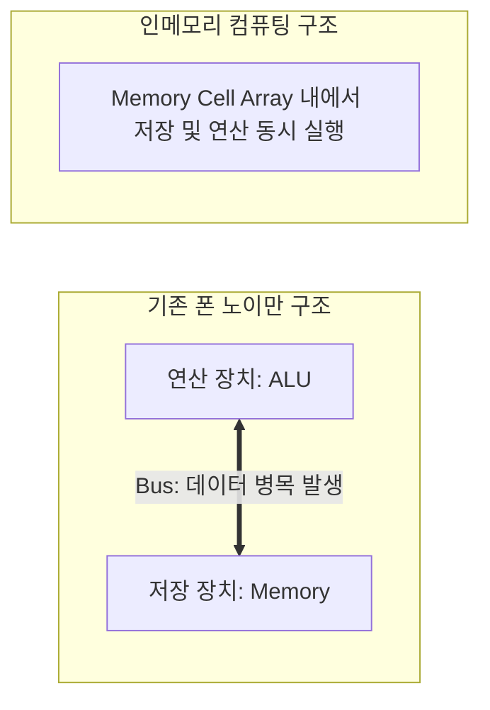

# 중국 40nm 뉴로모픽 인메모리 컴퓨팅 칩 설계 혁신 분석

이 문서는 베이징대학교와 중국과학원 공동 연구팀이 미국의 첨단 미세공정 장비 수입 규제를 우회하기 위해 구형 공정(40nm)과 비(Non) 폰 노이만 아키텍처 설계를 결합하여 구현한 뉴로모픽 인메모리 컴퓨팅(In-Memory Computing) 칩의 기술적 특성을 분석합니다.

## 1. 기술적 대전제: 폰 노이만 구조 극복

기존 엔비디아(NVIDIA) 등 범용 GPU의 독주는 엄청난 HBM 메모리 대역폭과 트랜지스터 밀도를 바탕으로 연산과 저장의 분리에서 기인하는 **폰 노이만 병목(Von Neumann Bottleneck)**을 물리적인 물량공세로 돌파하는 구조입니다.

중국의 40나노 뉴로모픽 칩은 하나의 셀(Cell) 혹은 어레이(Array) 내에서 데이터 저장과 곱셈-누산(MAC, Multiply-Accumulate) 연산을 동시에 처리하는 **인메모리 컴퓨팅(IMC)**을 아키텍처 수준에서 극대화했습니다. 데이터 이동 비용을 거의 0에 가깝게 낮춤으로써 버스 대역폭 제한을 해소했습니다.

## 2. 성능 지표 및 공정의 의의

### 2.1. 40나노미터(nm) 공정의 시사점
- 글로벌 파운드리가 3nm 이하 공정 경쟁에 목매는 현 시점에서, 40nm 구형 노드를 이용해 엔비디아 A100 GPU를 정량적으로 앞지르는 벤치마크 지표를 도출했습니다.
- 이는 고비용의 미세 전력 제어가 차단된 상황에서 하드웨어 구조 및 뇌 모방(Neuromorphic) 신호 매핑 알고리즘의 최적화가 물리적 미세화 한계를 일정 수준 극복할 수 있음을 증명합니다. (DeepSeek이 알고리즘 효율화로 가속기를 대체하려 한 행보와 궤를 같이함)

### 2.2. A100 대비 478배 가속 및 한계
- **가속 태스크**: 생체 모방적 복잡 신경망 모델링 및 실시간 **뇌 표면 재구성(Brain Surface Reconstruction)** 작업에 최적화된 하드웨어 맵을 인포매틱스로 주입하여 최대 **478배** 속도 향상.
- **한계점**: 본 칩은 특정 정적 신경 전달 계수와 스파이킹 신경망(SNN) 매핑에 최적화된 전용 반도체(ASIC) 계열입니다. 대용량 트랜스포머 어텐션(Self-Attention) 연산과 같이 시퀀스가 동적으로 길어지는 LLM 범용 워크로드에서는 여전히 엔비디아 GPU 패키징이 절대적인 압도적 우위에 있습니다.

## 3. 향후 전망: 도메인 특화 가속기(ASIC)의 다극화

미래의 AI 하드웨어 인프라 시장은 단일 범용 고비용 GPU가 시장을 독식하는 패러다임에서, 엣지(Edge) 및 소형 로컬 환경의 특수 도메인 태스크를 저전력/고성능으로 소화해 내는 특화 칩셋(NPU, neuromorphic chip)이 다수 포진하여 보완하는 분산형 생태계로 전개될 것입니다.

---
## 🔗 관련 문서 링크
- 모바일 온디바이스 AI 서빙 기술: [[wiki/Models/Optimization-and-Serving/Adaptive-Inference-Routing-Fastino-Pioneer.md]]
- 저사양 로컬 학습용 프레임워크: [[wiki/Models/Small-Models/HuggingFace-Smol-Course.md]]
