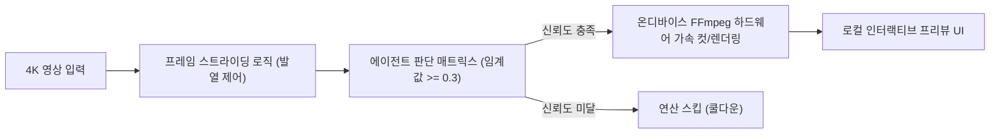

# 온디바이스 에이전틱 비디오 파이프라인 및 서멀 스로틀링 극복 패턴

## 1. 개요 및 하드웨어 병목

클라우드 서버와 통신하지 않고 단말(스마트폰, 태블릿, 로컬 PC) 내부에서 4K 고해상도 영상을 직접 분석하고 편집 결정을 내리는 **로컬-퍼스트(Local-First) 에이전틱 비디오 AI**는 개인정보 보호와 네트워크 제약 해소 측면에서 큰 주목을 받고 있습니다.

그러나 스마트폰 및 에지 칩셋 환경에서 온디바이스 비디오 에이전트를 가동할 때 발생하는 최대의 물리적 장벽은 모델의 지능이 아니라 **하드웨어의 발열과 서멀 스로틀링(Thermal Throttling, 일명 "The Caveman Bottleneck")**입니다:
- 스마트폰 AP/NPU에서 4K 비디오의 프레임 단위 전수 추론을 일정 시간 지속하면 칩셋 온도가 임계치를 초과하여 클럭 주파수가 강제 다운클럭되거나 OS에 의해 프로세스가 강제 종료됩니다.
- 배터리 급방전 및 고속 I/O 메모리 대역폭 포화 문제가 동시에 발생합니다.

---

## 2. 서멀 최적화 3대 핵심 아키텍처 패턴

### 1) 프레임 스트라이딩 (Frame Striding Logic)
모든 프레임을 무조건 추론 엔진에 통과시키는 대신, 비디오의 모션 변화율과 장면 전환 강도를 추적하여 **동적 보폭(Striding)**으로 프레임을 샘플링합니다:
- 정적 장면이나 연속 동작 구간에서는 1~2초 간격으로 스트라이드를 넓혀 칩셋에 쿨다운(Cool-down) 시간을 부여합니다.
- 급격한 화면 전환이나 오디오 피크 감지 시에만 일시적으로 보폭을 좁혀 세부 프레임을 분석합니다.

### 2) 신뢰도 게이팅 의사결정 매트릭스 (Confidence-Gated Decision Matrix)
- 에이전트가 컷 편집, 화면 전환(Transition), 색보정(Color Grading)을 제안할 때 **0.3 수준의 명확한 신뢰도 임계값(Threshold)**을 적용합니다.
- 모델의 확신도가 임계값을 넘지 못하는 애매한 구간에서는 후속 심층 연산이나 복잡한 생성 파이프라인의 구동을 사전에 차단(Early Exit)하여 전력과 연산 자원을 보존합니다.

### 3) 완전 온디바이스 네이티브 미디어 파이프라인
- 클라우드 서버 왕복(Round-trip) 없이 단말 내부에서 직접 빌드된 **FFmpeg C/C++ 네이티브 라이브러리 파이프라인**을 통해 컷, 트랜지션, 색보정 렌더링을 하드웨어 가속기로 직접 처리합니다.
- 웹(WASM) 및 iOS(Metal) 간 동일 아키텍처를 유지하며, 대화형 프리뷰 UI를 제공하여 사용자가 커밋하기 전에 변경 사항을 시각적으로 확인할 수 있게 합니다.

---

## 3. 엔지니어링 체크리스트 및 실무 지표

| 평가 항목 | 지침 및 권장치 | 위험 신호 (Bad Practice) |
| :--- | :--- | :--- |
| **열 관리** | 프레임 스트라이딩 적용으로 서멀 정체 유지 | 전 프레임 연속 분석으로 AP 45℃ 초과 및 스로틀링 |
| **추론 게이팅** | 신뢰도 임계값(e.g., 0.3) 기반 조기 탈출(Early Exit) | 모든 프레임에 걸쳐 풀 파이프라인 상시 가동 |
| **네트워크 의존성**| 데이터가 단말을 벗어나지 않는 Zero-Cloud 로컬 완결 | 프레임 청크를 클라우드로 지속 스트리밍 |
| **인터페이스** | 비파괴적(Non-destructive) 인터랙티브 미리보기 | 사용자 검증 없는 백그라운드 덮어쓰기 |

---

## 🔗 관련 문서
- [[wiki/Models/Multimodal-and-Vision/Gemini-Agentic-Video-and-Omni-Flash-API.md|Gemini Agentic Video API]]
- [[wiki/Models/Optimization-and-Serving/온디바이스-AI-및-AI-PC-기술-트렌드-2026.md|온디바이스 AI 및 AI PC 기술 트렌드 2026]]
- [[wiki/Models/Optimization-and-Serving/스마트폰-환경의-LLM-서빙-기술-2026.md|스마트폰 환경의 LLM 서빙 기술 2026]]
- [[wiki/Models/Optimization-and-Serving/000_Optimization-and-Serving-MOC.md|최적화 및 서빙 MOC]]
