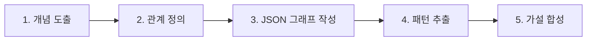

# Graph-PRefLexOR: Graph-Native 강화학습 기반 과학적 가설 생성 프레임워크

이 문서는 MIT Laboratory for Atomistic and Molecular Mechanics(LAMM) 및 Oak Ridge 국립연구소가 제안한 **Graph-PRefLexOR**(Graph-based Preference recursive Language modeling for Exploratory Optimization of Reasoning) 프레임워크의 핵심 아키텍처 및 강화학습 기반 정렬 전략을 분석합니다.

---

## 1. 아키텍처 개요: Graph-Native Reasoning vs. Black-box CoT

기존 LLM의 다단계 추론(Chain-of-Thought, CoT)은 생각의 흐름이 외부로 투명하게 드러나지 않고, 기계가 즉각적으로 분석하거나 재사용하기 어려운 텍스트 기반 블랙박스라는 한계가 존재했습니다. Graph-PRefLexOR는 모델이 질문을 받았을 때 추론 경로를 컴퓨터 판독이 가능한 구조적 **지식 그래프(Knowledge Graph)** 형태로 강제 전개시킵니다.

### 1.1. 추론의 5단계 구조화
모델은 다음과 같은 구조화된 단계를 거쳐 최종 가설을 생성합니다:
1. **Brainstorming (개념 도출)**: 문제 해결에 필요한 원자적 개념들을 발산적으로 탐색.
2. **Sketching Relations (관계 정의)**: 개념 간의 관계 및 의존 관계를 스케치.
3. **JSON Graph Construction (구조적 그래프화)**: 구조적 관계를 정의된 스펙의 JSON 지식 그래프 형태로 작성.
4. **Pattern Extraction (공통 패턴 식별)**: 서브 그래프나 순환 고리 등 의미 있는 패턴 추출.
5. **Hypothesis Synthesis (가설 합성)**: 정립된 그래프 구조를 문장 형태의 최종 과학적 가설로 융합.

이러한 기하학적 제약 덕분에 추론 과정의 **추적 가능성(Traceability)** 지표가 92%까지 증가하며, 가설 수립 정확도가 기존 대비 40~65% 향상됩니다.



---

## 2. 강화학습 정렬 전략: Gated GRPO 및 가혹한 정보 보틀넥

모델이 형식(JSON)만 흉내 내고 실질적인 논리가 없는 그래프를 생성하는 꼼수(**Reward Hacking**)를 방지하기 위해, Graph-PRefLexOR는 극도로 통제된 보상 및 최적화 설정을 사용합니다.

### 2.1. GRPO (Group Relative Policy Optimization) 및 ORPO 결합
- **ORPO (Odds Ratio Preference Optimization)**: 사후 정렬의 초기 단계에서 모델의 지식 그래프 선호도를 기본 제어하기 위해 적용합니다.
- **GRPO**: 기준 정책(Reference Policy) 없이 동일 질문에 대해 다수의 샘플링(Group Rollout)을 수행하고, 각 샘플링된 지식 그래프의 구조적 무결성 및 복원력을 상대 평가하여 폴리시를 업데이트합니다.

### 2.2. 정보 보틀넥 (Information Bottleneck) 보상
학습 시, 모델이 생성한 설명이나 줄글 텍스트 답변을 모두 마스킹(삭제)합니다. 오직 모델이 작성한 JSON 지식 그래프 구조체만을 판독기(Decoder/Judge)에 주입한 뒤, **"이 지식 그래프 구조 정보만으로 원래 정답(가설 타깃)을 완벽하게 재구성할 수 있는가?"**를 기준으로 보상을 부여합니다. 
이로 인해 모델은 핵심적인 인과 관계 정보만을 지식 그래프에 고밀도로 채워 넣도록 강제 학습됩니다.

---

## 3. 구현 세부 및 실전 적용 가이드

### 3.1. 이종 학문 개념 재조합 (Conceptual Recombination)
지식 그래프의 가장 강력한 이점은 각 질문 단계에서 학습/생성된 지식 그래프 조각(Sub-graphs)들을 대규모 단일 지식망으로 병합할 때 나타납니다.
추론 컴퓨팅 자원(Test-time compute)을 확장함에 따라, 서로 멀리 떨어져 있던 도메인 간의 개념(예: '개미 떼 군집 지능' $\leftrightarrow$ '나노 로봇 조립')이 지식망의 다리를 통해 융합되어 새로운 하이브리드 가설을 스스로 수립하는 **창의적 도약** 현상이 통계적으로 유의미하게 확인되었습니다.

### 3.2. 로컬 재현 및 경량 모델 서빙 팁
- **형식 준수 병목**: Qwen3-8B/1.7B, Llama-3.2-3B 등의 소형 모델은 JSON 지식 그래프 스펙을 엄격히 준수하기 어려우므로, 훈련 프롬프트에 `JsonSchema` 제약(Structured Outputs)을 강제 적용해 서빙해야 합니다.
- **API 비용 우회 및 Judge**: 대량의 상용 API 호출을 방지하기 위해 로컬 BGE 임베딩 기반 유사도 계산 및 비동기 오프라인 큐(예: GLM-5.2 local judge)를 활용한 자체 평가 파이프라인 구축을 권장합니다.

```python
# Graph-PRefLexOR JSON Graph 스키마 예시
{
  "nodes": [
    {"id": "A", "label": "개미 군집 지능", "type": "BiologicalSystem"},
    {"id": "B", "label": "자가 회복 폴리머", "type": "MaterialClass"}
  ],
  "edges": [
    {"source": "A", "target": "B", "relation": "인과 기법 모사 (Decentralized Healing)", "weight": 0.85}
  ]
}
```

---

## 🔗 관련 문서 링크
- 공식 GitHub: [lamm-mit/graph-preflexor-grpo](https://github.com/lamm-mit/graph-preflexor-grpo)
- GRPO 알고리즘 정의: [[wiki/Models/RL/GRPO-Algorithm-Definition.md]]
- LLM 기반 지식 그래프 구축: [[wiki/Models/Reasoning-and-Cognition/LLM을-활용한-상향식-지식-그래프-구축.md]]
- [[wiki/Models/000_Models-MOC.md]]
- [[index.md]]
