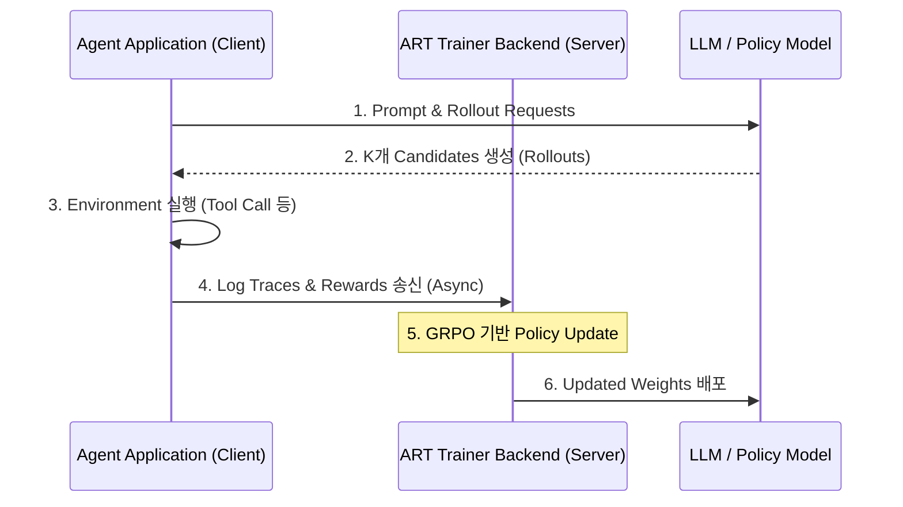

# OpenPipe: ART (Agent Reinforcement Trainer) 기술 규격 및 아키텍처

이 문서는 GRPO(Group Relative Policy Optimization) 알고리즘을 사용해 LLM 에이전트의 다중 턴 의사결정 프로세스를 자율 훈련시키는 오픈소스 프레임워크 **OpenPipe ART**의 기술 사양과 작동 원리를 정의합니다.

## 1. 아키텍처 개요: 비동기 분리형 RL 루프

전형적인 강화학습(RLHF, PPO) 시스템은 에이전트 개발 파이프라인 내부로 통합하기 어렵고 대량의 GPU 메모리를 요구합니다. OpenPipe ART는 에이전트 애플리케이션 실행 환경(클라이언트)과 강화학습 연산 엔진(서버)을 격리하는 **비동기 클라이언트-서버** 구조를 채택했습니다.



- **GRPO 최적화**: 복잡한 비즈니스 규칙이나 특정 태스크에서 정답을 맞췄을 때 부여되는 외재적 보상(Reward)을 기반으로, 별도의 Value Network 없이 에이전트 후보군 간의 상대적인 이득(Advantage)만 계산해 정렬합니다.

## 2. 핵심 구현 프레임워크 및 워크플로우

1.  **에이전트 우선(Agent-First) 설계**:
    - 일반 텍스트 완성 뿐만 아니라, 도구 사용(Tool Use), 대화 상태 유지 및 예외 상황 자가 수정(Self-correction) 등의 시나리오를 추적하며 보상을 집계합니다.
2.  **온더잡 트레이닝 (On-the-job Training)**:
    - 에이전트가 프로덕션 혹은 시뮬레이션 환경에서 실제 작업을 수행하며 겪는 실패와 성공 트레이스(Traces)를 로그로 수집하여 정책을 자율 개선합니다.

## 3. 실전 ART 구현 및 Reward 설정 스펙 예시

OpenPipe ART 프레임워크를 연동하여 특정 작업(예: JSON 포맷팅 및 도구 정확도)에 대한 보상 함수를 바인딩하고 학습을 등록하는 Python 연동 스펙 예시입니다.

```python
import os
from openpipe_art import ARTTrainer, TaskConfig

# 1. 보상 함수(Reward Function) 정의
def evaluate_agent_tool_use(agent_rollout) -> float:
    """
    에이전트의 실행 추적(Trace)을 검사하여 올바른 도구를 호출하고
    JSON 포맷을 충실히 지켰는지 0.0 ~ 1.0 점수를 반환합니다.
    """
    reward = 0.0
    history = agent_rollout.get("history", [])
    
    # 예: "search_nvidia_finance" 도구를 불렀는지 확인
    for step in history:
        if step.get("tool_name") == "search_nvidia_finance":
            reward += 0.5
        # JSON 포맷 검증 성공 여부
        if step.get("valid_json_response"):
            reward += 0.5
            
    return reward

# 2. ART 학습 구성
config = TaskConfig(
    project_name="nvidia-finance-agent",
    base_model="Qwen/Qwen2.5-7B-Instruct",
    learning_rate=1e-5,
    group_size=4,  # GRPO 계산을 위한 1회당 후보군 개수
    max_steps=200
)

# 3. 비동기 트레이너 백엔드 연결 및 훈련 등록
trainer = ARTTrainer(api_key=os.getenv("ART_API_KEY"), config=config)
trainer.register_reward_function(evaluate_agent_tool_use)

# 4. 훈련 실행
# trainer.start_training_loop()
```

---
## 🔗 관련 문서 링크
- SFT와 RL의 중복 제어 및 Compositional Generalization: [[wiki/Models/Reasoning-and-Cognition/SFT-vs-RL-Compositional-Generalization.md]]
- 소형 모델 파인튜닝 실무: [[wiki/Models/Small-Models/HuggingFace-Smol-Course.md]]
- 적응형 추론 미들웨어 설계: [[wiki/Models/Optimization-and-Serving/Adaptive-Inference-Routing-Fastino-Pioneer.md]]
