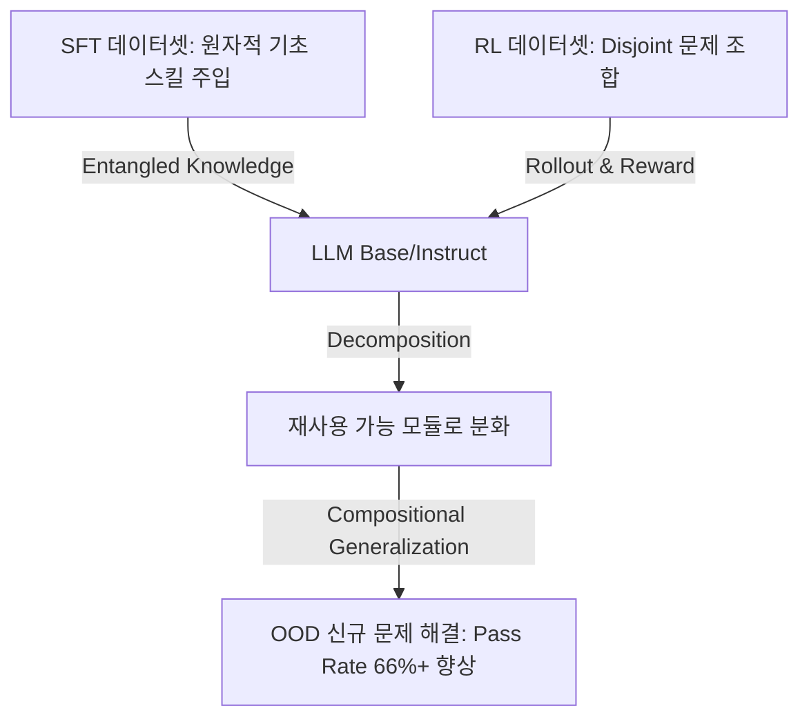

# SFT와 RL의 역할 분담을 통한 LLM 추론 일반화 극대화 전략 (ICML 2026)

이 문서는 Post-training(사후 학습) 단계에서 SFT(지도 미세 조정)와 RL(강화학습)의 수학적/시스템적 결합 메커니즘을 분석하여 보지 못한 문제 조합(OOD)에 대응하는 일반화(Compositional Generalization) 최적화 설계 방식을 제안합니다.

## 1. 아키텍처적 기여: 지식의 얽힘(Entanglement) 해소

SFT 단독 모델은 복잡한 문제의 해답 과정을 뭉텅이(Entangled) 형태로 학습하기 때문에, 조금만 구성이 바뀐 신규 문제에서는 추론 성능이 붕괴합니다. RL은 보상 신호(Reward Signal) 기반의 동적 탐색(Rollout)을 통해 뭉쳐진 지식을 독립적인 **재사용 가능 원자적 모듈(Reusable Atomic Modules)**로 분해(Decomposition)하고 재조합하는 역할을 수행합니다.



## 2. 데이터셋 설계 원칙: Disjoint Set 전략

일반화 효과를 극대화하기 위해서는 SFT 학습용 프롬프트 데이터셋과 RL 학습용 프롬프트 데이터셋을 완전히 분리하는 **Disjoint Set (비중복 집합)** 전략을 실행해야 합니다.

1.  **SFT 단계 (기초 부품 완전 커버)**:
    - 작업 해결에 필요한 개별 원자적 스킬(Atomic Skills)들을 고르게 주입합니다. SFT 데이터에 포함되지 않은 원자적 기초 능력이 있다면, RL 단계에서 해당 능력의 발현 확률(Rollout Reachability)은 0%가 되기 때문입니다.
2.  **RL 단계 (Off-support 조합 탐색)**:
    - SFT 단계에서 보여주지 않은 신규 문제 조합만 선별하여 보상 기반 학습을 유도합니다. SFT와 중복된 문제를 주면 모델은 지식을 분해/모듈화하는 대신 외운 답안 패턴을 그대로 모사하는 지름길(Short-cut)을 취해 지능 향상을 가로막습니다.

## 3. 실전 구현 가이드

### 3.1. Base 모델 vs. Instruct 모델 적용
- **Base 모델**: 다단계 추론(CoT) 포맷과 정답 구조를 모르는 상태이므로 RL만 바로 주입하면 학습 그라디언트가 0이 되어 붕괴(Collapse)합니다. 반드시 사전 SFT 단계가 필요합니다.
- **Instruct 모델**: 이미 사전 튜닝을 통해 추론 포맷과 기초 지식을 지니고 있으므로 바로 RL을 적용하여 일반화 성능을 극대화할 수 있습니다. 단, 특수 도메인 스킬이 빠져 있다면 이를 채우는 타겟 SFT 선행 후 RL을 결합해야 합니다.

### 3.2. 훈련 프레임워크 설정 예시 (GRPO 기반)
에이전트 훈련 파이프라인에서 GRPO(Group Relative Policy Optimization)를 사용하여 훈련할 때, SFT와 RL의 데이터 중복을 막는 Python 데이터 로더 예시입니다.

```python
def prepare_disjoint_datasets(raw_dataset):
    """
    SFT와 RL 데이터셋이 겹치지 않도록 분할하는 로직
    """
    skills = raw_dataset.groupby('skill_type')
    sft_data = []
    rl_data = []
    
    for skill, group in skills:
        # 50%의 조합은 SFT용, 나머지 50%의 새로운 조합은 RL용으로 완벽히 격리
        split_idx = len(group) // 2
        sft_data.extend(group.iloc[:split_idx].to_dict('records'))
        rl_data.extend(group.iloc[split_idx:].to_dict('records'))
        
    return sft_data, rl_data
```

---
## 🔗 관련 문서 링크
- GRPO 기반 에이전트 자가 개선 훈련 프레임워크: [[wiki/Models/RL/OpenPipe-ART-Agent-Reinforcement-Trainer.md]]
- 소형 모델 파인튜닝 실습: [[wiki/Models/Small-Models/HuggingFace-Smol-Course.md]]
