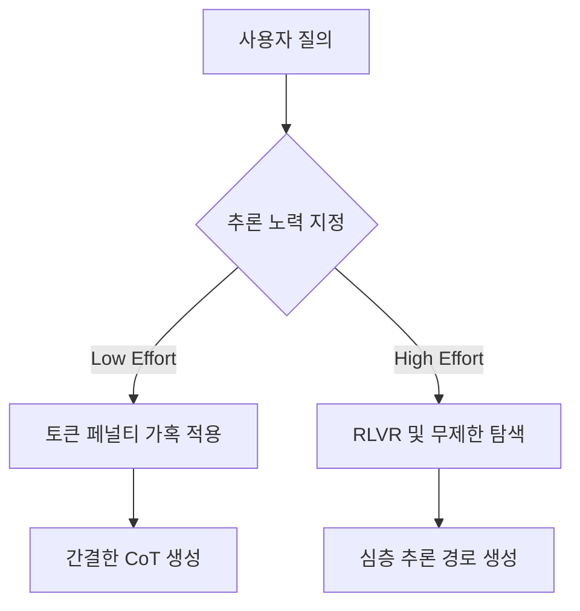

# 추론 LLM의 추론 노력(Reasoning Effort) 제어 및 스케일링 메커니즘

이 문서는 OpenAI o1, o3, DeepSeek R1 및 Thinking Machines Lab의 Inkling 등 최신 추론형 대규모 언어 모델(Reasoning LLMs)에 탑재되는 **가변 추론 노력(Variable Reasoning Effort)**의 제어 설계 및 사후 학습(Post-training) 방법론을 분석합니다.

---

## 1. 가변 추론 노력 (Variable Reasoning Effort) 개요

과거의 생성 모델과 달리, 최신 추론형 LLMs는 단일한 추론 경로(Chain-of-Thought, CoT)의 길이에 고정되지 않고 사용자의 요구사항이나 태스크 난이도에 따라 **추론 노력을 제어(Low, Medium, High Effort)**할 수 있습니다. 
이러한 가변 노력 모드는 런타임의 임의적 반응이 아니라, **사후 학습(Post-training) 단계에서 추론 제어 인터페이스(Inference Control Plane) 형태로 모델 내부에 웰딩(Welding, 용접)**되어 고착된 제어 시스템입니다.

---

## 2. 가변 추론 노력 주입을 위한 3대 핵심 메커니즘

모델이 API 파라미터나 시스템 지침을 통해 자신의 추론 길이를 정밀 통제하게 만드는 훈련 기법입니다.

### 2.1. 혼합 학습 컨텍스트 (Mixed Training Contexts)
- 훈련 데이터셋 구성 시, 각 문제 해결 경로에 대해 인위적으로 다단계 추론의 양을 차별화한 다중 버전(Short CoT, Long CoT, Max-effort CoT)을 주입합니다.
- 프롬프트에 `[Low Effort]`, `[High Effort]`와 같은 메타 태그를 명시하여 각 조건에 따라 다른 길이의 추론 분포를 출력하도록 매핑합니다.

### 2.2. 강화학습에서의 토큰 페널티 동적 조정 (Token Penalties in RL)
- RL(강화학습) 정렬 단계에서 보상 함수(Reward Function)에 길이 페널티(Length Penalty) 항을 결합합니다:
  $$Reward = Reward_{Base} - \lambda \times L_{CoT}$$
- $\lambda$ 값을 동적으로 스케일링하여, 모델이 정답률을 유지하는 범위 내에서 불필요한 추론 토큰 사용을 억제하고 최소한의 CoT만 내뱉도록 학습을 유도합니다.

### 2.3. 컴퓨팅 라우팅 및 예산 컷오프 (Compute Budget Routing)
- 하네스 단계에서 지정된 예산(예: `max_completion_tokens`)에 따라 추론 토큰 수를 강제 컷오프하거나, 쉬운 연산은 즉시 답변하는 경량 라우터 모델로 질의를 분배합니다.

---

## 3. RLVR (Reinforcement Learning with Verifiable Rewards)의 역할

추론 노력의 스케일링을 정확하게 제어하는 기반 기술은 **검증 가능한 보상을 통한 강화학습(RLVR)**입니다.

- **Verifiable Reward**: 코딩(테스트 패스 여부)이나 수학(정답 수치 일치 여부)과 같이 기계적으로 참/거짓 판독이 가능한 규칙을 기반으로 학습 그라디언트를 구성합니다.
- **Inference Scaling**: 검증 가능한 환경 내에서 모델은 "더 오랫동안 생각하고(Inference-time search)", "스스로 에러를 감지하고 수정하는(Self-Correction)" 기법을 강화학습을 통해 스스로 습득하게 되며, 이 과정에서 추론 노력 제어판이 완성됩니다.

---

## 4. 실전 개발 팁: 추론 비용과 정확도의 경제적 균형

에이전트 오케스트레이션 개발 시, 무작정 Max Effort 추론 모델을 사용하는 것은 극단적인 비용 낭비(Token Maxing)를 초래합니다.

1.  **결정 분기 설계 (Decision Split)**:
    - 린터 에러 수정, 단순 API 호출 파싱 등은 `Low/Medium Effort`로 처리합니다.
    - 시스템 설계, 샌드박스 내부의 테스트가 계속 실패하여 추론 경로 재기획이 필요할 때만 `High/Max Effort` 모드로 라우팅합니다.
2.  **테스트 타임 컴퓨트 확장**:
    - Sebastian Raschka의 저서 *Build a Reasoning Model (From Scratch)*에 따르면, 고정된 작은 모델(예: 3B/8B)을 활용해 RLVR 정렬 후, 추론 단계를 세분화하여 테스트 타임 컴퓨트(MCTS, Self-Reflection)를 적용하는 것이 대형 모델의 무제한 추론보다 높은 토큰 가성비를 보입니다.

---

## 🔗 관련 문서 링크
- o1/DeepSeek 추론 최적화 동향: [[wiki/Models/SFT/OpenAI o1 추론 스케일링 및 2026년 최신 동향.md]]
- 하네스 오케스트레이션 비용 제어: [[wiki/Agents/Coding-and-Engineering/하네스-핸드북-및-하네스-이펙트-연구-2026.md]]
- [[wiki/Models/Reasoning-and-Cognition/000_Reasoning-and-Cognition-MOC.md]]
- [[index.md]]
