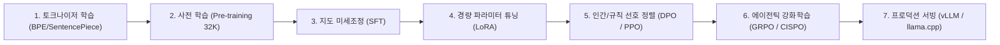

# MiniMind: 단일 GPU 풀스택 경량 LLM 학습 및 에이전틱 강화학습 파이프라인

## 1. 개요 및 설계 목적

최근 대형 언어 모델(LLM) 연구와 개발은 수천억 파라미터의 거대 모델 위주로 진행되면서, 개별 엔지니어나 학생이 모델의 전 과정을 직접 구축하고 검증하기 위한 진입 장벽이 매우 높아졌습니다.
- 대부분의 프레임워크(DeepSpeed, Megatron-LM 등)는 복잡한 분산 환경에 최적화되어 있어 내부 메커니즘이 블랙박스화되어 있습니다.
- **MiniMind**(jingyaogong/minimind)는 **단일 소비자용 GPU(RTX 3090 24GB) 1장으로 약 2시간(클라우드 대여비 기준 약 $3)** 만에 토크나이저부터 사전 학습, 지시 튜닝, 다양한 강화학습(RL) 정렬까지의 전체 LLM 엔지니어링 라이프사이클을 스크래치(From Scratch)로 학습할 수 있도록 설계된 오픈소스 교육/실습 프로젝트입니다.

---

## 2. 모델 규격 및 아키텍처 스펙

MiniMind는 최소한의 연산 자원으로 현대 프론티어 LLM의 핵심 아키텍처를 온전히 재현합니다:

| 항목 | 상세 스펙 | 비고 |
| :--- | :--- | :--- |
| **파라미터 규모** | **Dense**: 64M / **MoE**: 198M-A64M | 초경량 실습 최적화 크기 |
| **컨텍스트 윈도우**| **32,768 (32K) 토큰** | RoPE(Rotary Position Embedding) 적용 |
| **하드웨어 요구량**| **단일 NVIDIA RTX 3090 (24GB)** | 학습 완주 소요 시간 약 2시간 |
| **라이선스** | Apache 2.0 | 상용 및 연구 목적 자유로운 활용 가능 |
| **서빙 호환성** | vLLM, Ollama, llama.cpp | 표준 OpenAI 호환 API 서버 내장 |

---

## 3. 엔드투엔드 전체 학습 파이프라인

MiniMind는 사전 학습부터 최신 에이전틱 사후 학습까지 8단계의 파이프라인을 온전한 코드로 제공합니다:

1. **토크나이저 구축**: 도메인 맞춤형 토크나이저를 직접 학습하여 어휘 사전(Vocab)을 구축.
2. **사전학습 (Pre-training)**: 웹 및 일반 말뭉치를 바탕으로 RoPE 기반 32K 컨텍스트를 학습.
3. **지도 미세조정 (SFT)**: 대화형 질의응답 및 멀티턴(Multi-turn) 대화 패턴 주입.
4. **LoRA (Low-Rank Adaptation)**: 메모리 효율적인 파라미터 튜닝 실습.
5. **선호도 정렬 (Preference Alignment)**:
   - **DPO (Direct Preference Optimization)**: 참조 모델 대비 직접 선호도 확률 최적화.
   - **PPO (Proximal Policy Optimization)**: 전통적 보상 모델 기반의 액터-크리틱 강화학습.
6. **차세대 에이전틱 강화학습 (Agentic RL)**:
   - **GRPO (Group Relative Policy Optimization)**: 그룹 상대 보상 기반으로 추론 체인 및 툴 호출(Tool Calling) 능력 고도화.
   - **CISPO**: 정책 최적화 및 안정성 보완.

---

## 4. 실무/교육적 가치 및 활용

1. **블랙박스 없는 메커니즘 이해**: 트랜스포머의 어텐션 블록, FFN, 정규화(RMSNorm), RoPE 회전 위치 임베딩의 수식을 직접 코드로 추적 가능.
2. **빠른 가설 검증 샌드박스**: 새로운 손실 함수, 활성화 함수, 또는 라우팅 알고리즘을 대규모 클러스터에 올리기 전 2시간 만에 신속 프로토타이핑.
3. **온디바이스/에지 배포 테스트**: 64M 크기는 모바일 브라우저(WebLLM), 스마트폰 NPU, 임베디드 장비에서 즉각 가동 가능.

---

## 🔗 관련 문서
- [[wiki/Models/Study-Resources.md|무료 머신러닝/딥러닝 교재 및 학습 가이드]]
- [[wiki/Models/SFT/000_SFT-MOC.md|지도 미세조정(SFT) MOC]]
- [[wiki/Models/RL/000_RL-MOC.md|강화학습(RL) MOC]]
- [[wiki/Models/Small-Models/000_Small-Models-MOC.md|소형 모델(Small-Models) MOC]]
