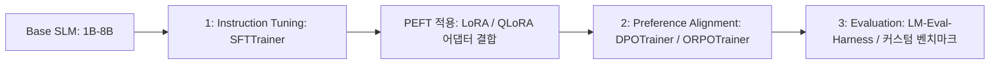

# Hugging Face: smol-course 소형 언어 모델 파인튜닝 가이드

이 문서는 Hugging Face에서 개설한 실무 실습 교육 코스인 **smol-course**의 커리큘럼 분석을 통해, 단일 GPU나 일반 개발자 로컬 환경에서 소형 모델(SLM) 및 비전 소형 모델(VLM)을 효율적으로 Instruction Tuning 및 Preference Alignment(선호도 정렬) 처리하는 설계 체계를 정리합니다.

## 1. 아키텍처 개요: 경량 고효율 Fine-tuning 파이프라인

`smol-course`는 1B~8B 크기의 소형 모델(Qwen2.5, Llama3, SmolLM 등)을 타겟으로 하여, 고가의 데이터 센터형 인프라 없이 일반 소비자용 GPU(예: 8GB~24GB VRAM) 환경에서 가동되도록 경량 라이브러리(PEFT, TRL, Transformers)를 조율하는 모범 설계안을 제시합니다.



## 2. 3대 핵심 학습 및 정렬 방법론

### 2.1. 지도 미세 조정 (Supervised Fine-Tuning, SFT)
- **도구**: `trl.SFTTrainer`
- **목적**: Base 모델에 대화형 구조(Chat Template) 및 명령어 준수 능력을 학습시킵니다.
- **최적화**: 메모리 소모를 억제하기 위해 **QLoRA (4-bit Quantized LoRA)**를 적극 사용하며, 패딩(Padding) 토큰으로 인한 연산 낭비를 방지하고자 **Pack된 시퀀스 학습 (Dataset Packing)**을 적용합니다.

### 2.2. 선호도 정렬 (Preference Alignment)
SFT 이후, 인간의 가이드라인이나 특정 도메인 선호도 피드백 데이터셋을 모델 정책에 이식합니다.
- **DPO (Direct Preference Optimization)**: 별도의 리워드 모델(Reward Model) 없이 직접 Chosen/Rejected 로그 확률을 비교해 정책을 업데이트하여 메모리 사용량을 최소화합니다.
- **ORPO (Odds Ratio Preference Optimization)**: SFT 단계와 Alignment 단계를 하나로 단일화하여 학습 단계와 그라디언트 노이즈를 획기적으로 줄인 최신 정렬 기법을 적용합니다.

### 2.3. 소형 비전 모델 (VLM) 정렬
텍스트 지능뿐만 아니라 소형 VLM(예: SmolVLM, Paligemma 등)을 대상으로 이미지 인식 정보와 명령어를 매핑하고 조율하는 파인튜닝 노트북과 가이드를 제공합니다.

## 3. QLoRA SFT 및 DPO 정렬 구현 스펙 예시

TRL(Transformer Reinforcement Learning) 라이브러리를 사용하여 로컬 환경에서 소형 모델의 SFT 및 DPO 학습 파이프라인을 구축하는 실전 파이썬 코드 예시입니다.

```python
import torch
from transformers import AutoModelForCausalLM, AutoTokenizer
from peft import LoraConfig
from trl import SFTTrainer, SFTConfig

# 1. 모델 및 토크나이저 로드 (소형 Qwen 모델)
model_id = "Qwen/Qwen2.5-1.5B"
tokenizer = AutoTokenizer.from_pretrained(model_id)
model = AutoModelForCausalLM.from_pretrained(
    model_id, 
    device_map="auto", 
    torch_dtype=torch.bfloat16
)

# 2. PEFT/LoRA 구성 선언
peft_config = LoraConfig(
    r=16,
    lora_alpha=32,
    target_modules=["q_proj", "v_proj", "k_proj", "o_proj"],
    lora_dropout=0.05,
    bias="none",
    task_type="CAUSAL_LM"
)

# 3. 경량 SFT Trainer 구성 및 실행
sft_config = SFTConfig(
    dataset_text_field="text",
    max_seq_length=2048,
    output_dir="./outputs_sft",
    per_device_train_batch_size=2,
    gradient_accumulation_steps=4,
    learning_rate=2e-4,
    logging_steps=10
)

trainer = SFTTrainer(
    model=model,
    train_dataset=None,  # 로컬 데이터셋 바인딩
    peft_config=peft_config,
    args=sft_config,
    tokenizer=tokenizer
)
# trainer.train()
```

---
## 🔗 관련 문서 링크
- SFT와 RL의 수학적 조합과 데이터 분리 원칙: [[wiki/Models/Reasoning-and-Cognition/SFT-vs-RL-Compositional-Generalization.md]]
- GRPO 기반 에이전트 자가 개선 실무: [[wiki/Models/RL/OpenPipe-ART-Agent-Reinforcement-Trainer.md]]
- 적응형 모델 라우팅 기법: [[wiki/Models/Optimization-and-Serving/Adaptive-Inference-Routing-Fastino-Pioneer.md]]
