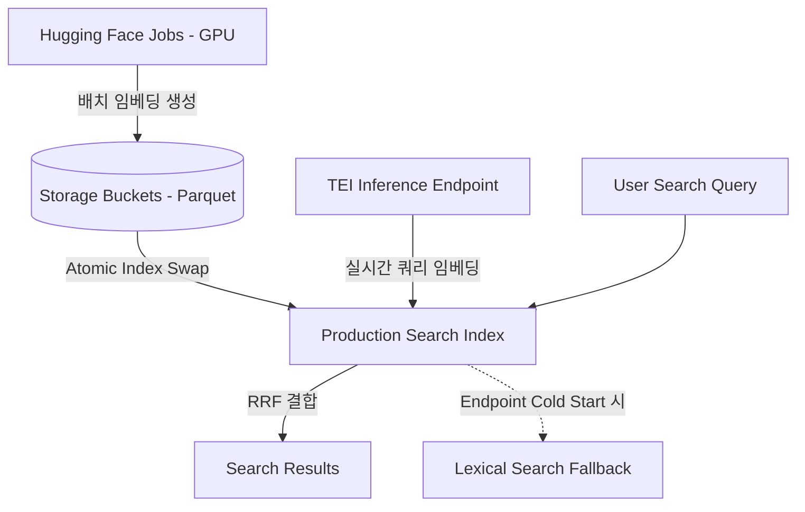

# 🔍 Papers with Code 사례로 본 Hugging Face 인프라 기반 RAG 하이브리드 검색 아키텍처

## 1. 설계적 지향성 및 요구사항
Papers with Code(PWC)는 11만 개가 넘는 학술 논문을 빠르게 검색하기 위해 하이브리드 검색 아키텍처를 가동합니다. 학술 검색은 단순 텍스트 매칭을 넘어 고도의 학술적 동의어 분석(예: "original BERT paper" -> Devlin et al., 2018 논문 매칭)이 필요하며, 대규모 쿼리와 저지연을 저비용으로 달성해야 합니다.

## 2. 배치/실시간 작업의 완벽한 분리 (이원화 인프라)

### 1) 오프라인 배치 파이프라인 (Hugging Face Jobs + Buckets)
- **역할**: 110,000+ 개의 전체 논문 코퍼스를 대상으로 주기적(일단위/배치) 고품질 벡터 임베딩 생성.
- **아키텍처**: Hugging Face Jobs를 통해 고성능 GPU(L4) 인스턴스를 단시간 스케일 아웃하여 병렬 연산 완료 후 즉시 종료.
- **저장**: 생성 완료된 임베딩은 Parquet 포맷으로 Hugging Face Storage Buckets에 정밀 체크섬과 함께 저장. 
- **무손실 교체(Atomic Activation)**: 서비스 가동 중 백그라운드에서 신규 임베딩 인덱스를 작성한 뒤, 완료 검증 단계를 마친 후에만 포인터를 전환(Atomic Swap)하여 무장애 롤백 및 업데이트 지원.

### 2) 온라인 실시간 파이프라인 (Inference Endpoints)
- **역할**: 사용자의 검색 쿼리 임베딩 변환 및 매 시간마다 올라오는 실시간 신규 논문의 증분 임베딩 연산 수행.
- **아키텍처**: TEI (Text Embeddings Inference) 전용 호스팅 인프라로 구동되는 Hugging Face Inference Endpoint를 활용하여 1ms 대의 저지연 임베딩 수행.
- **Scale-to-Zero 비용 절감**: 트래픽이 완전히 없는 야간/새벽 타임에는 엔드포인트를 0으로 자동 셧다운(Scale-to-Zero)함.
- **Lexical Fallback (콜드 스타트 방어)**: 인프라 콜드 스타트로 인해 인퍼런스 서버가 켜지는 수십 초간, BM25 기반의 어휘(Lexical) 검색엔진이 먼저 즉각 반응하여 서비스 무중단을 보장하는 하이브리드 검색 백업 가동.

## 3. Matryoshka Representation Learning (MRL) 적용
- **개념**: 벡터 차원 내에 공간적 중요도를 집중시켜, 큰 사이즈의 고품질 임베딩 벡터에서 일부 저차원 접두 부분만 추출해 사용해도 인출 정확도를 거의 보존하는 최신 기법.
- **모델**: **Qwen/Qwen3-Embedding-0.6B** (0.6B 크기로 MTEB 벤치마크 SOTA급 정확도 획득).
- **적용 결과**: 1024차원 고밀도 벡터를 256차원으로 축소 사용. HNSW 인덱스 스토리지 용량을 73% 가까이 크게 절감하면서도, 최고 성능 검색 정확도(ANN recall)를 안정적으로 방어함.
