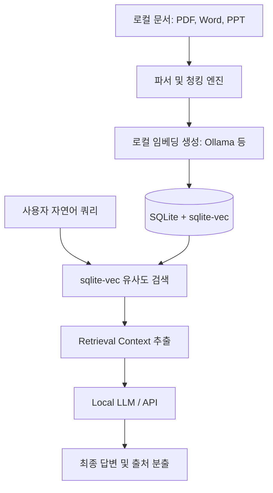

# KnowNote: Electron 기반 오픈소스 로컬 퍼스트 NotebookLM 대안

이 문서는 데이터 프라이버시를 유지하면서 대용량 문서를 로컬 환경에서 파싱하고 질의응답할 수 있는 오픈소스 로컬 퍼스트 AI 지식 베이스 **KnowNote**의 기술 아키텍처와 특징을 기술합니다.

## 1. 아키텍처 개요: Local-only RAG Pipeline

KnowNote는 클라우드 서버나 외부 데이터베이스의 의존성을 모두 걷어내고, 사용자의 데스크톱 환경 내에서 모든 벡터 임베딩, 스토리지 적재 및 컨텍스트 검색을 수행하는 **로컬 퍼스트(Local-First)** 패러다임을 지향합니다.



- **데스크톱 애플리케이션**: Electron + React + TypeScript 기반으로 단일 실행 파일 형태로 배포되어 Docker 설치 등의 복잡한 인프라 세팅 진입장벽을 제거했습니다.
- **로컬 스토리지 및 벡터 인덱싱**: **SQLite**를 사용해 지식 베이스 내 정형 데이터와 양방향 관계 데이터를 보관하고, C 기반 경량 벡터 검색 확장이식인 **sqlite-vec**를 내장하여 매우 빠르고 가벼운 로컬 시맨틱 검색(Semantic Search)을 처리합니다.

## 2. 주요 기능 및 흐름

### 2.1. NotebookLM 스타일 워크플로우
구글의 NotebookLM처럼 복수의 연구 문서, 수업 자료, 코드 가이드를 업로드하여 사이드바에 '소스(Sources)' 카탈로그를 형성하고, 소스 내의 문맥에만 입각한 질의응답을 돌릴 수 있습니다. 생성된 모든 응답에는 정확히 해당 텍스트를 인용한 본문의 위치를 앵커(Anchor) 링크로 표기해 줍니다.

### 2.2. 유연한 AI 프로바이더 지원
- 상용 API 모델(OpenAI, DeepSeek 등)의 호출을 선택하여 쓸 수 있습니다.
- 오프라인 프라이버시 보호가 필수적일 경우, 로컬에 설치된 **Ollama** 서비스(Llama, Mistral 등)와 완벽히 통신하여 외부 유출 없이 로컬 RAG 파이프라인을 구동합니다.

## 3. sqlite-vec 기반 로컬 검색 스키마 예시

KnowNote 백엔드에서 경량 벡터 인덱스를 구축하고 유사도를 조회할 때 사용하는 SQLite SQL DDL 및 DML 개념 예시입니다.

```sql
-- 1. sqlite-vec 확장을 로드한 뒤 경량 벡터 가상 테이블 선언 (1536차원 기준)
CREATE VIRTUAL TABLE document_chunks_embeddings USING vec0(
    chunk_id TEXT PRIMARY KEY,
    embedding FLOAT[1536]
);

-- 2. 실제 본문 텍스트 테이블 생성
CREATE TABLE document_chunks (
    id TEXT PRIMARY KEY,
    document_title TEXT,
    content TEXT,
    page_number INTEGER
);

-- 3. 코사인 유사도를 이용한 로컬 유사 문맥 검색 쿼리
SELECT 
    c.document_title,
    c.content,
    c.page_number,
    v.distance
FROM document_chunks_embeddings v
JOIN document_chunks c ON v.chunk_id = c.id
WHERE v.embedding MATCH :query_vector AND k = 3
ORDER BY v.distance ASC;
```

---
## 🔗 관련 문서 링크
- 코드베이스 RAG 자동 생성 및 OKF 규격: [[wiki/RAG/OpenWiki-OKF-Codebase-Documentation.md]]
- 에이전트의 격리된 실행 및 Harbor 샌드박스: [[wiki/Agents/Evaluations/Deep-Agents-Benchmarking-Methodology.md]]
