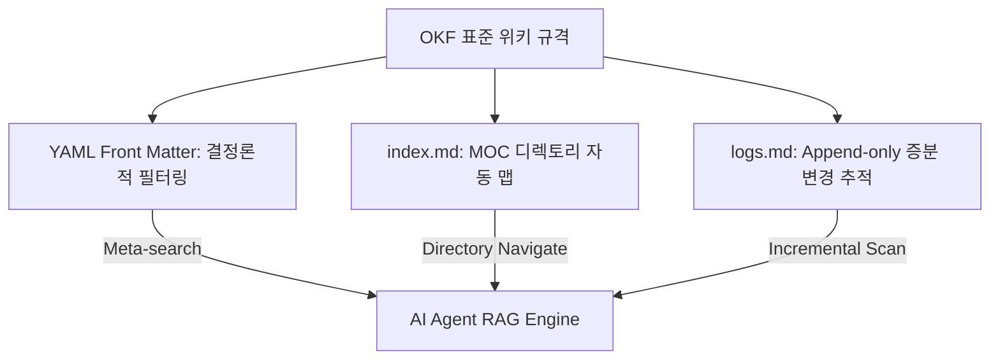

# OpenWiki 0.2: OKF 표준 규격 도입을 통한 코드베이스 RAG 최적화

이 문서는 LangChain이 2026년 7월에 릴리스한 **OpenWiki 0.2**의 핵심 기여인 **Open Knowledge Format (OKF)** 표준과, 이를 활용하여 AI 에이전트 전용 코드베이스 RAG 파이프라인의 검색 효율성을 개선하는 메커니즘을 상세히 다룹니다.

## 1. 개요 및 탄생 배경: 기계 가독성(Machine-readability)의 한계

기존의 코드베이스 문서화 및 위키는 주로 인간 개발자(Human developer)의 시각적 가독성만을 고려해 작성되어, AI 에이전트(Claude Code, Cursor 등)가 RAG 파이프라인으로 참조할 때 다음과 같은 문제에 봉착했습니다.
- 문서 간 구조적 연관성을 파악하기 위해 전체 디렉토리를 깊이 스캔(Full Directory Scanning)해야 함으로써 **대량의 컨텍스트 토큰(Tokens) 낭비**.
- 시맨틱 임베딩 매칭만으로는 단순 키워드 필터링 및 메타데이터 기반 필터링과 같은 **결정론적 한계 제어 불가능**.

Google Cloud와 LangChain은 이를 구조적으로 보완하기 위해 AI 친화적 마크다운 스펙인 **Open Knowledge Format (OKF)** 표준 규격을 제정했습니다.

## 2. OKF 표준의 3대 핵심 기둥



### 2.1. YAML Front Matter 메타데이터화
모든 마크다운 위키 파일 최상단에 구조화된 YAML 프런트매터를 의무적으로 기입합니다.
```yaml
---
title: "문서 제목"
description: "AI 에이전트가 1줄로 문맥을 요약 조회할 수 있는 메타 데이터 요약"
tags: [RAG, Optimization, GraphRAG]
categories: [RAG]
resource_urls: ["https://github.com/...", "https://arxiv.org/..."]
---
```
AI 에이전트는 문서 전체를 임베딩 벡터 검색하기에 앞서, YAML 프런트매터 필드를 활용해 태그, 카테고리, 원천 리소스 주소 등으로 **하이브리드 필터링(Hybrid Filtering)**을 선 수행하여 검색 노이즈를 근절합니다.

### 2.2. 표준 디렉토리 맵 (`index.md`)
각 서브디렉토리 루트에 자동으로 생성되며, 하위 파일들의 위키 링크(`[[ ]]`)와 개별 요약 요약문을 트리 형태로 관리합니다. 에이전트가 단일 진입점(Map of Content)을 통해 위키의 카테고리 변화를 구조적으로 이해할 수 있게 돕습니다.

### 2.3. 영구 누적 기록 로그 (`logs.md`)
지식 추가, 갱신 및 삭제 로그를 기록하는 영구 누적 원장(Changelog)입니다.
- **포맷**: `DATE | ACTION | SCOPE | FILES | SUMMARY`
- 에이전트가 세션을 시작할 때 전체 파일의 해시를 비교하거나 전역 스캔할 필요 없이, `logs.md` 하단에 최근 기재된 변경 내역만 증분 로드(Incremental Loading)하여 지식 상태를 싱크함으로써 동기화 토큰 소모를 획기적으로 낮춥니다.

## 3. 실무 예시 및 구조 설계

OpenWiki 0.2 CLI를 활용하여 로컬 프로젝트 코드베이스에서 OKF 준수 위키를 빌드하고 린팅(Lint)하는 워크플로우 예시입니다.

```bash
# 1. OpenWiki CLI 도구 전역 설치
npm install -g @langchain/openwiki-cli

# 2. 로컬 코드베이스 분석을 통한 OKF 마크다운 문서 자동 생성
openwiki generate --src="./src" --dest="./wiki" --format="okf"

# 3. 생성된 위키의 index.md, logs.md 및 YAML frontmatter 무결성 점검
openwiki lint --dir="./wiki"
```

---
## 🔗 관련 문서 링크
- 로컬 경량 데이터베이스 RAG 설계: [[wiki/RAG/KnowNote-Local-First-RAG-NotebookLM.md]]
- 에이전트 다단계 피드백 루프 모니터링: [[wiki/Agents/Evaluations/Deep-Agents-Benchmarking-Methodology.md]]
